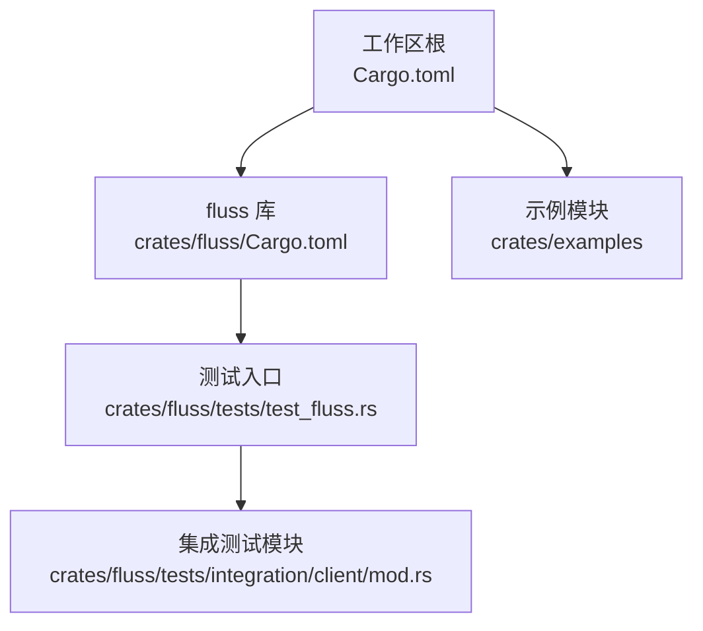
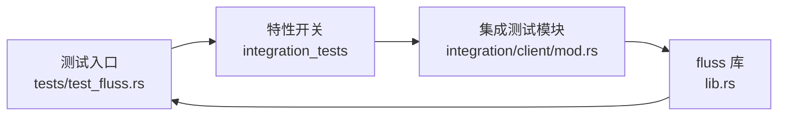
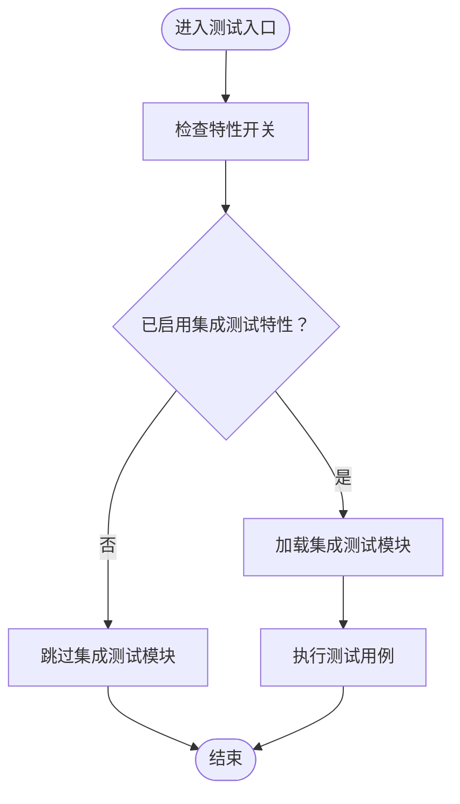
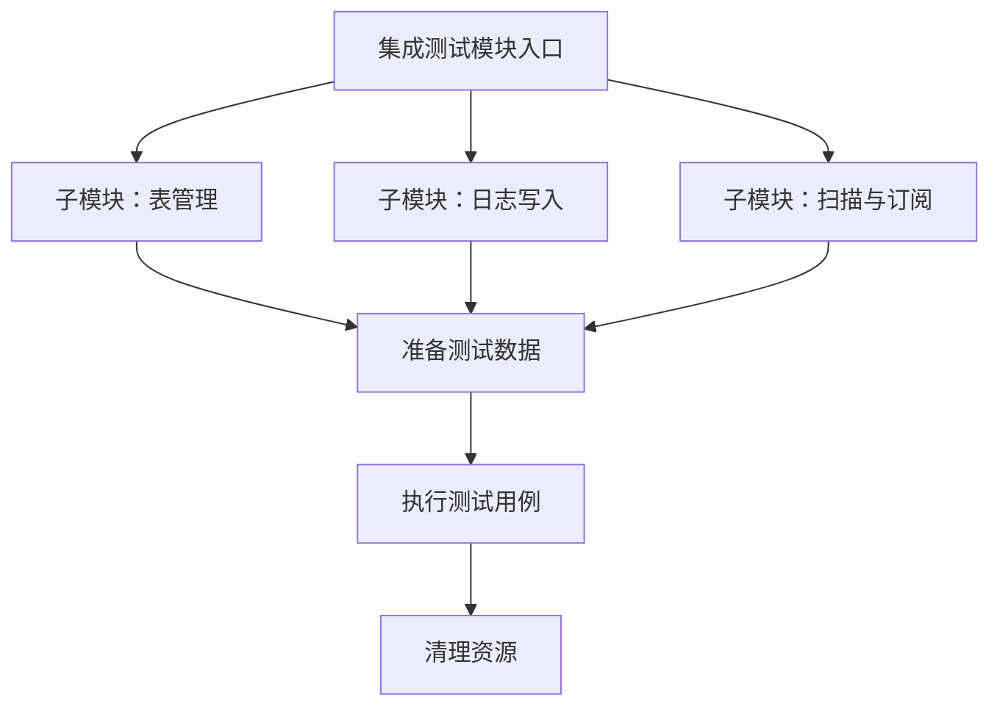
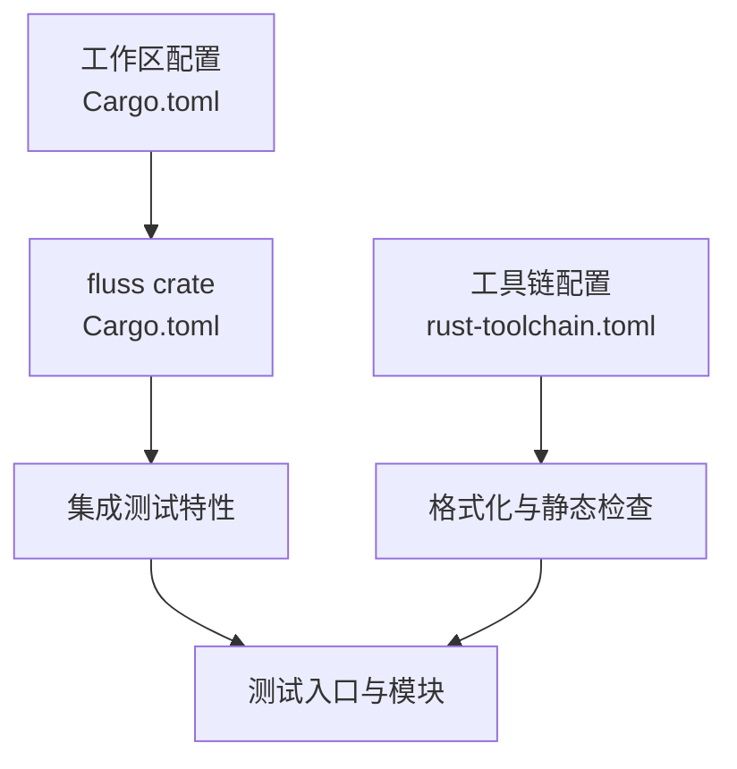
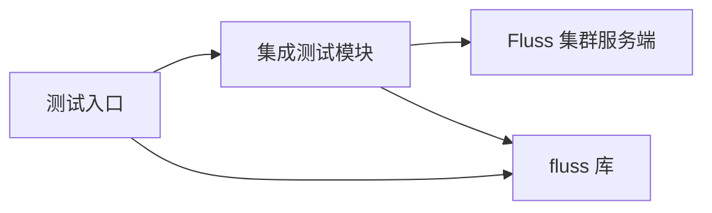

# 测试自动化

<cite>
**本文引用的文件**
- [Cargo.toml](file://Cargo.toml)
- [crates/fluss/Cargo.toml](file://crates/fluss/Cargo.toml)
- [crates/fluss/tests/test_fluss.rs](file://crates/fluss/tests/test_fluss.rs)
- [crates/fluss/tests/integration/client/mod.rs](file://crates/fluss/tests/integration/client/mod.rs)
- [README.md](file://README.md)
- [rust-toolchain.toml](file://rust-toolchain.toml)
- [rustfmt.toml](file://rustfmt.toml)
</cite>

## 目录
1. [引言](#引言)
2. [项目结构](#项目结构)
3. [核心组件](#核心组件)
4. [架构总览](#架构总览)
5. [详细组件分析](#详细组件分析)
6. [依赖分析](#依赖分析)
7. [性能考虑](#性能考虑)
8. [故障排查指南](#故障排查指南)
9. [结论](#结论)
10. [附录](#附录)

## 引言
本文件面向 CI/CD 中的测试自动化落地，结合仓库现有测试结构与配置，系统性阐述如何在该 Rust 工作区中组织单元测试、集成测试与示例验证；并给出可扩展到 GitHub Actions 的流水线设计思路（概念性方案），覆盖并行执行、测试报告与覆盖率统计、容器化与集群测试环境准备、测试分类与优先级策略、失败诊断与最佳实践等内容。由于当前仓库未包含 CI 配置文件与覆盖率工具配置，本文以“如何接入”的方式提供可操作的实施建议。

## 项目结构
该仓库采用多 crate 工作区布局，核心库为 fluss，examples 作为示例模块，测试位于 fluss crate 内部，通过特性开关控制集成测试模块的编译与运行。

图表来源
- [Cargo.toml](file://Cargo.toml#L29-L36)
- [crates/fluss/Cargo.toml](file://crates/fluss/Cargo.toml#L18-L55)
- [crates/fluss/tests/test_fluss.rs](file://crates/fluss/tests/test_fluss.rs#L17-L26)
- [crates/fluss/tests/integration/client/mod.rs](file://crates/fluss/tests/integration/client/mod.rs#L17-L22)

章节来源
- [Cargo.toml](file://Cargo.toml#L29-L36)
- [crates/fluss/Cargo.toml](file://crates/fluss/Cargo.toml#L18-L55)

## 核心组件
- 测试入口与条件编译
  - 在测试入口文件中使用特性开关加载集成测试模块，确保仅在启用相应特性时编译与运行集成测试。
  - 参考路径：[测试入口](file://crates/fluss/tests/test_fluss.rs#L17-L26)
- 集成测试占位
  - 集成测试模块目前包含一个空测试用例，用于演示集成测试的组织方式。
  - 参考路径：[集成测试模块](file://crates/fluss/tests/integration/client/mod.rs#L17-L22)
- 特性开关
  - fluss crate 定义了集成测试特性，用于启用相关测试代码。
  - 参考路径：[特性定义](file://crates/fluss/Cargo.toml#L50-L52)
- 工作区与工具链
  - 工作区统一版本与依赖；工具链配置包含格式化与静态检查组件。
  - 参考路径：[工作区配置](file://Cargo.toml#L29-L36)，[工具链配置](file://rust-toolchain.toml#L18-L20)，[格式化配置](file://rustfmt.toml#L18-L19)

章节来源
- [crates/fluss/tests/test_fluss.rs](file://crates/fluss/tests/test_fluss.rs#L17-L26)
- [crates/fluss/tests/integration/client/mod.rs](file://crates/fluss/tests/integration/client/mod.rs#L17-L22)
- [crates/fluss/Cargo.toml](file://crates/fluss/Cargo.toml#L50-L52)
- [Cargo.toml](file://Cargo.toml#L29-L36)
- [rust-toolchain.toml](file://rust-toolchain.toml#L18-L20)
- [rustfmt.toml](file://rustfmt.toml#L18-L19)

## 架构总览
下图展示了测试在工作区中的组织与运行关系，强调测试入口、特性开关与集成测试模块之间的耦合。

图表来源
- [crates/fluss/tests/test_fluss.rs](file://crates/fluss/tests/test_fluss.rs#L17-L26)
- [crates/fluss/tests/integration/client/mod.rs](file://crates/fluss/tests/integration/client/mod.rs#L17-L22)
- [crates/fluss/Cargo.toml](file://crates/fluss/Cargo.toml#L50-L52)

## 详细组件分析

### 组件一：测试入口与条件编译
- 设计要点
  - 使用特性开关隔离集成测试，避免在常规构建中引入外部依赖或长耗时逻辑。
  - 测试入口集中声明集成测试模块，便于后续扩展更多子模块。
- 复杂度与性能
  - 条件编译在编译期决定是否包含集成测试，对运行时无额外开销。
- 错误处理与边界
  - 若未启用特性，集成测试模块不会被编译；若启用特性但模块为空，测试将通过但不执行实际逻辑。
- 优化建议
  - 将集成测试拆分为更细粒度的子模块，提升并行执行效率与定位能力。

图表来源
- [crates/fluss/tests/test_fluss.rs](file://crates/fluss/tests/test_fluss.rs#L17-L26)
- [crates/fluss/Cargo.toml](file://crates/fluss/Cargo.toml#L50-L52)

章节来源
- [crates/fluss/tests/test_fluss.rs](file://crates/fluss/tests/test_fluss.rs#L17-L26)
- [crates/fluss/Cargo.toml](file://crates/fluss/Cargo.toml#L50-L52)

### 组件二：集成测试模块
- 设计要点
  - 当前模块包含一个占位测试，用于演示集成测试的组织方式。
  - 建议后续在此模块中按功能域拆分子模块，如表管理、日志写入、扫描等。
- 复杂度与性能
  - 单个测试用例复杂度低，适合并行扩展。
- 错误处理与边界
  - 需要为每个子模块准备独立的资源清理与错误恢复逻辑。
- 优化建议
  - 引入共享的测试辅助工具（如临时表创建、数据准备、集群连接）以减少重复代码。

图表来源
- [crates/fluss/tests/integration/client/mod.rs](file://crates/fluss/tests/integration/client/mod.rs#L17-L22)

章节来源
- [crates/fluss/tests/integration/client/mod.rs](file://crates/fluss/tests/integration/client/mod.rs#L17-L22)

### 组件三：特性开关与工作区配置
- 设计要点
  - 通过特性开关控制集成测试的编译与运行，配合工作区统一版本与依赖管理。
  - 工具链配置提供格式化与静态检查支持，有助于保持测试代码质量。
- 复杂度与性能
  - 特性开关在编译期生效，不影响运行时性能。
- 错误处理与边界
  - 未正确启用特性会导致集成测试缺失；工具链组件缺失可能影响代码风格一致性。
- 优化建议
  - 在 CI 中显式传递特性参数，确保测试与生产构建的一致性。

图表来源
- [Cargo.toml](file://Cargo.toml#L29-L36)
- [crates/fluss/Cargo.toml](file://crates/fluss/Cargo.toml#L50-L52)
- [rust-toolchain.toml](file://rust-toolchain.toml#L18-L20)

章节来源
- [Cargo.toml](file://Cargo.toml#L29-L36)
- [crates/fluss/Cargo.toml](file://crates/fluss/Cargo.toml#L50-L52)
- [rust-toolchain.toml](file://rust-toolchain.toml#L18-L20)

## 依赖分析
- 组件内聚与耦合
  - 测试入口与集成测试模块之间存在直接依赖；通过特性开关降低对外部库的耦合。
- 外部依赖与集成点
  - 集成测试需要外部 Fluss 集群服务端支持，当前仓库 README 提供了本地集群启动指引。
  - 参考路径：[本地集群启动指引](file://README.md#L35-L54)
- 潜在循环依赖
  - 当前测试结构未见循环依赖风险。
- 接口契约与实现细节
  - 集成测试模块需遵循统一的资源准备与清理流程，确保可重复性与隔离性。

图表来源
- [crates/fluss/tests/test_fluss.rs](file://crates/fluss/tests/test_fluss.rs#L17-L26)
- [crates/fluss/tests/integration/client/mod.rs](file://crates/fluss/tests/integration/client/mod.rs#L17-L22)
- [README.md](file://README.md#L35-L54)

章节来源
- [crates/fluss/tests/test_fluss.rs](file://crates/fluss/tests/test_fluss.rs#L17-L26)
- [crates/fluss/tests/integration/client/mod.rs](file://crates/fluss/tests/integration/client/mod.rs#L17-L22)
- [README.md](file://README.md#L35-L54)

## 性能考虑
- 并行执行
  - 将集成测试按功能域拆分为多个子模块，利用 cargo test 的并行能力提升整体吞吐。
- 资源复用
  - 在 CI 中复用已启动的集群实例，减少启动与初始化时间。
- 缓存与增量
  - 对于非变更测试集，启用增量构建与缓存以缩短流水线时间。
- 报告与覆盖率
  - 建议在 CI 中生成 XML 报告与 HTML 报告，结合覆盖率阈值保障质量门禁。

## 故障排查指南
- 集成测试未运行
  - 症状：集成测试模块未被编译或执行。
  - 排查：确认已启用集成测试特性；检查测试入口是否正确加载模块。
  - 参考路径：[特性开关](file://crates/fluss/Cargo.toml#L50-L52)，[测试入口](file://crates/fluss/tests/test_fluss.rs#L17-L26)
- 集群连接失败
  - 症状：集成测试因无法连接集群而失败。
  - 排查：确认本地或 CI 中的 Fluss 集群已正确启动；检查网络连通性与端口暴露。
  - 参考路径：[本地集群启动指引](file://README.md#L35-L54)
- 资源泄漏与竞态
  - 症状：测试间相互干扰或资源未释放。
  - 排查：为每个测试用例提供独立的数据库/表空间与清理逻辑；避免全局状态共享。
- 报告与覆盖率缺失
  - 症状：CI 中缺少测试报告或覆盖率统计。
  - 排查：在 CI 中启用报告生成与覆盖率导出步骤；设置覆盖率阈值并将其纳入质量门禁。

章节来源
- [crates/fluss/Cargo.toml](file://crates/fluss/Cargo.toml#L50-L52)
- [crates/fluss/tests/test_fluss.rs](file://crates/fluss/tests/test_fluss.rs#L17-L26)
- [README.md](file://README.md#L35-L54)

## 结论
当前仓库已具备测试入口与特性开关的基础能力，建议在 CI 中通过特性参数启用集成测试，并结合功能域拆分与并行执行策略提升效率。同时，补充报告与覆盖率配置、容器化与集群准备脚本，形成完整的测试自动化闭环。后续可在集成测试模块中逐步完善各类场景的验证逻辑，持续提升质量与稳定性。

## 附录
- 测试分类与优先级策略（建议）
  - 快速测试：单元测试与小范围逻辑验证，优先保证高并发与低延迟。
  - 完整测试：覆盖关键路径与边界条件，适合作为每日流水线主干。
  - 回归测试：针对重大变更与热点模块，确保稳定性与兼容性。
- 测试环境自动化（建议）
  - Docker：封装 Fluss 集群镜像与依赖，提供一键启动能力。
  - Kubernetes：在集群中部署测试专用命名空间与服务，支持多实例并行。
  - 自动准备：在 CI 中拉起集群、创建测试表、注入初始数据，完成后回收资源。
- 测试失败诊断与修复建议（建议）
  - 采集测试日志与堆栈信息，结合报告定位失败用例。
  - 对不稳定用例增加重试机制与超时控制，必要时降级为弱校验。
- 测试维护最佳实践（建议）
  - 保持测试用例短小精悍，职责单一；为每个功能域建立独立子模块。
  - 统一资源生命周期管理，避免跨用例共享状态。
  - 将测试文档化，明确前置条件、执行步骤与期望结果。