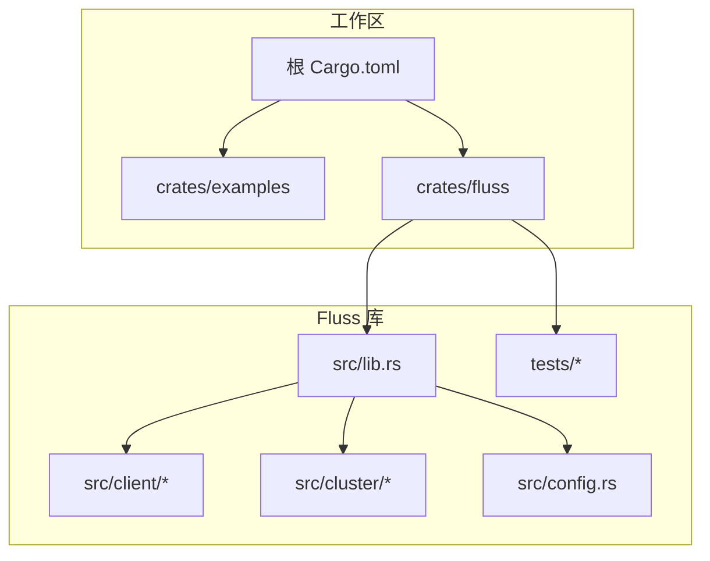
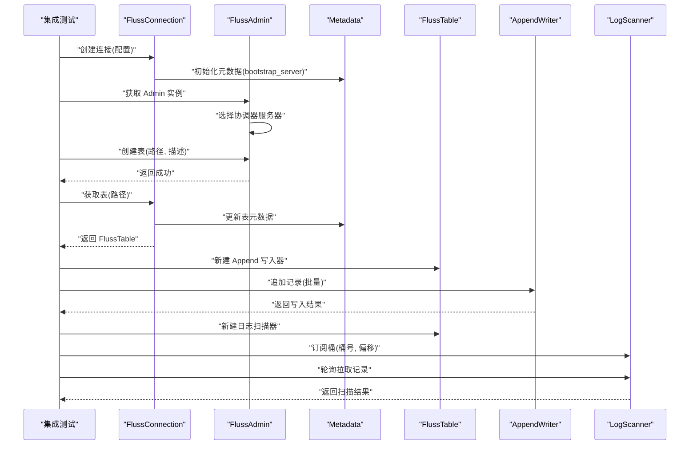
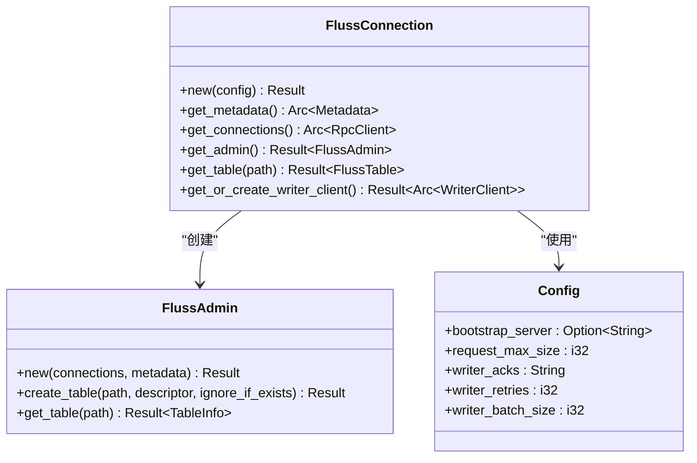
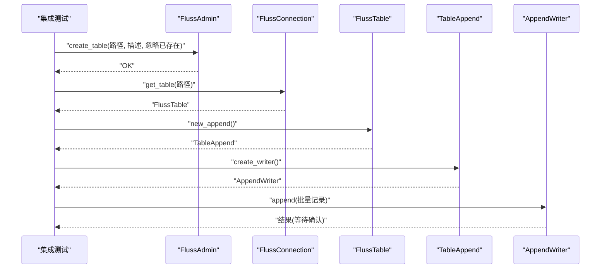
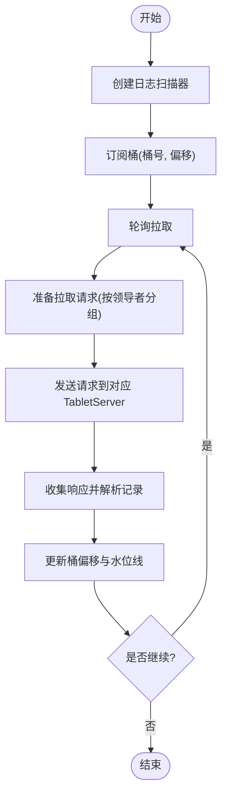
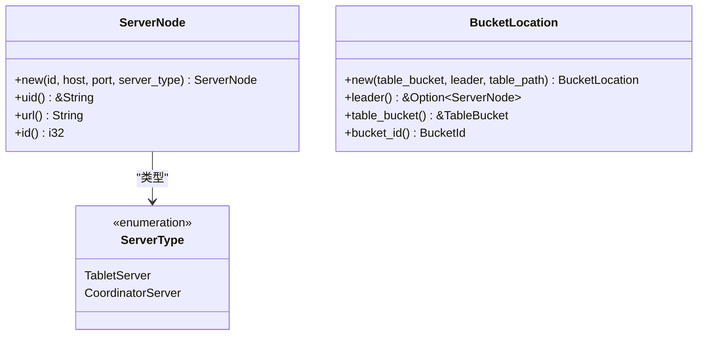
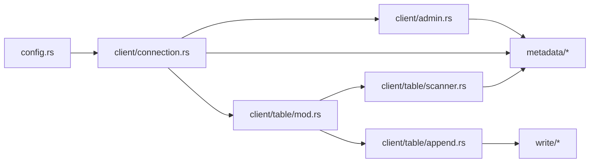

# 集成测试

<cite>
**本文引用的文件**
- [README.md](file://README.md)
- [Cargo.toml](file://Cargo.toml)
- [crates/fluss/Cargo.toml](file://crates/fluss/Cargo.toml)
- [crates/fluss/src/lib.rs](file://crates/fluss/src/lib.rs)
- [crates/fluss/src/config.rs](file://crates/fluss/src/config.rs)
- [crates/fluss/src/client/mod.rs](file://crates/fluss/src/client/mod.rs)
- [crates/fluss/src/client/connection.rs](file://crates/fluss/src/client/connection.rs)
- [crates/fluss/src/client/admin.rs](file://crates/fluss/src/client/admin.rs)
- [crates/fluss/src/client/table/mod.rs](file://crates/fluss/src/client/table/mod.rs)
- [crates/fluss/src/client/table/append.rs](file://crates/fluss/src/client/table/append.rs)
- [crates/fluss/src/client/table/scanner.rs](file://crates/fluss/src/client/table/scanner.rs)
- [crates/fluss/src/cluster/mod.rs](file://crates/fluss/src/cluster/mod.rs)
- [crates/fluss/tests/test_fluss.rs](file://crates/fluss/tests/test_fluss.rs)
- [crates/fluss/tests/integration/client/mod.rs](file://crates/fluss/tests/integration/client/mod.rs)
</cite>

## 目录
1. [简介](#简介)
2. [项目结构](#项目结构)
3. [核心组件](#核心组件)
4. [架构总览](#架构总览)
5. [详细组件分析](#详细组件分析)
6. [依赖关系分析](#依赖关系分析)
7. [性能考量](#性能考量)
8. [故障排查指南](#故障排查指南)
9. [结论](#结论)
10. [附录](#附录)

## 简介
本文件面向 Fluss Rust 客户端的集成测试，目标是帮助读者从零搭建 Fluss 集群测试环境（含 Docker 部署思路与配置要点），并系统化地编写与执行集成测试，覆盖客户端连接、表管理、数据写入与读取的完整流程。同时提供测试数据准备与清理策略、环境隔离、并发测试与故障注入等高级测试技术建议，并给出测试报告生成的实践路径。

## 项目结构
- 工作区采用多 crate 组织：根工作区定义统一版本与依赖；核心库位于 crates/fluss，示例位于 crates/examples，测试位于 crates/fluss/tests。
- 测试通过特性开关启用：当启用 integration_tests 特性时，才会编译并运行集成测试模块。
- 客户端 API 按功能分层：连接层、元数据层、写入层、扫描层、管理（Admin）层。

图表来源
- [Cargo.toml](file://Cargo.toml#L29-L36)
- [crates/fluss/src/lib.rs](file://crates/fluss/src/lib.rs#L18-L37)
- [crates/fluss/Cargo.toml](file://crates/fluss/Cargo.toml#L18-L55)

章节来源
- [Cargo.toml](file://Cargo.toml#L29-L36)
- [crates/fluss/Cargo.toml](file://crates/fluss/Cargo.toml#L18-L55)
- [crates/fluss/src/lib.rs](file://crates/fluss/src/lib.rs#L18-L37)

## 核心组件
- 连接与配置
  - FlussConnection 负责建立与集群的网络连接、维护元数据、提供 Admin 与 Table 访问入口。
  - Config 提供 bootstrap_server、请求大小、写入确认、重试次数、批大小等参数。
- 管理（Admin）
  - FlussAdmin 提供创建表、查询表等管理能力，内部通过 RPC 客户端向协调器服务器发起请求。
- 表操作
  - FlussTable 封装表级操作，支持新建 Append 写入器与日志扫描器。
  - AppendWriter 支持批量追加记录并等待结果。
  - LogScanner 支持订阅桶并轮询拉取日志记录。
- 集群模型
  - ServerNode、ServerType、BucketLocation 等用于描述节点类型、URL、桶位置与领导者等。

章节来源
- [crates/fluss/src/client/connection.rs](file://crates/fluss/src/client/connection.rs#L30-L82)
- [crates/fluss/src/config.rs](file://crates/fluss/src/config.rs#L21-L39)
- [crates/fluss/src/client/admin.rs](file://crates/fluss/src/client/admin.rs#L27-L93)
- [crates/fluss/src/client/table/mod.rs](file://crates/fluss/src/client/table/mod.rs#L32-L67)
- [crates/fluss/src/client/table/append.rs](file://crates/fluss/src/client/table/append.rs#L25-L69)
- [crates/fluss/src/client/table/scanner.rs](file://crates/fluss/src/client/table/scanner.rs#L38-L108)
- [crates/fluss/src/cluster/mod.rs](file://crates/fluss/src/cluster/mod.rs#L26-L99)

## 架构总览
下图展示了集成测试中客户端与 Fluss 集群之间的交互路径：客户端通过 FlussConnection 获取 Admin 与 Table，Admin 创建表后，客户端使用 Table 的 Append 写入器写入数据，再通过 LogScanner 订阅桶并轮询读取。

图表来源
- [crates/fluss/src/client/connection.rs](file://crates/fluss/src/client/connection.rs#L37-L81)
- [crates/fluss/src/client/admin.rs](file://crates/fluss/src/client/admin.rs#L34-L92)
- [crates/fluss/src/client/table/mod.rs](file://crates/fluss/src/client/table/mod.rs#L56-L66)
- [crates/fluss/src/client/table/append.rs](file://crates/fluss/src/client/table/append.rs#L45-L69)
- [crates/fluss/src/client/table/scanner.rs](file://crates/fluss/src/client/table/scanner.rs#L53-L107)

## 详细组件分析

### 连接与配置
- FlussConnection.new 接收 Config，基于 bootstrap_server 初始化 Metadata，并持有 RpcClient。
- get_admin 返回 FlussAdmin，内部根据 Metadata 中的协调器服务器建立连接。
- get_table 在更新元数据后返回 FlussTable。
- get_or_create_writer_client 懒加载 WriterClient，避免重复创建。

图表来源
- [crates/fluss/src/client/connection.rs](file://crates/fluss/src/client/connection.rs#L30-L82)
- [crates/fluss/src/client/admin.rs](file://crates/fluss/src/client/admin.rs#L27-L50)
- [crates/fluss/src/config.rs](file://crates/fluss/src/config.rs#L21-L39)

章节来源
- [crates/fluss/src/client/connection.rs](file://crates/fluss/src/client/connection.rs#L37-L81)
- [crates/fluss/src/config.rs](file://crates/fluss/src/config.rs#L21-L39)

### 表管理与写入
- FlussAdmin.create_table 通过协调器服务器创建表；get_table 查询表信息并反序列化为 TableInfo。
- FlussTable.new_append 返回 TableAppend，再由 TableAppend.create_writer 得到 AppendWriter。
- AppendWriter.append 发送记录并通过结果句柄等待确认；flush 触发刷新。

图表来源
- [crates/fluss/src/client/admin.rs](file://crates/fluss/src/client/admin.rs#L52-L92)
- [crates/fluss/src/client/table/mod.rs](file://crates/fluss/src/client/table/mod.rs#L56-L66)
- [crates/fluss/src/client/table/append.rs](file://crates/fluss/src/client/table/append.rs#L45-L69)

章节来源
- [crates/fluss/src/client/admin.rs](file://crates/fluss/src/client/admin.rs#L52-L92)
- [crates/fluss/src/client/table/mod.rs](file://crates/fluss/src/client/table/mod.rs#L56-L66)
- [crates/fluss/src/client/table/append.rs](file://crates/fluss/src/client/table/append.rs#L45-L69)

### 日志扫描与订阅
- FlussTable.new_scan 返回 TableScan，再由 TableScan.create_log_scanner 创建 LogScanner。
- LogScanner.subscribe 订阅指定桶与偏移；poll 轮询拉取记录并更新状态。
- LogFetcher 根据可拉取桶集合构造 Fetch 请求，按领导者节点分组发送请求并聚合响应。

图表来源
- [crates/fluss/src/client/table/scanner.rs](file://crates/fluss/src/client/table/scanner.rs#L53-L107)
- [crates/fluss/src/client/table/scanner.rs](file://crates/fluss/src/client/table/scanner.rs#L135-L173)
- [crates/fluss/src/client/table/scanner.rs](file://crates/fluss/src/client/table/scanner.rs#L175-L244)

章节来源
- [crates/fluss/src/client/table/scanner.rs](file://crates/fluss/src/client/table/scanner.rs#L53-L107)
- [crates/fluss/src/client/table/scanner.rs](file://crates/fluss/src/client/table/scanner.rs#L135-L173)
- [crates/fluss/src/client/table/scanner.rs](file://crates/fluss/src/client/table/scanner.rs#L175-L244)

### 集群节点与桶定位
- ServerNode 描述节点标识、UID、主机与端口、服务器类型。
- BucketLocation 包含表桶、领导者节点与表路径。
- 通过 Cluster 可查询桶领导者并路由请求。

图表来源
- [crates/fluss/src/cluster/mod.rs](file://crates/fluss/src/cluster/mod.rs#L26-L99)

章节来源
- [crates/fluss/src/cluster/mod.rs](file://crates/fluss/src/cluster/mod.rs#L26-L99)

## 依赖关系分析
- 工作区统一版本与依赖，fluss crate 通过 features 控制集成测试模块的编译。
- 客户端模块之间耦合清晰：connection 依赖 config 与 rpc，admin 依赖 connection 与 metadata，table 依赖 connection 与 metadata，append 与 scanner 依赖 writer 与 metadata。

图表来源
- [crates/fluss/src/config.rs](file://crates/fluss/src/config.rs#L21-L39)
- [crates/fluss/src/client/connection.rs](file://crates/fluss/src/client/connection.rs#L30-L82)
- [crates/fluss/src/client/admin.rs](file://crates/fluss/src/client/admin.rs#L18-L32)
- [crates/fluss/src/client/table/mod.rs](file://crates/fluss/src/client/table/mod.rs#L18-L31)
- [crates/fluss/src/client/table/append.rs](file://crates/fluss/src/client/table/append.rs#L18-L30)
- [crates/fluss/src/client/table/scanner.rs](file://crates/fluss/src/client/table/scanner.rs#L18-L31)

章节来源
- [crates/fluss/Cargo.toml](file://crates/fluss/Cargo.toml#L50-L51)
- [crates/fluss/src/lib.rs](file://crates/fluss/src/lib.rs#L18-L37)

## 性能考量
- 批处理与确认策略
  - 通过 Config 的 writer_batch_size 与 writer_acks 调整吞吐与一致性权衡。
  - 合理设置 writer_retries 以应对瞬时网络波动。
- 拉取参数
  - LogFetcher 使用固定的最大/最小拉取字节与最大等待时间，可根据延迟与带宽调优。
- 并发与公平性
  - LogScannerStatus 使用公平映射管理桶状态，避免饥饿；在高并发场景下建议控制订阅桶数量与轮询频率。

章节来源
- [crates/fluss/src/config.rs](file://crates/fluss/src/config.rs#L28-L39)
- [crates/fluss/src/client/table/scanner.rs](file://crates/fluss/src/client/table/scanner.rs#L32-L36)
- [crates/fluss/src/client/table/scanner.rs](file://crates/fluss/src/client/table/scanner.rs#L246-L331)

## 故障排查指南
- 连接失败
  - 检查 bootstrap_server 是否可达；确认协调器服务器地址正确。
- 表不存在或权限问题
  - 使用 Admin.get_table 确认表是否存在；必要时先创建表。
- 写入无响应
  - 检查 writer_acks 与网络延迟；适当增加 writer_retries；确认写入器未被提前释放。
- 读取不到数据
  - 确认订阅的桶号与起始偏移正确；检查高水位线更新；增大轮询等待时间。
- 元数据不同步
  - 在获取表后调用 FlussConnection.get_table 会触发元数据更新；确保在写入前完成元数据同步。

章节来源
- [crates/fluss/src/client/connection.rs](file://crates/fluss/src/client/connection.rs#L77-L81)
- [crates/fluss/src/client/admin.rs](file://crates/fluss/src/client/admin.rs#L69-L92)
- [crates/fluss/src/client/table/scanner.rs](file://crates/fluss/src/client/table/scanner.rs#L95-L107)

## 结论
本文梳理了 Fluss Rust 客户端的集成测试路径：从环境准备、连接配置、表管理、数据写入与读取，到性能调优与故障排查。结合仓库中的特性开关与现有测试骨架，读者可以在此基础上扩展更全面的集成测试套件，覆盖多桶、多分区、并发与故障注入等复杂场景。

## 附录

### A. 搭建 Fluss 集群测试环境（Docker 部署思路与配置）
- 环境要求
  - Java 17+，JAVA_HOME 设置正确。
- 本地集群启动
  - 下载 Fluss 发行包，解压后使用本地脚本启动集群。
- 客户端连接
  - 通过 Config.bootstrap_server 指向协调器或代理服务地址。
- 停止集群
  - 使用提供的停止脚本关闭集群。

章节来源
- [README.md](file://README.md#L35-L54)
- [README.md](file://README.md#L129-L133)
- [crates/fluss/src/config.rs](file://crates/fluss/src/config.rs#L24-L26)

### B. 编写集成测试的方法
- 启用集成测试特性
  - 在测试工程中启用 integration_tests 特性，使集成测试模块参与编译。
- 测试组织
  - 使用现有的测试模块结构，在 integration 子目录下按功能拆分测试文件。
- 测试步骤建议
  - 连接测试：验证 FlussConnection.new 成功并能获取 Admin。
  - 表操作测试：Admin.create_table 与 get_table 的组合校验。
  - 数据读写测试：AppendWriter 写入后，LogScanner 订阅并轮询读取。
- 断言与报告
  - 使用断言库对返回值与行为进行断言；结合测试框架生成报告。

章节来源
- [crates/fluss/Cargo.toml](file://crates/fluss/Cargo.toml#L50-L51)
- [crates/fluss/tests/test_fluss.rs](file://crates/fluss/tests/test_fluss.rs#L18-L25)
- [crates/fluss/tests/integration/client/mod.rs](file://crates/fluss/tests/integration/client/mod.rs#L18-L21)

### C. 测试数据准备与清理策略
- 准备
  - 为每个测试创建独立的表路径，避免命名冲突。
  - 写入前先查询表是否存在，必要时忽略已存在标志。
- 清理
  - 测试结束后删除临时表，或在测试前清空历史数据。
  - 关闭连接与扫描器，释放资源。

章节来源
- [crates/fluss/src/client/admin.rs](file://crates/fluss/src/client/admin.rs#L52-L66)
- [crates/fluss/src/client/table/scanner.rs](file://crates/fluss/src/client/table/scanner.rs#L286-L301)

### D. 环境隔离、并发测试与故障注入
- 环境隔离
  - 使用独立的测试集群或容器实例，避免多团队共享环境。
- 并发测试
  - 多个 AppendWriter 并发写入不同桶；多个 LogScanner 并发订阅不同桶。
- 故障注入
  - 模拟网络抖动、领导者切换、节点不可用等场景，观察客户端重试与恢复行为。

章节来源
- [crates/fluss/src/client/table/append.rs](file://crates/fluss/src/client/table/append.rs#L58-L68)
- [crates/fluss/src/client/table/scanner.rs](file://crates/fluss/src/client/table/scanner.rs#L246-L331)