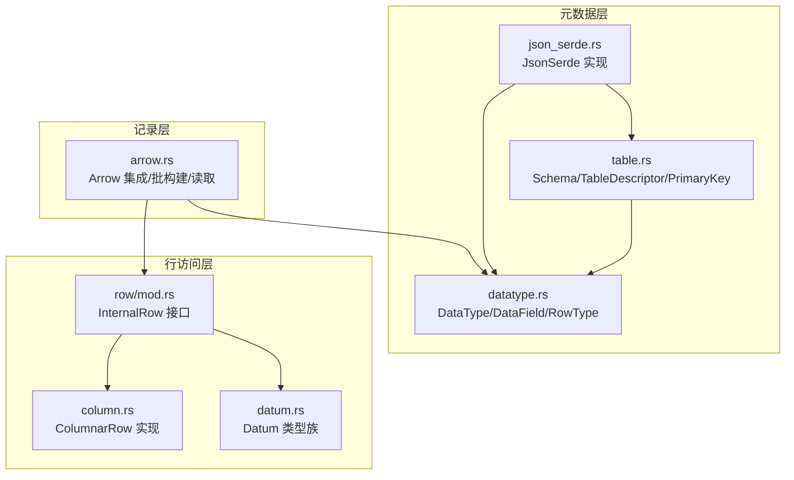
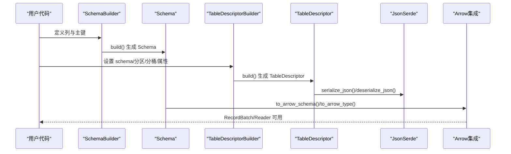
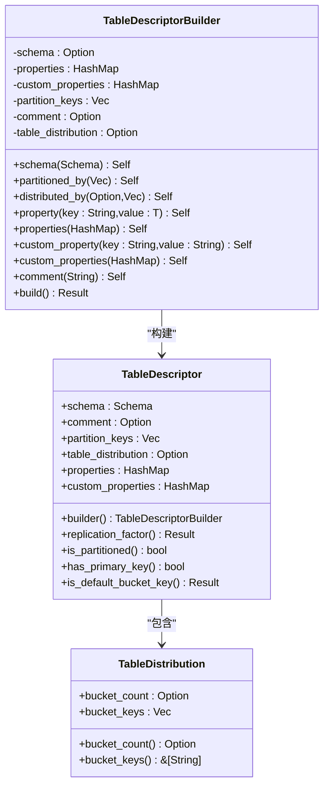
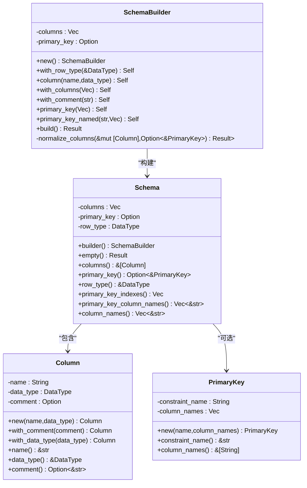
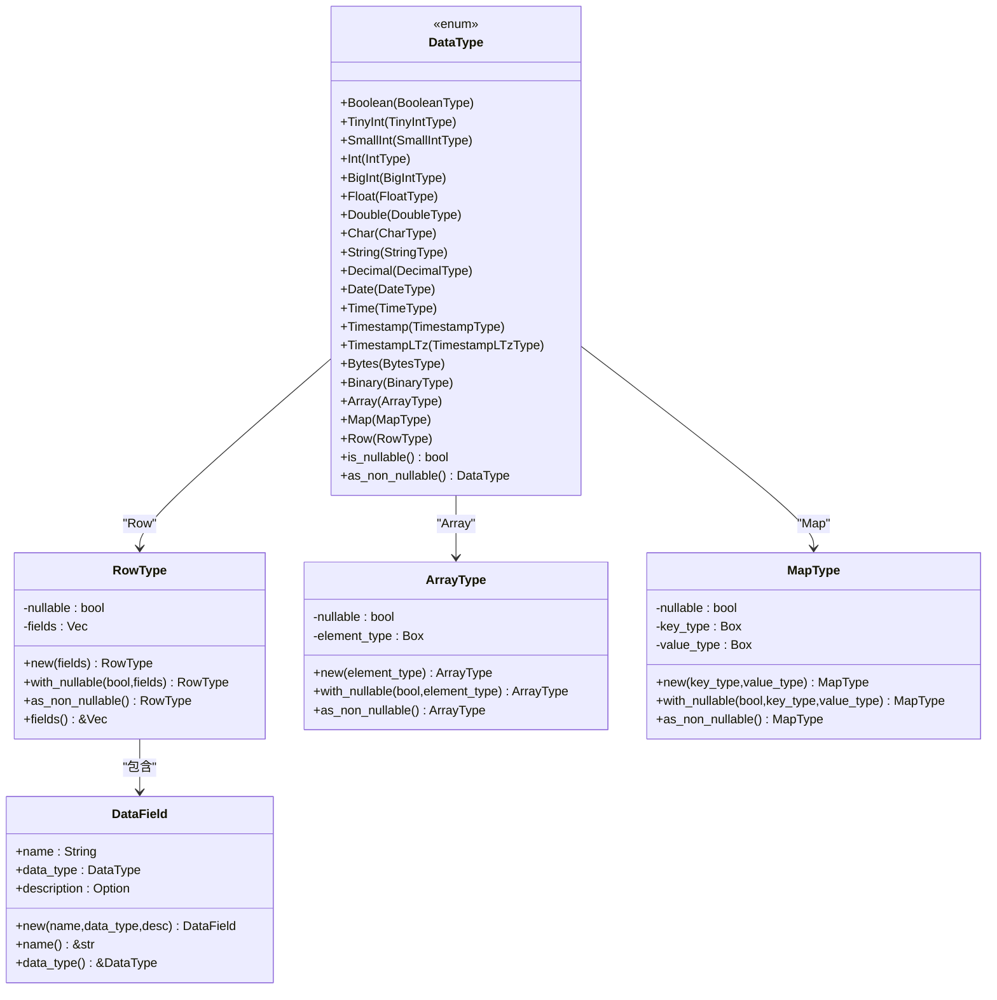
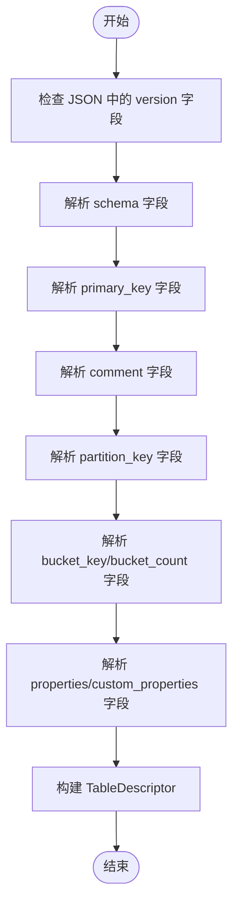
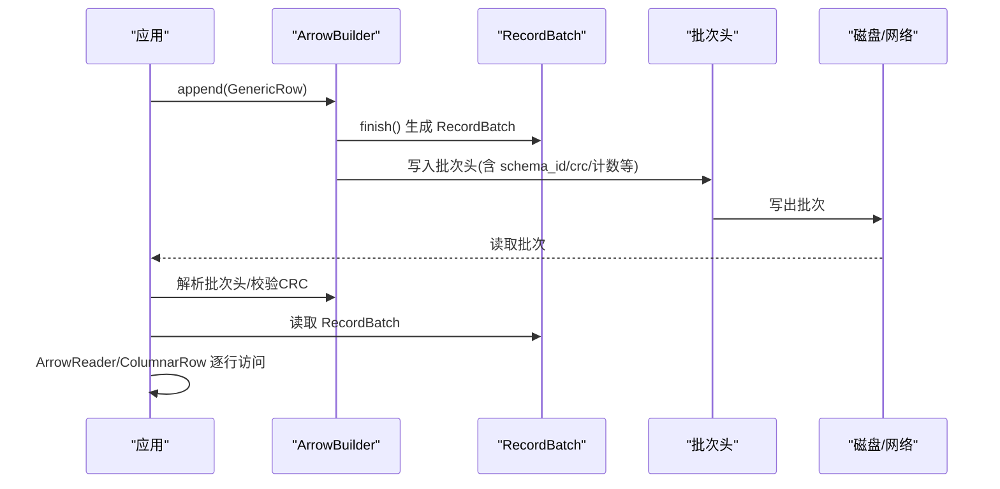
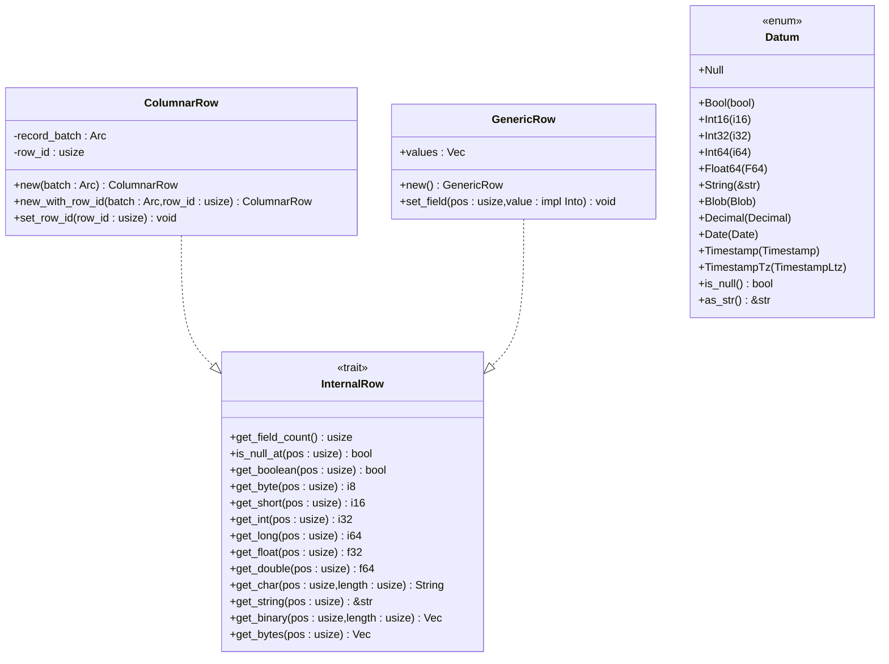
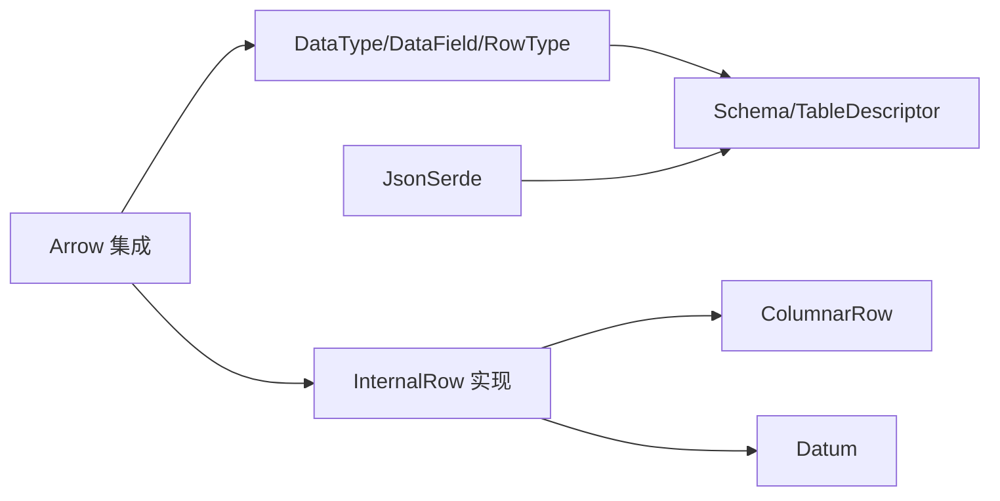

# Schema 管理

<cite>
**本文引用的文件**
- [table.rs](file://crates/fluss/src/metadata/table.rs)
- [datatype.rs](file://crates/fluss/src/metadata/datatype.rs)
- [json_serde.rs](file://crates/fluss/src/metadata/json_serde.rs)
- [arrow.rs](file://crates/fluss/src/record/arrow.rs)
- [column.rs](file://crates/fluss/src/row/column.rs)
- [datum.rs](file://crates/fluss/src/row/datum.rs)
- [mod.rs](file://crates/fluss/src/row/mod.rs)
- [example_table.rs](file://crates/examples/src/example_table.rs)
</cite>

## 目录
1. [简介](#简介)
2. [项目结构](#项目结构)
3. [核心组件](#核心组件)
4. [架构总览](#架构总览)
5. [详细组件分析](#详细组件分析)
6. [依赖关系分析](#依赖关系分析)
7. [性能考量](#性能考量)
8. [故障排查指南](#故障排查指南)
9. [结论](#结论)
10. [附录](#附录)

## 简介
本文件围绕 Fluss 的 Schema 管理功能进行系统化文档化，重点解释 TableDescriptor 的设计与实现、字段定义与数据类型映射、约束条件、版本管理与兼容性检查、迁移策略，以及与 Arrow 格式的集成与性能优化。文档同时提供面向初学者的渐进式讲解与面向开发者的代码级细节，帮助读者快速理解并正确使用 Schema 管理能力。

## 项目结构
Schema 管理相关代码主要分布在以下模块：
- 元数据层：表结构定义、数据类型系统、JSON 序列化/反序列化
- 记录层：Arrow 集成、批记录构建与读取
- 行访问层：通用行与列式行接口及实现

图表来源
- [table.rs](file://crates/fluss/src/metadata/table.rs#L26-L144)
- [datatype.rs](file://crates/fluss/src/metadata/datatype.rs#L21-L44)
- [json_serde.rs](file://crates/fluss/src/metadata/json_serde.rs#L25-L464)
- [arrow.rs](file://crates/fluss/src/record/arrow.rs#L402-L447)
- [mod.rs](file://crates/fluss/src/row/mod.rs#L26-L74)
- [column.rs](file://crates/fluss/src/row/column.rs#L25-L48)
- [datum.rs](file://crates/fluss/src/row/datum.rs#L37-L63)

章节来源
- [table.rs](file://crates/fluss/src/metadata/table.rs#L1-L921)
- [datatype.rs](file://crates/fluss/src/metadata/datatype.rs#L1-L815)
- [json_serde.rs](file://crates/fluss/src/metadata/json_serde.rs#L1-L465)
- [arrow.rs](file://crates/fluss/src/record/arrow.rs#L1-L546)
- [mod.rs](file://crates/fluss/src/row/mod.rs#L1-L149)
- [column.rs](file://crates/fluss/src/row/column.rs#L1-L170)
- [datum.rs](file://crates/fluss/src/row/datum.rs#L1-L288)

## 核心组件
- Column：列定义，包含名称、数据类型、注释等
- Schema：表的逻辑模式，由列集合与主键约束组成，并派生出 Row 数据类型
- TableDescriptor：物理表描述，包含 Schema、分区键、分桶配置、属性等
- DataType/DataField/RowType：数据类型系统，覆盖标量、数组、映射、嵌套行等
- JsonSerde：Schema/TableDescriptor 的 JSON 序列化/反序列化
- Arrow 集成：将 Fluss 的 DataType 映射到 Arrow Schema/类型，支持批构建与读取

章节来源
- [table.rs](file://crates/fluss/src/metadata/table.rs#L26-L144)
- [datatype.rs](file://crates/fluss/src/metadata/datatype.rs#L21-L815)
- [json_serde.rs](file://crates/fluss/src/metadata/json_serde.rs#L25-L464)
- [arrow.rs](file://crates/fluss/src/record/arrow.rs#L402-L447)

## 架构总览
Schema 管理从“定义”到“持久化/传输”的关键流程如下：
- 定义阶段：通过 SchemaBuilder/Column 定义列与主键
- 模型阶段：Schema 自动派生 RowType；TableDescriptorBuilder 组装表级属性
- 序列化阶段：JsonSerde 将 Schema/TableDescriptor 转换为 JSON
- 存储/传输阶段：Arrow 集成将 RowType 转换为 Arrow Schema，用于批构建与读取

图表来源
- [table.rs](file://crates/fluss/src/metadata/table.rs#L101-L215)
- [table.rs](file://crates/fluss/src/metadata/table.rs#L287-L374)
- [json_serde.rs](file://crates/fluss/src/metadata/json_serde.rs#L232-L295)
- [json_serde.rs](file://crates/fluss/src/metadata/json_serde.rs#L328-L464)
- [arrow.rs](file://crates/fluss/src/record/arrow.rs#L402-L447)

## 详细组件分析

### TableDescriptor 设计与实现
- 角色定位：承载表的物理属性（Schema、分区键、分桶键/数量、属性、注释等）
- 关键点：
  - 分布规则校验：分桶键不可与分区键重叠；主键表的分桶键必须是主键去掉分区键后的子集
  - 默认分桶键：当主键存在且未显式指定分桶键时，默认使用“物理主键-分区键”
  - 属性管理：复制因子、KV/日志格式等以字符串键值形式存储
- 构建器：TableDescriptorBuilder 提供链式设置方法，最终 build() 校验并产出 TableDescriptor

图表来源
- [table.rs](file://crates/fluss/src/metadata/table.rs#L287-L374)
- [table.rs](file://crates/fluss/src/metadata/table.rs#L376-L565)

章节来源
- [table.rs](file://crates/fluss/src/metadata/table.rs#L287-L565)

### Schema 与 Column
- Column：包含名称、数据类型、注释
- Schema：包含列集合、可选主键、以及派生的 RowType（DataType::Row）
- SchemaBuilder：提供 with_row_type/with_columns/column/primary_key 等方法，build() 时执行列名去重、主键完整性与可空性规范化

图表来源
- [table.rs](file://crates/fluss/src/metadata/table.rs#L26-L144)
- [table.rs](file://crates/fluss/src/metadata/table.rs#L146-L268)

章节来源
- [table.rs](file://crates/fluss/src/metadata/table.rs#L26-L268)

### 数据类型系统（DataType/DataField/RowType）
- 基本类型：布尔、整数系列、浮点系列、字符、字符串、十进制、日期、时间、时间戳、字节/二进制等
- 复合类型：数组（元素类型）、映射（键值类型）、行（字段列表）
- 可空性：每个类型都支持可空标记，提供非空转换方法
- 工具类：DataTypes 提供便捷构造函数，DataField 用于行内字段定义

图表来源
- [datatype.rs](file://crates/fluss/src/metadata/datatype.rs#L21-L815)

章节来源
- [datatype.rs](file://crates/fluss/src/metadata/datatype.rs#L21-L815)

### JSON 序列化与版本管理
- JsonSerde trait：为 DataType/Column/Schema/TableDescriptor 提供统一的 JSON 序列化/反序列化
- 版本字段：Schema/TableDescriptor 在 JSON 中包含 version 字段，便于未来演进与兼容性检查
- 列定义：支持 name、data_type、comment
- 表定义：支持 schema、comment、partition_key、bucket_key、bucket_count、properties、custom_properties

图表来源
- [json_serde.rs](file://crates/fluss/src/metadata/json_serde.rs#L225-L295)
- [json_serde.rs](file://crates/fluss/src/metadata/json_serde.rs#L297-L464)

章节来源
- [json_serde.rs](file://crates/fluss/src/metadata/json_serde.rs#L25-L464)

### 与 Arrow 的集成与性能优化
- 类型映射：to_arrow_type 将 Fluss 的 DataType 映射到 Arrow 的基础类型；to_arrow_schema 将 RowType 映射为 Arrow Schema
- 批构建：MemoryLogRecordsArrowBuilder 使用 Arrow 的 ArrayBuilder 逐列构建 RecordBatch，并写入自定义批次头
- 读取：LogRecordBatch 解析批次头后，结合 Arrow Metadata 读取 RecordBatch，通过 ArrowReader/ColumnarRow 提供行访问
- 性能要点：
  - 列式存储减少序列化开销
  - 批量写入（默认最大记录数常量）提升吞吐
  - CRC 校验保证数据完整性
  - 支持不同 WriterId/BatchSequence 追踪幂等性（预留）

图表来源
- [arrow.rs](file://crates/fluss/src/record/arrow.rs#L104-L230)
- [arrow.rs](file://crates/fluss/src/record/arrow.rs#L280-L400)
- [arrow.rs](file://crates/fluss/src/record/arrow.rs#L528-L544)

章节来源
- [arrow.rs](file://crates/fluss/src/record/arrow.rs#L1-L546)

### 行访问层（ColumnarRow/GenericRow/Datum）
- InternalRow：统一的行访问接口，支持布尔、整数、浮点、字符串、二进制等读取
- ColumnarRow：基于 Arrow RecordBatch 的列式行实现，按列索引读取对应数组
- GenericRow：通用行，内部持有 Datum 列表，用于中间态或测试场景
- Datum：统一的值类型族，支持 Null、布尔、整数、浮点、字符串、Blob、Decimal、Date、Timestamp/TimestampTz 等

图表来源
- [mod.rs](file://crates/fluss/src/row/mod.rs#L26-L74)
- [column.rs](file://crates/fluss/src/row/column.rs#L25-L170)
- [datum.rs](file://crates/fluss/src/row/datum.rs#L37-L288)

章节来源
- [mod.rs](file://crates/fluss/src/row/mod.rs#L1-L149)
- [column.rs](file://crates/fluss/src/row/column.rs#L1-L170)
- [datum.rs](file://crates/fluss/src/row/datum.rs#L1-L288)

## 依赖关系分析
- 元数据层依赖：Schema/DataType 作为核心模型，TableDescriptor 依赖 Schema 与分布策略
- 序列化层：JsonSerde 依赖 DataType/Column/Schema/TableDescriptor 的具体实现
- 记录层：Arrow 集成依赖 DataType/RowType 映射，以及行访问层的实现
- 行访问层：ColumnarRow/GenericRow 依赖 Arrow 的 RecordBatch 与 Datum

图表来源
- [table.rs](file://crates/fluss/src/metadata/table.rs#L26-L144)
- [datatype.rs](file://crates/fluss/src/metadata/datatype.rs#L21-L815)
- [json_serde.rs](file://crates/fluss/src/metadata/json_serde.rs#L25-L464)
- [arrow.rs](file://crates/fluss/src/record/arrow.rs#L402-L447)
- [mod.rs](file://crates/fluss/src/row/mod.rs#L26-L74)
- [column.rs](file://crates/fluss/src/row/column.rs#L25-L170)
- [datum.rs](file://crates/fluss/src/row/datum.rs#L37-L288)

章节来源
- [table.rs](file://crates/fluss/src/metadata/table.rs#L1-L921)
- [datatype.rs](file://crates/fluss/src/metadata/datatype.rs#L1-L815)
- [json_serde.rs](file://crates/fluss/src/metadata/json_serde.rs#L1-L465)
- [arrow.rs](file://crates/fluss/src/record/arrow.rs#L1-L546)
- [mod.rs](file://crates/fluss/src/row/mod.rs#L1-L149)
- [column.rs](file://crates/fluss/src/row/column.rs#L1-L170)
- [datum.rs](file://crates/fluss/src/row/datum.rs#L1-L288)

## 性能考量
- 列式存储：Arrow 的列式布局在扫描与聚合场景下具有显著优势
- 批处理：MemoryLogRecordsArrowBuilder 使用固定上限的记录数批量写入，降低系统调用次数
- 类型映射：精确的 Arrow 类型映射避免不必要的装箱与转换
- 校验与幂等：批次头包含 CRC、WriterId、BatchSequence 等字段，便于快速校验与幂等控制
- 可空性：合理设置可空性可减少冗余存储与比较成本

[本节为通用性能讨论，不直接分析特定文件]

## 故障排查指南
- 主键约束错误
  - 现象：构建 TableDescriptor 时报错，提示分桶键包含分区键或分桶键不是主键的子集
  - 处理：确认分区键与分桶键无交集；主键表的分桶键应为主键去除分区键后的子集
- 列名重复
  - 现象：SchemaBuilder.build() 抛出重复列名错误
  - 处理：确保列名唯一
- 可空性违规
  - 现象：主键列被设置为可空
  - 处理：自动规范化为主键列强制非空
- Arrow 类型不支持
  - 现象：to_arrow_type 对某些 Fluss 类型未实现映射
  - 处理：扩展映射或在上层转换为已支持类型

章节来源
- [table.rs](file://crates/fluss/src/metadata/table.rs#L217-L268)
- [table.rs](file://crates/fluss/src/metadata/table.rs#L510-L564)
- [arrow.rs](file://crates/fluss/src/record/arrow.rs#L425-L447)

## 结论
Fluss 的 Schema 管理以 DataType/DataField/RowType 为核心数据模型，配合 Schema/TableDescriptor 的构建与校验机制，实现了从逻辑模式到物理表的完整闭环。通过 JsonSerde 支持版本化与跨系统传输，借助 Arrow 的高性能列式存储与批处理能力，整体方案兼顾了表达力、可维护性与运行效率。建议在实际使用中：
- 明确主键与分区键，避免冲突
- 合理选择数据类型与可空性
- 使用 TableDescriptorBuilder 的链式 API 逐步构建
- 在需要复杂嵌套或数组时，优先采用 RowType/Map/Array 并配合 JSON 序列化

[本节为总结性内容，不直接分析特定文件]

## 附录

### 示例：定义复杂 Schema（嵌套结构、数组字段）
- 嵌套结构：使用 DataTypes::row 或 DataTypes::row_from_types 定义行字段
- 数组字段：使用 DataTypes::array 包裹元素类型
- 示例参考路径：[示例程序](file://crates/examples/src/example_table.rs#L34-L41)

章节来源
- [example_table.rs](file://crates/examples/src/example_table.rs#L34-L41)
- [datatype.rs](file://crates/fluss/src/metadata/datatype.rs#L773-L787)