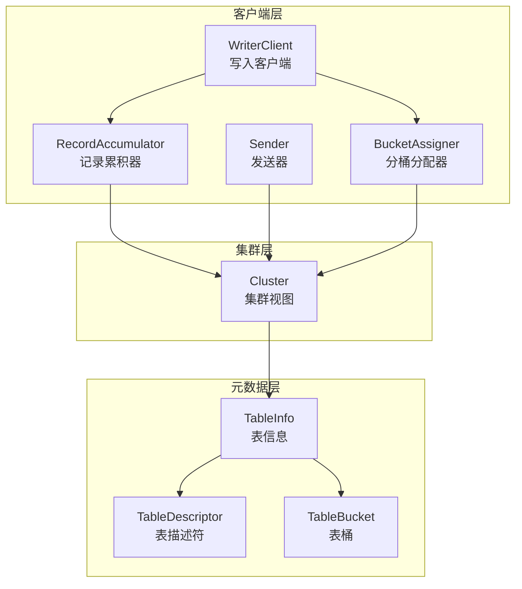
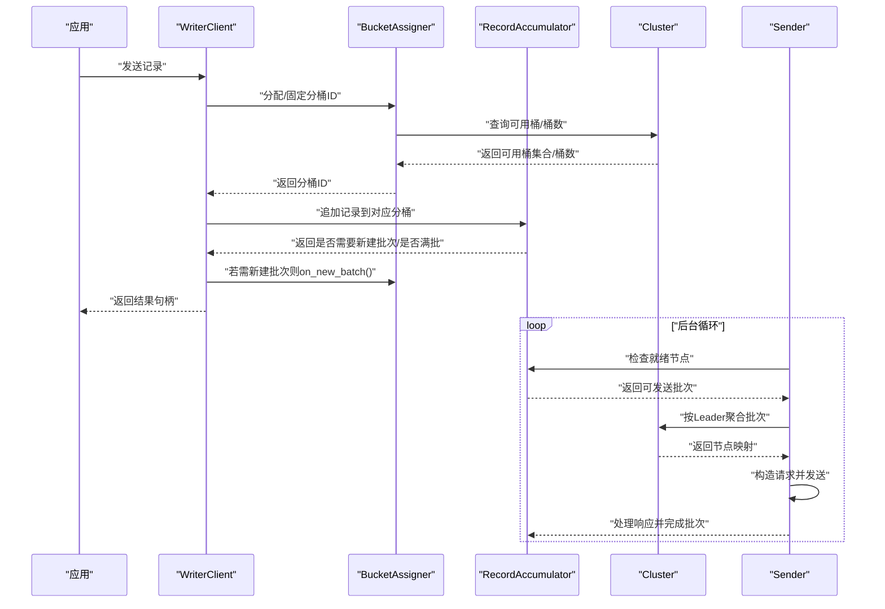
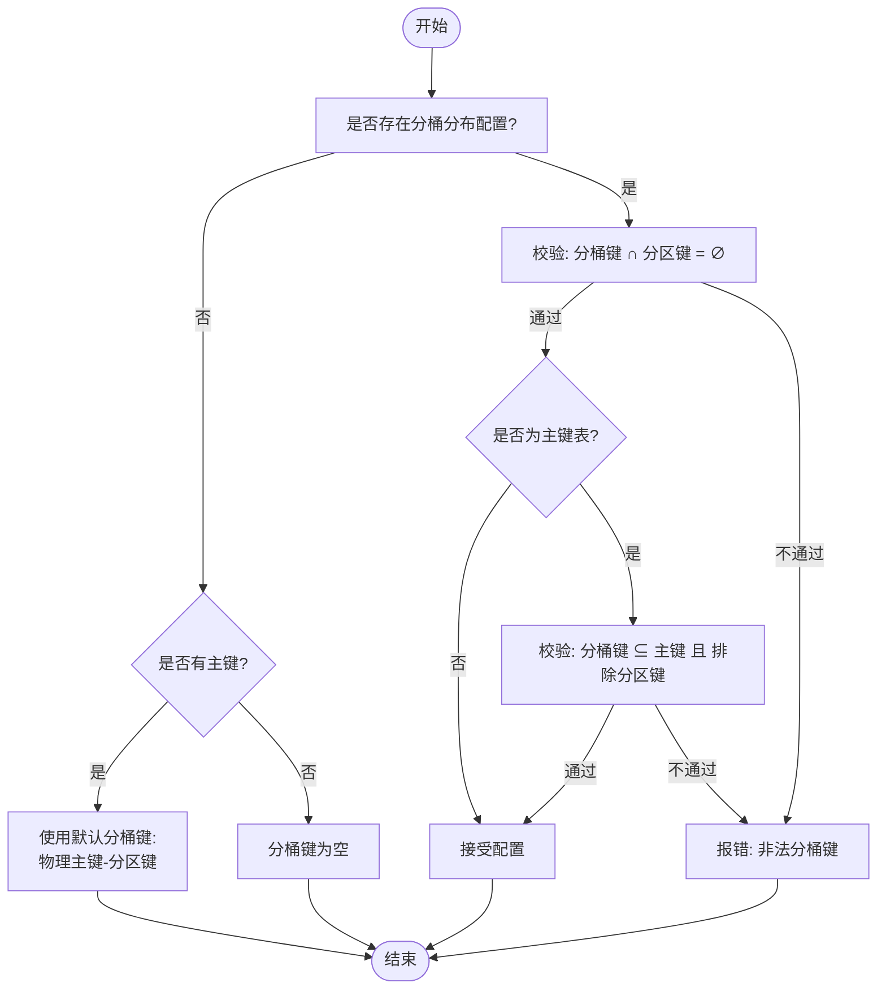
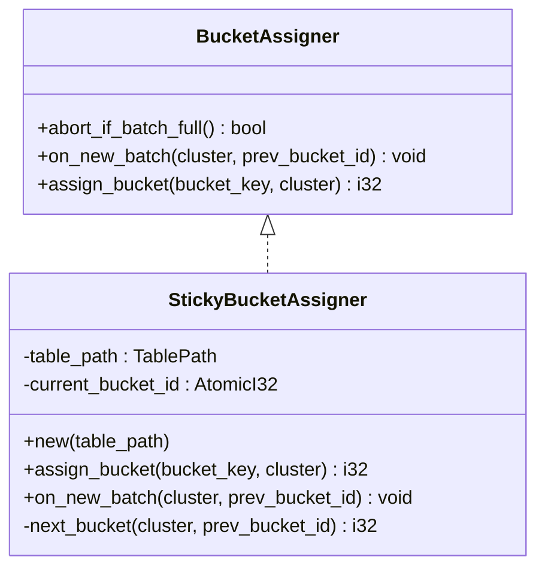
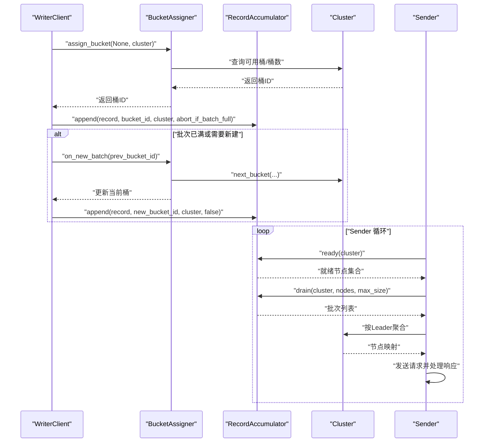
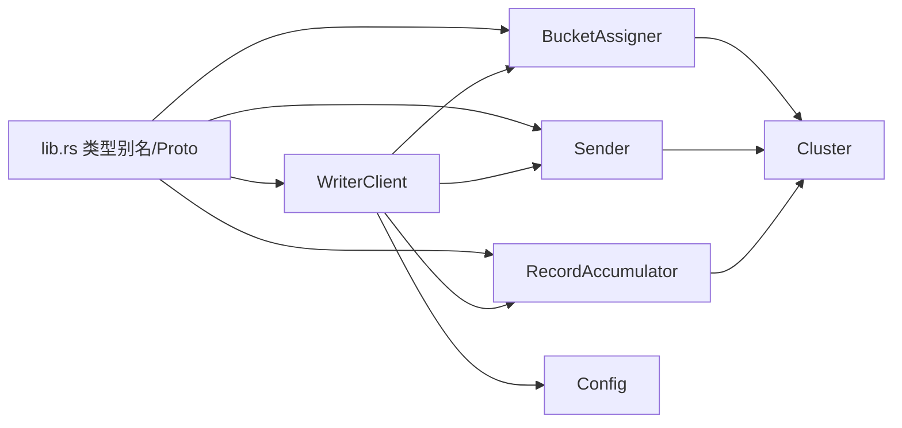

# 分区与分桶配置

<cite>
**本文引用的文件**
- [lib.rs](file://crates/fluss/src/lib.rs)
- [config.rs](file://crates/fluss/src/config.rs)
- [client/mod.rs](file://crates/fluss/src/client/mod.rs)
- [write/mod.rs](file://crates/fluss/src/client/write/mod.rs)
- [bucket_assigner.rs](file://crates/fluss/src/client/write/bucket_assigner.rs)
- [writer_client.rs](file://crates/fluss/src/client/write/writer_client.rs)
- [accumulator.rs](file://crates/fluss/src/client/write/accumulator.rs)
- [batch.rs](file://crates/fluss/src/client/write/batch.rs)
- [sender.rs](file://crates/fluss/src/client/write/sender.rs)
- [cluster.rs](file://crates/fluss/src/cluster/cluster.rs)
- [table.rs](file://crates/fluss/src/metadata/table.rs)
</cite>

## 目录
1. [引言](#引言)
2. [项目结构](#项目结构)
3. [核心组件](#核心组件)
4. [架构总览](#架构总览)
5. [详细组件分析](#详细组件分析)
6. [依赖分析](#依赖分析)
7. [性能考虑](#性能考虑)
8. [故障排查指南](#故障排查指南)
9. [结论](#结论)
10. [附录：配置示例与最佳实践](#附录配置示例与最佳实践)

## 引言
本文件围绕“分区与分桶配置”主题，系统性阐述该系统的分区策略设计与实现细节，包括分区键选择、分区数量配置、分桶数量与分桶键、分桶分配算法、负载均衡策略，以及它们在数据分布、并发处理与性能优化方面的综合影响。同时覆盖动态分区调整与分桶重新平衡的高级能力，并给出与写入客户端协作关系及性能调优建议。

## 项目结构
本项目采用模块化组织，与分区/分桶相关的关键模块集中在 client、cluster、metadata 与 proto 等子模块中。其中：
- client 写入路径包含写入客户端、批次累积器、发送器、分桶分配器等；
- cluster 提供集群视图、表桶位置与可用性信息；
- metadata 定义表结构、分桶分布、表描述符与表信息等元数据模型；
- lib.rs 暴露类型别名（如 TableId、PartitionId、BucketId），并在 proto 子模块中生成协议定义。

图表来源
- [writer_client.rs](file://crates/fluss/src/client/write/writer_client.rs#L32-L77)
- [accumulator.rs](file://crates/fluss/src/client/write/accumulator.rs#L35-L61)
- [sender.rs](file://crates/fluss/src/client/write/sender.rs#L31-L61)
- [bucket_assigner.rs](file://crates/fluss/src/client/write/bucket_assigner.rs#L23-L29)
- [cluster.rs](file://crates/fluss/src/cluster/cluster.rs#L29-L39)
- [table.rs](file://crates/fluss/src/metadata/table.rs#L376-L481)
- [table.rs](file://crates/fluss/src/metadata/table.rs#L634-L672)
- [table.rs](file://crates/fluss/src/metadata/table.rs#L893-L921)

章节来源
- [lib.rs](file://crates/fluss/src/lib.rs#L18-L37)
- [client/mod.rs](file://crates/fluss/src/client/mod.rs#L18-L27)
- [write/mod.rs](file://crates/fluss/src/client/write/mod.rs#L18-L35)

## 核心组件
- 表描述与分桶分布
  - TableDescriptor：用于构建表的分区键与分桶配置（分桶数量、分桶键），并进行合法性校验（如分桶键不可与分区键重叠、主键表的分桶键必须是主键子集且排除分区键）。
  - TableInfo：承载表的物理主键、分桶键、分区键、分桶数量等运行时信息。
- 集群视图
  - Cluster：维护表桶到 Leader 节点的映射、可用桶列表、表信息等，支持按表路径查询可用桶与桶数量。
- 分桶分配器
  - BucketAssigner 接口与 StickyBucketAssigner 实现：负责在新批次或批次满时选择/固定分桶 ID，优先使用可用桶，否则回退到随机桶。
- 写入客户端与发送链路
  - WriterClient：协调分桶分配、记录累积与发送；根据配置决定 ACK 数量。
  - RecordAccumulator：按表与分桶聚合待发送批次，支持超时/大小触发发送。
  - Sender：从累积器取出可发送批次，按目标节点聚合请求并发送，处理响应完成批次。
- 批次与序列化
  - WriteBatch/ArrowLogWriteBatch：封装批次生命周期、追加记录、序列化与完成回调。

章节来源
- [table.rs](file://crates/fluss/src/metadata/table.rs#L270-L285)
- [table.rs](file://crates/fluss/src/metadata/table.rs#L376-L565)
- [table.rs](file://crates/fluss/src/metadata/table.rs#L634-L869)
- [cluster.rs](file://crates/fluss/src/cluster/cluster.rs#L29-L86)
- [cluster.rs](file://crates/fluss/src/cluster/cluster.rs#L207-L232)
- [bucket_assigner.rs](file://crates/fluss/src/client/write/bucket_assigner.rs#L23-L29)
- [bucket_assigner.rs](file://crates/fluss/src/client/write/bucket_assigner.rs#L32-L103)
- [writer_client.rs](file://crates/fluss/src/client/write/writer_client.rs#L32-L77)
- [writer_client.rs](file://crates/fluss/src/client/write/writer_client.rs#L89-L146)
- [accumulator.rs](file://crates/fluss/src/client/write/accumulator.rs#L35-L61)
- [accumulator.rs](file://crates/fluss/src/client/write/accumulator.rs#L128-L162)
- [sender.rs](file://crates/fluss/src/client/write/sender.rs#L31-L61)
- [batch.rs](file://crates/fluss/src/client/write/batch.rs#L67-L128)

## 架构总览
下图展示了从写入客户端到集群与元数据的整体交互流程，重点体现分桶分配、批次累积与发送过程中的关键决策点。

图表来源
- [writer_client.rs](file://crates/fluss/src/client/write/writer_client.rs#L89-L123)
- [bucket_assigner.rs](file://crates/fluss/src/client/write/bucket_assigner.rs#L90-L101)
- [accumulator.rs](file://crates/fluss/src/client/write/accumulator.rs#L164-L242)
- [sender.rs](file://crates/fluss/src/client/write/sender.rs#L63-L106)
- [cluster.rs](file://crates/fluss/src/cluster/cluster.rs#L207-L232)

## 详细组件分析

### 分区与分桶的建模与约束
- 分区键（partition_keys）
  - 通过 TableDescriptorBuilder.partitioned_by 设置，用于表级分区。
  - 在分桶分布规范化过程中，分桶键不得包含任何分区键列。
- 分桶键（bucket_keys）
  - 通过 TableDescriptorBuilder.distributed_by 设置分桶数量与分桶键。
  - 对于有主键的表，分桶键必须是主键的子集，并且排除分区键；若未显式设置分桶键，则默认使用“物理主键（去除分区键）”作为分桶键。
- 分桶数量（bucket_count）
  - 可显式指定；若未指定且存在主键表，则由系统推导默认值（来自表信息）。
- 合法性校验
  - 分桶键与分区键不可重叠；
  - 主键表的分桶键必须是主键子集且排除分区键；
  - 若违反上述规则，将抛出非法表错误。

图表来源
- [table.rs](file://crates/fluss/src/metadata/table.rs#L510-L565)
- [table.rs](file://crates/fluss/src/metadata/table.rs#L487-L508)

章节来源
- [table.rs](file://crates/fluss/src/metadata/table.rs#L340-L351)
- [table.rs](file://crates/fluss/src/metadata/table.rs#L345-L350)
- [table.rs](file://crates/fluss/src/metadata/table.rs#L402-L415)
- [table.rs](file://crates/fluss/src/metadata/table.rs#L469-L481)
- [table.rs](file://crates/fluss/src/metadata/table.rs#L510-L565)

### 分桶分配器与负载均衡
- 接口与职责
  - BucketAssigner：抽象分桶分配行为，提供 on_new_batch 与 assign_bucket 等方法。
- StickyBucketAssigner 实现
  - 初始阶段：若无可用桶，随机选择一个桶；若仅有一个可用桶，直接使用；否则在可用桶集合中随机挑选一个不同于上一次的桶。
  - 固定策略：一旦确定当前桶，后续批次尽量沿用同一桶（粘性），以提升局部性与吞吐。
  - 新批次场景：当累积器判定批次已满或需要新建批次时，触发 on_new_batch 以更新当前桶。
- 负载均衡策略
  - 优先使用“可用桶”集合，避免向无 Leader 的桶写入；
  - 在可用桶范围内进行随机选择，有助于跨节点均匀分布；
  - 结合 Sender 的节点级轮询与按节点聚合，进一步实现跨节点的负载均衡。

图表来源
- [bucket_assigner.rs](file://crates/fluss/src/client/write/bucket_assigner.rs#L23-L29)
- [bucket_assigner.rs](file://crates/fluss/src/client/write/bucket_assigner.rs#L32-L103)

章节来源
- [bucket_assigner.rs](file://crates/fluss/src/client/write/bucket_assigner.rs#L23-L29)
- [bucket_assigner.rs](file://crates/fluss/src/client/write/bucket_assigner.rs#L45-L83)
- [bucket_assigner.rs](file://crates/fluss/src/client/write/bucket_assigner.rs#L90-L101)

### 写入客户端与批次累积
- WriterClient
  - 维护 RecordAccumulator、Sender、Metadata 与 BucketAssigner 映射；
  - send 流程：获取/创建分桶分配器 → 分配桶 → 追加记录 → 若需新建批次则 on_new_batch 并重新分配桶 → 返回结果句柄；
  - 支持 flush 与关闭。
- RecordAccumulator
  - 按表与分桶维护批次队列，支持尝试追加、新建批次、就绪检查、按节点聚合与清空；
  - 就绪判断：批次大小/超时/关闭/刷新状态满足其一即视为可发送；
  - drain：按节点轮询桶，聚合不超过最大请求大小的批次。
- Sender
  - 周期性检查就绪节点，从累积器取出批次，按目标节点聚合请求并发送；
  - 处理响应，完成批次并清理飞行中批次。

图表来源
- [writer_client.rs](file://crates/fluss/src/client/write/writer_client.rs#L89-L123)
- [accumulator.rs](file://crates/fluss/src/client/write/accumulator.rs#L128-L162)
- [accumulator.rs](file://crates/fluss/src/client/write/accumulator.rs#L164-L242)
- [sender.rs](file://crates/fluss/src/client/write/sender.rs#L63-L106)
- [cluster.rs](file://crates/fluss/src/cluster/cluster.rs#L207-L232)

章节来源
- [writer_client.rs](file://crates/fluss/src/client/write/writer_client.rs#L32-L77)
- [writer_client.rs](file://crates/fluss/src/client/write/writer_client.rs#L89-L146)
- [accumulator.rs](file://crates/fluss/src/client/write/accumulator.rs#L35-L61)
- [accumulator.rs](file://crates/fluss/src/client/write/accumulator.rs#L128-L162)
- [accumulator.rs](file://crates/fluss/src/client/write/accumulator.rs#L244-L333)
- [sender.rs](file://crates/fluss/src/client/write/sender.rs#L31-L61)
- [sender.rs](file://crates/fluss/src/client/write/sender.rs#L120-L167)

### 元数据与集群视图
- TableInfo
  - 记录表的物理主键、分桶键、分区键、分桶数量、属性等；
  - 提供 to_table_descriptor 方法，便于序列化/传输。
- Cluster
  - 维护表桶到 Leader 的映射、可用桶列表、表信息；
  - 提供 get_available_buckets_for_table_path、get_bucket_count、leader_for 等查询接口。

章节来源
- [table.rs](file://crates/fluss/src/metadata/table.rs#L634-L869)
- [table.rs](file://crates/fluss/src/metadata/table.rs#L844-L857)
- [cluster.rs](file://crates/fluss/src/cluster/cluster.rs#L29-L86)
- [cluster.rs](file://crates/fluss/src/cluster/cluster.rs#L207-L243)

## 依赖分析
- 组件耦合
  - WriterClient 依赖 BucketAssigner、RecordAccumulator、Sender 与 Metadata；
  - RecordAccumulator 依赖 Cluster 查询表桶与 Leader；
  - Sender 依赖 Metadata 获取连接并按节点聚合请求；
  - BucketAssigner 依赖 Cluster 查询可用桶与桶数。
- 外部依赖
  - 配置来源于 Config（ACK、重试、批大小等）；
  - 类型别名与协议定义来自 lib.rs 与 proto 子模块。

图表来源
- [writer_client.rs](file://crates/fluss/src/client/write/writer_client.rs#L32-L77)
- [accumulator.rs](file://crates/fluss/src/client/write/accumulator.rs#L35-L61)
- [sender.rs](file://crates/fluss/src/client/write/sender.rs#L31-L61)
- [bucket_assigner.rs](file://crates/fluss/src/client/write/bucket_assigner.rs#L18-L29)
- [config.rs](file://crates/fluss/src/config.rs#L21-L39)
- [lib.rs](file://crates/fluss/src/lib.rs#L31-L37)

章节来源
- [config.rs](file://crates/fluss/src/config.rs#L21-L39)
- [lib.rs](file://crates/fluss/src/lib.rs#L31-L37)

## 性能考虑
- 分桶数量
  - 增加分桶数量可提升并发写入与负载均衡效果，但会增加元数据与寻址开销；应结合写入峰值与节点容量评估。
- 分桶键选择
  - 主键表建议使用“物理主键（剔除分区键）”作为默认分桶键，确保热点分散；
  - 若业务具备稳定的分桶键（如用户 ID、地域等），可显式配置以提升局部性与查询效率。
- 批次与网络参数
  - 合理设置 writer_batch_size 与 request_max_size，避免单请求过大导致压缩/传输压力；
  - ACK 策略（all 或具体副本数）影响端到端确认延迟与可靠性权衡。
- 负载均衡
  - StickyBucketAssigner 的粘性策略减少跨桶切换成本；
  - Sender 按节点聚合与轮询，配合可用桶集合，降低热点桶与节点压力。

## 故障排查指南
- 常见错误
  - 非法分桶键：分桶键与分区键重叠，或主键表的分桶键不是主键子集且排除分区键，将触发非法表错误。
  - 无可用桶：当所有桶均无 Leader 时，分桶分配器回退到随机桶，可能引发写入失败或延迟。
  - 发送失败：Sender 处理响应时若出现错误码，需检查对应桶的 Leader 状态与网络连通性。
- 排查步骤
  - 检查表描述符构建是否符合分桶/分区约束；
  - 查看 Cluster 中可用桶列表与 Leader 映射；
  - 关注 Sender 的响应处理逻辑与飞行批次清理；
  - 校验 WriterClient 的 ACK 配置与累积器就绪检查周期。

章节来源
- [table.rs](file://crates/fluss/src/metadata/table.rs#L510-L565)
- [cluster.rs](file://crates/fluss/src/cluster/cluster.rs#L130-L162)
- [sender.rs](file://crates/fluss/src/client/write/sender.rs#L169-L186)
- [writer_client.rs](file://crates/fluss/src/client/write/writer_client.rs#L79-L87)

## 结论
本系统通过明确的表描述与分桶分布模型、基于可用桶的分桶分配器与粘性策略、以及累积器与发送器的协同机制，实现了高效、可扩展的分区与分桶写入路径。合理配置分桶数量与分桶键、结合 ACK 与批大小参数，可在保证高吞吐的同时实现良好的负载均衡与稳定性。

## 附录：配置示例与最佳实践
- 分区策略
  - 范围分区：通过分区键表达时间/数值范围，结合分桶键实现热点分散；
  - 哈希分区：使用哈希函数对分区键计算分区 ID，再结合分桶键；
  - 复合分区：多列组合形成复合分区键，适用于多维过滤场景。
- 分桶策略
  - 默认分桶键：主键表默认使用“物理主键（剔除分区键）”；
  - 自定义分桶键：选择业务稳定字段（如用户 ID、地域）作为分桶键；
  - 动态调整：通过修改表描述符的分桶数量与分桶键，触发分桶重新平衡。
- 写入客户端协作
  - 使用 WriterClient 的 send 接口进行异步写入，结合 ResultHandle 获取写入结果；
  - 在高并发场景下，适当增大 writer_batch_size 与 request_max_size，减少请求次数；
  - 根据可靠性需求设置 writer_acks，平衡延迟与一致性。

章节来源
- [table.rs](file://crates/fluss/src/metadata/table.rs#L340-L351)
- [table.rs](file://crates/fluss/src/metadata/table.rs#L345-L350)
- [table.rs](file://crates/fluss/src/metadata/table.rs#L402-L415)
- [table.rs](file://crates/fluss/src/metadata/table.rs#L469-L481)
- [writer_client.rs](file://crates/fluss/src/client/write/writer_client.rs#L89-L146)
- [config.rs](file://crates/fluss/src/config.rs#L21-L39)