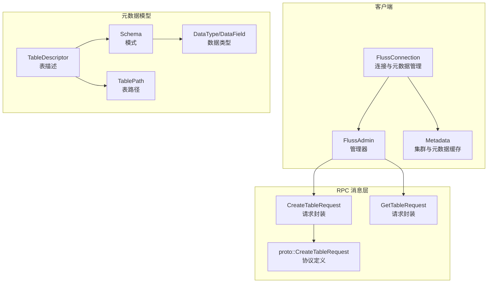
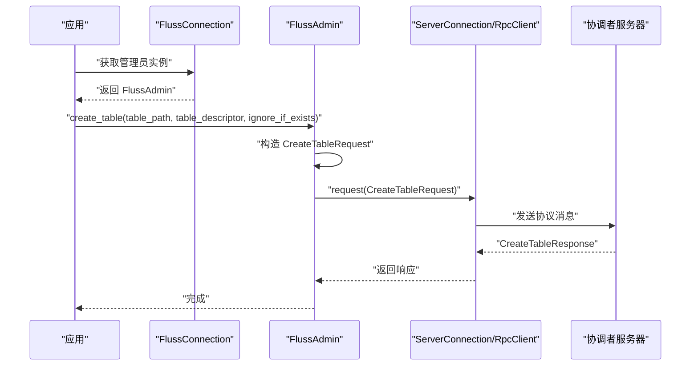
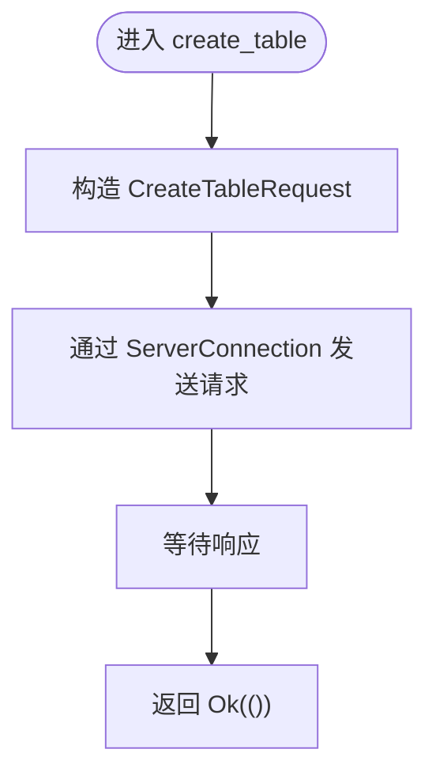
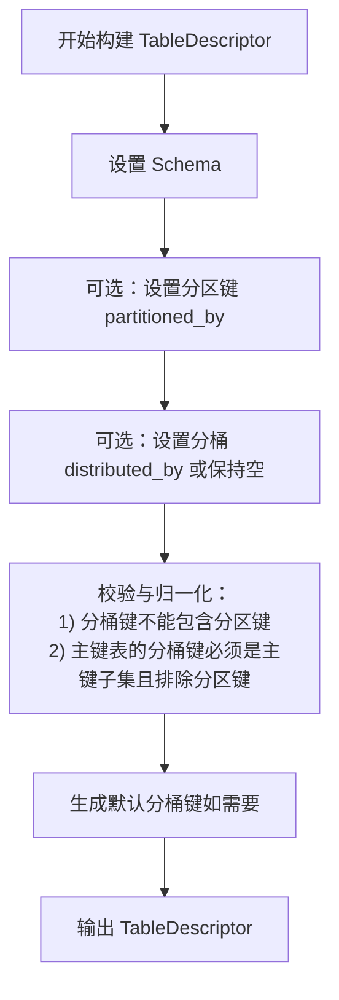
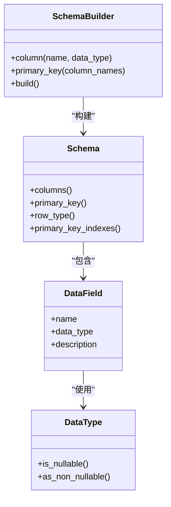
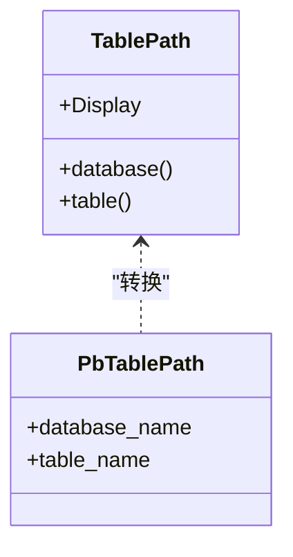
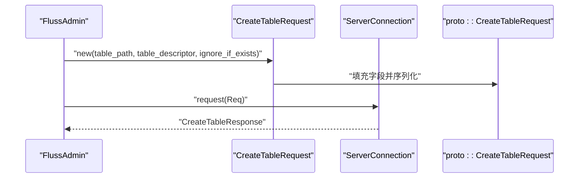
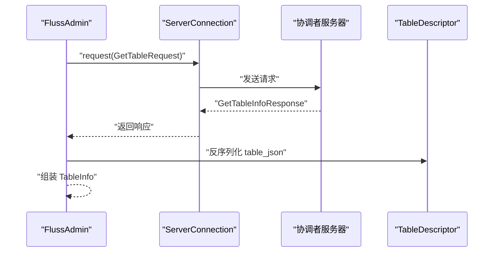
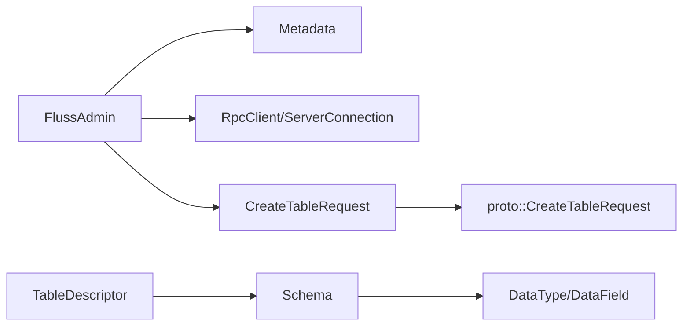

# 表创建

<cite>
**本文引用的文件**
- [crates/fluss/src/client/admin.rs](file://crates/fluss/src/client/admin.rs)
- [crates/fluss/src/metadata/table.rs](file://crates/fluss/src/metadata/table.rs)
- [crates/fluss/src/metadata/datatype.rs](file://crates/fluss/src/metadata/datatype.rs)
- [crates/fluss/src/proto/fluss_api.proto](file://crates/fluss/src/proto/fluss_api.proto)
- [crates/fluss/src/rpc/message/create_table.rs](file://crates/fluss/src/rpc/message/create_table.rs)
- [crates/fluss/src/rpc/message/get_table.rs](file://crates/fluss/src/rpc/message/get_table.rs)
- [crates/fluss/src/client/connection.rs](file://crates/fluss/src/client/connection.rs)
- [crates/fluss/src/client/metadata.rs](file://crates/fluss/src/client/metadata.rs)
- [crates/fluss/src/error.rs](file://crates/fluss/src/error.rs)
- [crates/examples/src/example_table.rs](file://crates/examples/src/example_table.rs)
</cite>

## 目录
1. [简介](#简介)
2. [项目结构](#项目结构)
3. [核心组件](#核心组件)
4. [架构总览](#架构总览)
5. [详细组件分析](#详细组件分析)
6. [依赖关系分析](#依赖关系分析)
7. [性能考量](#性能考量)
8. [故障排查指南](#故障排查指南)
9. [结论](#结论)
10. [附录](#附录)

## 简介
本文件围绕 Fluss 的“表创建”能力进行系统化说明，重点覆盖以下方面：
- FlussAdmin::create_table 方法的实现细节与使用模式
- TableDescriptor 的构建流程（Schema 定义、分区策略、分桶配置等）
- TablePath 的概念与命名规则
- ignore_if_exists 参数的作用与适用场景
- 与 RPC 层的交互过程（请求构建、发送、响应处理）
- 错误处理策略与常见问题的解决方案
- 多类表的创建示例（简单表、分区表、带分桶策略的表）

## 项目结构
围绕“表创建”的相关模块主要分布在以下位置：
- 客户端入口与管理器：client/admin.rs、client/connection.rs、client/metadata.rs
- 元数据模型：metadata/table.rs、metadata/datatype.rs
- RPC 请求消息：rpc/message/create_table.rs、rpc/message/get_table.rs
- 协议定义：proto/fluss_api.proto
- 示例：examples/example_table.rs
- 错误类型：error.rs

图表来源
- [crates/fluss/src/client/connection.rs](file://crates/fluss/src/client/connection.rs#L30-L82)
- [crates/fluss/src/client/admin.rs](file://crates/fluss/src/client/admin.rs#L28-L93)
- [crates/fluss/src/client/metadata.rs](file://crates/fluss/src/client/metadata.rs#L29-L109)
- [crates/fluss/src/rpc/message/create_table.rs](file://crates/fluss/src/rpc/message/create_table.rs#L32-L62)
- [crates/fluss/src/rpc/message/get_table.rs](file://crates/fluss/src/rpc/message/get_table.rs#L29-L54)
- [crates/fluss/src/metadata/table.rs](file://crates/fluss/src/metadata/table.rs#L376-L565)
- [crates/fluss/src/metadata/datatype.rs](file://crates/fluss/src/metadata/datatype.rs#L21-L800)
- [crates/fluss/src/proto/fluss_api.proto](file://crates/fluss/src/proto/fluss_api.proto#L117-L137)

章节来源
- [crates/fluss/src/client/connection.rs](file://crates/fluss/src/client/connection.rs#L30-L82)
- [crates/fluss/src/client/admin.rs](file://crates/fluss/src/client/admin.rs#L28-L93)
- [crates/fluss/src/client/metadata.rs](file://crates/fluss/src/client/metadata.rs#L29-L109)
- [crates/fluss/src/metadata/table.rs](file://crates/fluss/src/metadata/table.rs#L376-L565)
- [crates/fluss/src/metadata/datatype.rs](file://crates/fluss/src/metadata/datatype.rs#L21-L800)
- [crates/fluss/src/proto/fluss_api.proto](file://crates/fluss/src/proto/fluss_api.proto#L117-L137)
- [crates/fluss/src/rpc/message/create_table.rs](file://crates/fluss/src/rpc/message/create_table.rs#L32-L62)
- [crates/fluss/src/rpc/message/get_table.rs](file://crates/fluss/src/rpc/message/get_table.rs#L29-L54)

## 核心组件
- FlussAdmin::create_table：对外暴露的表创建入口，负责将 TablePath、TableDescriptor 和 ignore_if_exists 封装为 RPC 请求并发送。
- TableDescriptor/TableDescriptorBuilder：表的完整描述，包含 Schema、分区键、分桶配置、属性等。
- Schema/SchemaBuilder：表的列定义、主键约束、行类型等。
- TablePath：数据库与表名的二元组合，用于唯一标识一张表。
- DataType/DataField：字段类型与描述，支撑 Schema 构建。
- RPC 请求封装：CreateTableRequest/GetTableRequest，负责序列化与版本信息。
- 协议定义：proto::CreateTableRequest/GetTableInfoResponse，承载网络传输格式。

章节来源
- [crates/fluss/src/client/admin.rs](file://crates/fluss/src/client/admin.rs#L52-L67)
- [crates/fluss/src/metadata/table.rs](file://crates/fluss/src/metadata/table.rs#L287-L374)
- [crates/fluss/src/metadata/table.rs](file://crates/fluss/src/metadata/table.rs#L93-L144)
- [crates/fluss/src/metadata/table.rs](file://crates/fluss/src/metadata/table.rs#L603-L632)
- [crates/fluss/src/metadata/datatype.rs](file://crates/fluss/src/metadata/datatype.rs#L21-L800)
- [crates/fluss/src/rpc/message/create_table.rs](file://crates/fluss/src/rpc/message/create_table.rs#L32-L62)
- [crates/fluss/src/rpc/message/get_table.rs](file://crates/fluss/src/rpc/message/get_table.rs#L29-L54)
- [crates/fluss/src/proto/fluss_api.proto](file://crates/fluss/src/proto/fluss_api.proto#L117-L137)

## 架构总览
下图展示了从应用到服务端的“表创建”调用链路，包括客户端封装、RPC 序列化、以及服务端响应。

图表来源
- [crates/fluss/src/client/connection.rs](file://crates/fluss/src/client/connection.rs#L62-L64)
- [crates/fluss/src/client/admin.rs](file://crates/fluss/src/client/admin.rs#L52-L67)
- [crates/fluss/src/rpc/message/create_table.rs](file://crates/fluss/src/rpc/message/create_table.rs#L32-L62)
- [crates/fluss/src/proto/fluss_api.proto](file://crates/fluss/src/proto/fluss_api.proto#L117-L124)

## 详细组件分析

### FlussAdmin::create_table 实现与使用
- 职责：接收 TablePath、TableDescriptor、ignore_if_exists，通过 ServerConnection 发送 CreateTableRequest。
- 关键点：
  - 请求体由 CreateTableRequest.new 构造，内部将 TablePath 转换为协议格式，将 TableDescriptor 序列化为 JSON 字节后放入请求体。
  - ignore_if_exists 控制当表已存在时的行为（详见“参数说明”）。
  - 返回值为 Result<()>，成功即完成。

图表来源
- [crates/fluss/src/client/admin.rs](file://crates/fluss/src/client/admin.rs#L52-L67)
- [crates/fluss/src/rpc/message/create_table.rs](file://crates/fluss/src/rpc/message/create_table.rs#L32-L62)

章节来源
- [crates/fluss/src/client/admin.rs](file://crates/fluss/src/client/admin.rs#L52-L67)
- [crates/fluss/src/rpc/message/create_table.rs](file://crates/fluss/src/rpc/message/create_table.rs#L32-L62)

### TableDescriptor 构建流程与关键参数
- Schema 定义：通过 SchemaBuilder 添加列与主键，最终 build 生成 Schema；Schema 内部会将列集合转换为 RowType。
- 分区策略：partitioned_by 指定分区键列表；TableDescriptor.normalize_distribution 会校验分区键与分桶键不重叠。
- 分桶配置：distributed_by 支持指定 bucket_count 与 bucket_keys；若未显式设置且存在主键，则按默认规则推导分桶键。
- 属性与注释：支持 properties/custom_properties 设置表级属性，comment 记录表注释。
- 默认分桶键规则：对于有主键的表，默认分桶键为主键中排除分区键后的列集合；若主键完全被分区键覆盖则报错。

图表来源
- [crates/fluss/src/metadata/table.rs](file://crates/fluss/src/metadata/table.rs#L287-L374)
- [crates/fluss/src/metadata/table.rs](file://crates/fluss/src/metadata/table.rs#L510-L564)

章节来源
- [crates/fluss/src/metadata/table.rs](file://crates/fluss/src/metadata/table.rs#L287-L374)
- [crates/fluss/src/metadata/table.rs](file://crates/fluss/src/metadata/table.rs#L510-L564)

### Schema 与数据类型
- SchemaBuilder 提供链式 API 添加列、设置主键、从 RowType 反向填充列等。
- DataType/DataField 支撑复杂嵌套结构（如 Row、Array、Map），并提供可空性、精度、长度等属性。
- 主键约束的列在构建时会被强制非空。

图表来源
- [crates/fluss/src/metadata/table.rs](file://crates/fluss/src/metadata/table.rs#L93-L144)
- [crates/fluss/src/metadata/datatype.rs](file://crates/fluss/src/metadata/datatype.rs#L21-L800)

章节来源
- [crates/fluss/src/metadata/table.rs](file://crates/fluss/src/metadata/table.rs#L93-L144)
- [crates/fluss/src/metadata/datatype.rs](file://crates/fluss/src/metadata/datatype.rs#L21-L800)

### TablePath 的概念与命名规则
- 结构：由 database 与 table 两部分组成，通常以“.”连接形成字符串表示。
- 使用：作为表的唯一标识，贯穿于请求与响应中（例如 proto::PbTablePath）。
- 命名建议：遵循数据库命名规范，避免保留字符与非法字符。

图表来源
- [crates/fluss/src/metadata/table.rs](file://crates/fluss/src/metadata/table.rs#L603-L632)
- [crates/fluss/src/proto/fluss_api.proto](file://crates/fluss/src/proto/fluss_api.proto#L55-L58)

章节来源
- [crates/fluss/src/metadata/table.rs](file://crates/fluss/src/metadata/table.rs#L603-L632)
- [crates/fluss/src/proto/fluss_api.proto](file://crates/fluss/src/proto/fluss_api.proto#L55-L58)

### ignore_if_exists 参数说明与使用场景
- 作用：当表已存在时，是否忽略错误并返回成功。
- 场景：
  - 幂等初始化：在重复部署或测试环境中，避免因表已存在而失败。
  - 迁移脚本：批量执行创建命令时，允许跳过已存在的对象。
- 注意：该参数仅控制“已存在”的行为，不影响其他校验（如 Schema、分区键、分桶键冲突）。

章节来源
- [crates/fluss/src/client/admin.rs](file://crates/fluss/src/client/admin.rs#L52-L67)
- [crates/fluss/src/rpc/message/create_table.rs](file://crates/fluss/src/rpc/message/create_table.rs#L38-L50)

### 与 RPC 层的交互过程
- 请求构建：CreateTableRequest.new 将 TablePath 转为 PbTablePath，将 TableDescriptor 序列化为 JSON 字节，设置 ignore_if_exists。
- 发送：通过 ServerConnection.request 发送，使用 ApiKey::CreateTable 与版本号。
- 响应：CreateTableResponse 为空响应体，成功即完成；失败由上层错误类型捕获。

图表来源
- [crates/fluss/src/rpc/message/create_table.rs](file://crates/fluss/src/rpc/message/create_table.rs#L32-L62)
- [crates/fluss/src/proto/fluss_api.proto](file://crates/fluss/src/proto/fluss_api.proto#L117-L124)

章节来源
- [crates/fluss/src/rpc/message/create_table.rs](file://crates/fluss/src/rpc/message/create_table.rs#L32-L62)
- [crates/fluss/src/proto/fluss_api.proto](file://crates/fluss/src/proto/fluss_api.proto#L117-L124)

### 获取表信息与反序列化
- get_table：通过 GetTableRequest 获取表信息，解析 GetTableInfoResponse 中的 table_json，反序列化为 TableDescriptor，再包装为 TableInfo 返回。
- 用途：验证创建结果、查看表的实际配置。

图表来源
- [crates/fluss/src/client/admin.rs](file://crates/fluss/src/client/admin.rs#L69-L92)
- [crates/fluss/src/rpc/message/get_table.rs](file://crates/fluss/src/rpc/message/get_table.rs#L29-L54)
- [crates/fluss/src/proto/fluss_api.proto](file://crates/fluss/src/proto/fluss_api.proto#L127-L137)

章节来源
- [crates/fluss/src/client/admin.rs](file://crates/fluss/src/client/admin.rs#L69-L92)
- [crates/fluss/src/rpc/message/get_table.rs](file://crates/fluss/src/rpc/message/get_table.rs#L29-L54)
- [crates/fluss/src/proto/fluss_api.proto](file://crates/fluss/src/proto/fluss_api.proto#L127-L137)

### 不同类型表的创建示例
以下示例展示如何创建不同类型的表（以路径定位，不直接粘贴代码）：
- 简单表：使用 Schema::builder 添加列，TableDescriptor::builder 设置 schema，调用 create_table。
- 分区表：在 TableDescriptor::builder 中调用 partitioned_by 指定分区键。
- 带分桶策略的表：在 TableDescriptor::builder 中调用 distributed_by 指定分桶键与桶数；或留空让系统根据主键推导默认分桶键。

参考示例路径
- [crates/examples/src/example_table.rs](file://crates/examples/src/example_table.rs#L34-L49)

章节来源
- [crates/examples/src/example_table.rs](file://crates/examples/src/example_table.rs#L34-L49)

## 依赖关系分析
- 组件耦合：
  - FlussAdmin 依赖 Metadata 以获取协调者服务器地址，并通过 RpcClient 建立连接。
  - CreateTableRequest 依赖 proto::CreateTableRequest 与 TableDescriptor 的 JSON 序列化。
  - Schema/DataType 为 TableDescriptor 的基础数据结构。
- 外部依赖：
  - proto 定义了网络传输的消息格式。
  - RpcClient/ServerConnection 提供网络通信抽象。

图表来源
- [crates/fluss/src/client/admin.rs](file://crates/fluss/src/client/admin.rs#L28-L93)
- [crates/fluss/src/client/metadata.rs](file://crates/fluss/src/client/metadata.rs#L29-L109)
- [crates/fluss/src/rpc/message/create_table.rs](file://crates/fluss/src/rpc/message/create_table.rs#L32-L62)
- [crates/fluss/src/metadata/table.rs](file://crates/fluss/src/metadata/table.rs#L376-L565)
- [crates/fluss/src/metadata/datatype.rs](file://crates/fluss/src/metadata/datatype.rs#L21-L800)
- [crates/fluss/src/proto/fluss_api.proto](file://crates/fluss/src/proto/fluss_api.proto#L117-L124)

章节来源
- [crates/fluss/src/client/admin.rs](file://crates/fluss/src/client/admin.rs#L28-L93)
- [crates/fluss/src/client/metadata.rs](file://crates/fluss/src/client/metadata.rs#L29-L109)
- [crates/fluss/src/rpc/message/create_table.rs](file://crates/fluss/src/rpc/message/create_table.rs#L32-L62)
- [crates/fluss/src/metadata/table.rs](file://crates/fluss/src/metadata/table.rs#L376-L565)
- [crates/fluss/src/metadata/datatype.rs](file://crates/fluss/src/metadata/datatype.rs#L21-L800)
- [crates/fluss/src/proto/fluss_api.proto](file://crates/fluss/src/proto/fluss_api.proto#L117-L124)

## 性能考量
- 分桶数量：合理设置 bucket_count 可提升写入并发与查询局部性；过大或过小都会影响性能。
- 分区键选择：分区键应覆盖热点查询维度，避免数据倾斜。
- 主键与分桶键：主键表的分桶键需与分区键解耦，确保主键完整性与分桶均匀性。
- 序列化开销：TableDescriptor JSON 序列化在请求构建阶段完成，建议避免频繁重复构建相同描述。

## 故障排查指南
- 常见错误类型：
  - 无效表定义：如重复列名、主键缺失、主键列可空等。
  - 分桶键与分区键冲突：分桶键不得包含分区键。
  - 主键表分桶键非法：必须是主键子集且排除分区键。
  - 复制因子未设置或无法转换为整数。
- 排查步骤：
  - 检查 SchemaBuilder 的列与主键设置，确认无重复与非法可空。
  - 检查 partitioned_by 与 distributed_by 的键集合关系。
  - 使用 get_table 验证实际创建结果与期望一致。
  - 查看错误类型中的具体提示信息，定位问题字段。

章节来源
- [crates/fluss/src/metadata/table.rs](file://crates/fluss/src/metadata/table.rs#L217-L268)
- [crates/fluss/src/metadata/table.rs](file://crates/fluss/src/metadata/table.rs#L510-L564)
- [crates/fluss/src/error.rs](file://crates/fluss/src/error.rs#L25-L50)

## 结论
- FlussAdmin::create_table 提供了简洁一致的表创建接口，结合 TableDescriptor 的强类型描述与 Schema 的灵活定义，能够覆盖多种表形态。
- ignore_if_exists 使幂等创建成为可能；配合 RPC 层的请求封装与协议定义，确保跨进程的稳定交互。
- 正确理解 TableDescriptor 的构建规则（分区键、分桶键、主键约束）是成功创建表的关键。

## 附录
- 快速参考
  - 创建简单表：设置 Schema，构建 TableDescriptor，调用 create_table。
  - 创建分区表：在 TableDescriptor 中设置 partitioned_by。
  - 创建带分桶策略的表：设置 distributed_by 或依赖默认分桶键。
  - 验证创建结果：使用 get_table 获取 TableInfo 并检查属性。