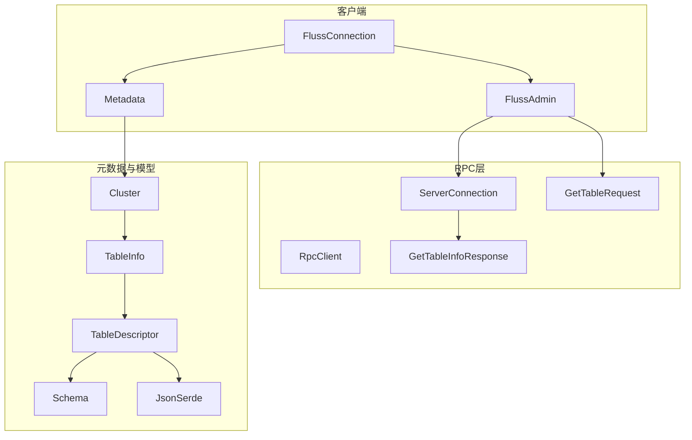
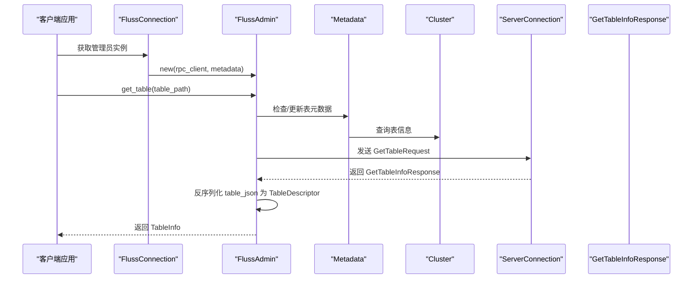
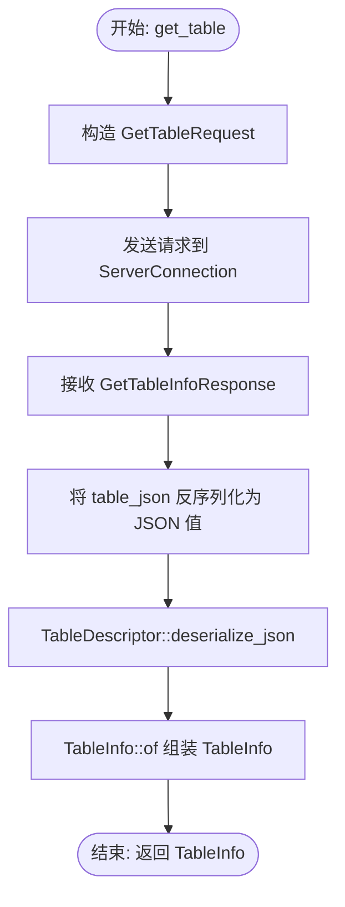
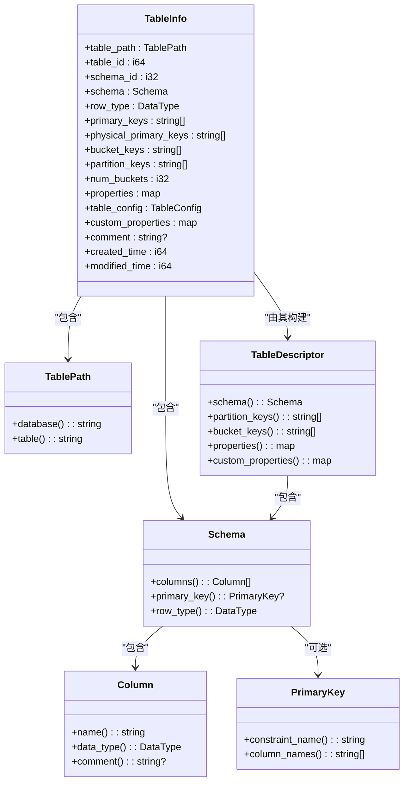
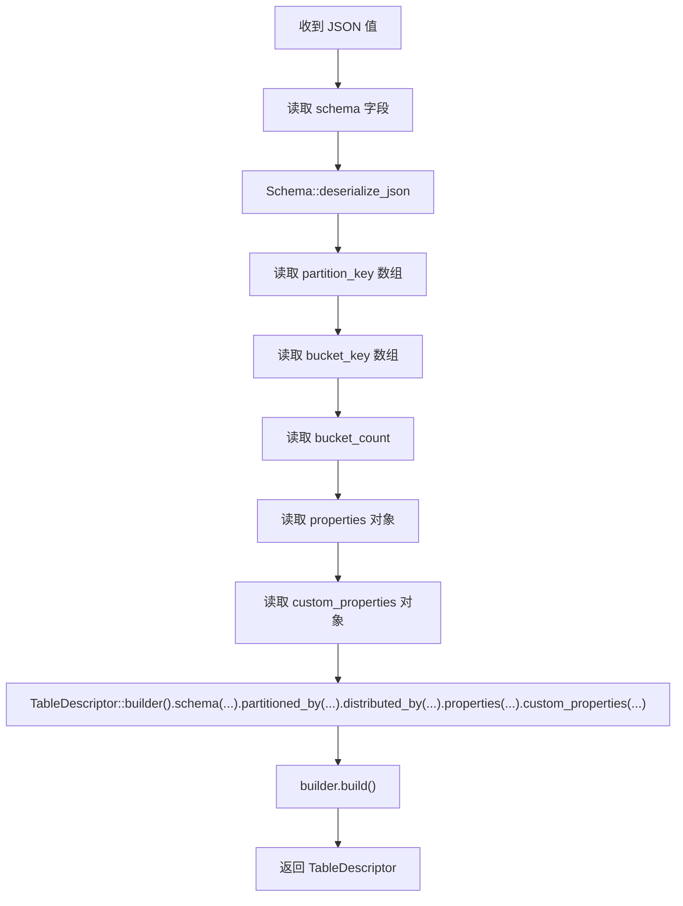
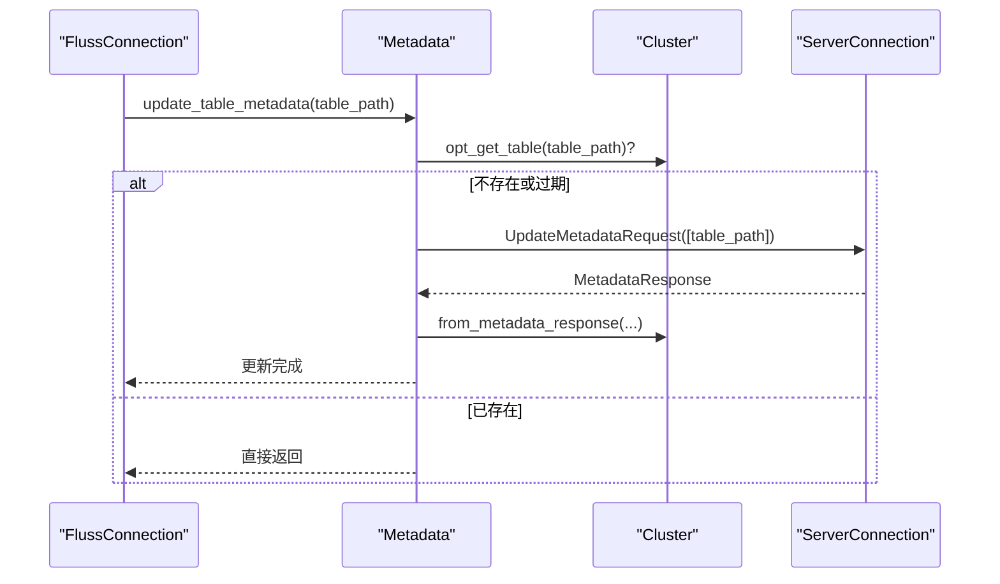
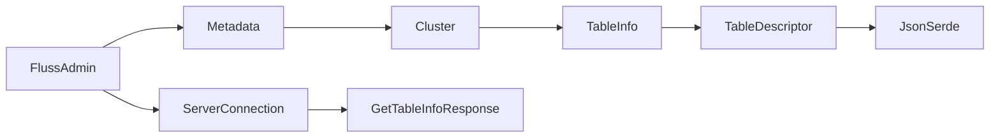

# 表查询

<cite>
**本文引用的文件**
- [crates/fluss/src/client/admin.rs](file://crates/fluss/src/client/admin.rs)
- [crates/fluss/src/metadata/table.rs](file://crates/fluss/src/metadata/table.rs)
- [crates/fluss/src/rpc/message/get_table.rs](file://crates/fluss/src/rpc/message/get_table.rs)
- [crates/fluss/src/metadata/json_serde.rs](file://crates/fluss/src/metadata/json_serde.rs)
- [crates/fluss/src/client/metadata.rs](file://crates/fluss/src/client/metadata.rs)
- [crates/fluss/src/proto/fluss_api.proto](file://crates/fluss/src/proto/fluss_api.proto)
- [crates/fluss/src/cluster/cluster.rs](file://crates/fluss/src/cluster/cluster.rs)
- [crates/fluss/src/rpc/server_connection.rs](file://crates/fluss/src/rpc/server_connection.rs)
- [crates/fluss/src/client/connection.rs](file://crates/fluss/src/client/connection.rs)
- [crates/examples/src/example_table.rs](file://crates/examples/src/example_table.rs)
</cite>

## 目录
1. [简介](#简介)
2. [项目结构](#项目结构)
3. [核心组件](#核心组件)
4. [架构总览](#架构总览)
5. [详细组件分析](#详细组件分析)
6. [依赖分析](#依赖分析)
7. [性能考虑](#性能考虑)
8. [故障排查指南](#故障排查指南)
9. [结论](#结论)
10. [附录](#附录)

## 简介
本文件围绕 Fluss 客户端的“表查询”能力进行系统化说明，重点解释 FlussAdmin::get_table 方法的实现原理与使用方式，详解 TableInfo 的结构与字段含义（如 table_id、schema_id、created_time、modified_time 等），并深入解析表描述符的 JSON 反序列化流程、查询权限控制现状、缓存机制与元数据同步策略。同时提供基于示例程序的使用指引与最佳实践建议。

## 项目结构
与“表查询”直接相关的关键模块如下：
- 客户端入口与管理器：FlussConnection、FlussAdmin
- 元数据与集群视图：Metadata、Cluster
- RPC 请求/响应与消息封装：GetTableRequest、GetTableInfoResponse、ServerConnection
- 元数据模型与 JSON 序列化：TableInfo、TableDescriptor、Schema、JsonSerde
- 协议定义：fluss_api.proto 中的 GetTableInfoRequest/Response

**图表来源**
- [crates/fluss/src/client/connection.rs](file://crates/fluss/src/client/connection.rs#L77-L81)
- [crates/fluss/src/client/admin.rs](file://crates/fluss/src/client/admin.rs#L69-L92)
- [crates/fluss/src/client/metadata.rs](file://crates/fluss/src/client/metadata.rs#L35-L104)
- [crates/fluss/src/rpc/message/get_table.rs](file://crates/fluss/src/rpc/message/get_table.rs#L29-L55)
- [crates/fluss/src/proto/fluss_api.proto](file://crates/fluss/src/proto/fluss_api.proto#L127-L137)
- [crates/fluss/src/cluster/cluster.rs](file://crates/fluss/src/cluster/cluster.rs#L29-L86)
- [crates/fluss/src/metadata/table.rs](file://crates/fluss/src/metadata/table.rs#L634-L754)
- [crates/fluss/src/metadata/json_serde.rs](file://crates/fluss/src/metadata/json_serde.rs#L328-L463)

**章节来源**
- [crates/fluss/src/client/connection.rs](file://crates/fluss/src/client/connection.rs#L37-L81)
- [crates/fluss/src/client/admin.rs](file://crates/fluss/src/client/admin.rs#L34-L92)
- [crates/fluss/src/client/metadata.rs](file://crates/fluss/src/client/metadata.rs#L35-L104)
- [crates/fluss/src/rpc/message/get_table.rs](file://crates/fluss/src/rpc/message/get_table.rs#L29-L55)
- [crates/fluss/src/proto/fluss_api.proto](file://crates/fluss/src/proto/fluss_api.proto#L127-L137)
- [crates/fluss/src/cluster/cluster.rs](file://crates/fluss/src/cluster/cluster.rs#L88-L171)
- [crates/fluss/src/metadata/table.rs](file://crates/fluss/src/metadata/table.rs#L634-L754)
- [crates/fluss/src/metadata/json_serde.rs](file://crates/fluss/src/metadata/json_serde.rs#L328-L463)

## 核心组件
- FlussAdmin::get_table：发起“获取表信息”的请求，接收服务端返回的二进制表描述 JSON，反序列化为 TableDescriptor，最终组装为 TableInfo 返回。
- TableInfo：承载表的完整元信息，包括路径、标识、Schema、主键/分桶/分区配置、属性、注释、时间戳等。
- TableDescriptor/Schema：描述表结构、主键、分布策略、属性等，支持 JSON 序列化/反序列化。
- GetTableRequest/GetTableInfoResponse：RPC 层的消息体，承载表路径与服务端返回的表元数据。
- Metadata/Cluster：维护集群视图与表元数据缓存，提供更新与查询接口。
- JsonSerde：统一的 JSON 序列化/反序列化协议，确保跨版本兼容性。

**章节来源**
- [crates/fluss/src/client/admin.rs](file://crates/fluss/src/client/admin.rs#L69-L92)
- [crates/fluss/src/metadata/table.rs](file://crates/fluss/src/metadata/table.rs#L634-L754)
- [crates/fluss/src/metadata/json_serde.rs](file://crates/fluss/src/metadata/json_serde.rs#L328-L463)
- [crates/fluss/src/rpc/message/get_table.rs](file://crates/fluss/src/rpc/message/get_table.rs#L29-L55)
- [crates/fluss/src/client/metadata.rs](file://crates/fluss/src/client/metadata.rs#L35-L104)
- [crates/fluss/src/cluster/cluster.rs](file://crates/fluss/src/cluster/cluster.rs#L88-L171)

## 架构总览
下图展示了从客户端调用到服务端响应的完整链路，以及关键对象之间的关系。

**图表来源**
- [crates/fluss/src/client/connection.rs](file://crates/fluss/src/client/connection.rs#L62-L64)
- [crates/fluss/src/client/admin.rs](file://crates/fluss/src/client/admin.rs#L69-L92)
- [crates/fluss/src/client/metadata.rs](file://crates/fluss/src/client/metadata.rs#L83-L94)
- [crates/fluss/src/rpc/message/get_table.rs](file://crates/fluss/src/rpc/message/get_table.rs#L29-L55)
- [crates/fluss/src/proto/fluss_api.proto](file://crates/fluss/src/proto/fluss_api.proto#L127-L137)
- [crates/fluss/src/cluster/cluster.rs](file://crates/fluss/src/cluster/cluster.rs#L234-L242)

## 详细组件分析

### FlussAdmin::get_table 实现原理
- 输入：TablePath（数据库名与表名）
- 流程：
  1) 通过 ServerConnection 向协调者或任意可用 TabletServer 发送 GetTableRequest
  2) 接收 GetTableInfoResponse，包含 table_id、schema_id、table_json（bytes）、created_time、modified_time
  3) 将 bytes 转换为 JSON 值，交由 TableDescriptor::deserialize_json 反序列化
  4) 使用 TableInfo::of 组装完整表信息（含 Schema、主键、分桶、分区、属性、注释、时间戳等）

**图表来源**
- [crates/fluss/src/client/admin.rs](file://crates/fluss/src/client/admin.rs#L69-L92)
- [crates/fluss/src/rpc/message/get_table.rs](file://crates/fluss/src/rpc/message/get_table.rs#L29-L55)
- [crates/fluss/src/metadata/json_serde.rs](file://crates/fluss/src/metadata/json_serde.rs#L372-L463)
- [crates/fluss/src/metadata/table.rs](file://crates/fluss/src/metadata/table.rs#L674-L710)

**章节来源**
- [crates/fluss/src/client/admin.rs](file://crates/fluss/src/client/admin.rs#L69-L92)
- [crates/fluss/src/rpc/message/get_table.rs](file://crates/fluss/src/rpc/message/get_table.rs#L29-L55)
- [crates/fluss/src/metadata/json_serde.rs](file://crates/fluss/src/metadata/json_serde.rs#L372-L463)
- [crates/fluss/src/metadata/table.rs](file://crates/fluss/src/metadata/table.rs#L674-L710)

### TableInfo 结构与字段说明
- 关键字段
  - table_path：表路径（数据库名、表名）
  - table_id：全局表标识
  - schema_id：Schema 版本标识
  - schema：Schema 对象（列、主键、RowType）
  - row_type：行类型（DataType::Row）
  - primary_keys：逻辑主键列名列表
  - physical_primary_keys：物理主键（排除分区列后的主键）
  - bucket_keys：分桶键（排除分区列后的分桶键）
  - partition_keys：分区键
  - num_buckets：分桶数量
  - properties/custom_properties：表属性与自定义属性
  - comment：表注释
  - created_time/modified_time：创建与修改时间戳
- 组装逻辑：TableInfo::of/new 会从 TableDescriptor 提取 Schema、分布与属性，计算物理主键与分桶键，并生成 TableConfig

**图表来源**
- [crates/fluss/src/metadata/table.rs](file://crates/fluss/src/metadata/table.rs#L603-L754)

**章节来源**
- [crates/fluss/src/metadata/table.rs](file://crates/fluss/src/metadata/table.rs#L634-L754)

### 表描述符的 JSON 反序列化与格式处理
- JSON 字段约定（TableDescriptor）
  - schema：Schema 对象
  - comment：可选注释
  - partition_key：分区键数组
  - bucket_key：分桶键数组
  - bucket_count：分桶数量（可选）
  - properties/custom_properties：属性对象
- 反序列化流程
  - 读取 schema 并反序列化为 Schema
  - 读取 partition_key、bucket_key、bucket_count
  - 读取 properties 与 custom_properties（对象键值字符串）
  - 调用 builder 构建 TableDescriptor，并在必要时规范化分布策略
- Schema 反序列化
  - columns：列数组，每列包含 name、data_type、comment
  - primary_key：主键列名数组
  - version：版本号（用于兼容性）
- DataType 反序列化
  - type：基础类型名（如 INTEGER、STRING 等）
  - nullable：是否可空
  - length/precision/scale 等扩展字段按需支持

**图表来源**
- [crates/fluss/src/metadata/json_serde.rs](file://crates/fluss/src/metadata/json_serde.rs#L372-L463)
- [crates/fluss/src/metadata/json_serde.rs](file://crates/fluss/src/metadata/json_serde.rs#L259-L294)
- [crates/fluss/src/metadata/json_serde.rs](file://crates/fluss/src/metadata/json_serde.rs#L133-L175)

**章节来源**
- [crates/fluss/src/metadata/json_serde.rs](file://crates/fluss/src/metadata/json_serde.rs#L297-L463)

### 查询权限控制
- 当前实现中，表查询未显式包含鉴权检查逻辑；权限控制通常由服务端在处理 GetTableInfoRequest 时完成。客户端侧仅负责构造请求与解析响应。
- 若需要在客户端侧进行权限校验，可在调用 get_table 前增加业务级权限判断（例如基于租户/角色的访问控制）。

**章节来源**
- [crates/fluss/src/client/admin.rs](file://crates/fluss/src/client/admin.rs#L69-L92)
- [crates/fluss/src/rpc/message/get_table.rs](file://crates/fluss/src/rpc/message/get_table.rs#L29-L55)

### 缓存机制与元数据同步
- 客户端缓存
  - Metadata 维护 Cluster，包含 table_info_by_path、table_id_by_path 等映射
  - FlussConnection::get_table 在获取表实例前会先调用 metadata.update_table_metadata 更新缓存
- 服务端缓存
  - 服务端在 MetadataResponse 中携带 table_json（bytes），客户端将其反序列化后写入本地缓存
- 同步策略
  - Metadata.update_tables_metadata 会向任一可用 TabletServer 发送 UpdateMetadataRequest，拉取最新元数据并合并到本地 Cluster
  - Cluster::from_metadata_response 会保留原 Cluster 的有效信息，避免全量覆盖

**图表来源**
- [crates/fluss/src/client/connection.rs](file://crates/fluss/src/client/connection.rs#L77-L81)
- [crates/fluss/src/client/metadata.rs](file://crates/fluss/src/client/metadata.rs#L78-L94)
- [crates/fluss/src/cluster/cluster.rs](file://crates/fluss/src/cluster/cluster.rs#L88-L171)

**章节来源**
- [crates/fluss/src/client/connection.rs](file://crates/fluss/src/client/connection.rs#L77-L81)
- [crates/fluss/src/client/metadata.rs](file://crates/fluss/src/client/metadata.rs#L66-L94)
- [crates/fluss/src/cluster/cluster.rs](file://crates/fluss/src/cluster/cluster.rs#L88-L171)

### 使用方式与示例
- 创建表后查询表信息的典型流程
  1) 构造 TableDescriptor 与 Schema
  2) 通过 FlussAdmin::create_table 创建表
  3) 通过 FlussAdmin::get_table 查询表信息
  4) 打印 TableInfo 或进一步使用

参考示例程序中的表查询片段与输出：

**章节来源**
- [crates/examples/src/example_table.rs](file://crates/examples/src/example_table.rs#L47-L53)

## 依赖分析
- 组件耦合
  - FlussAdmin 依赖 ServerConnection、Metadata、TableInfo/TableDescriptor
  - Metadata/Cluster 提供缓存与更新能力
  - JsonSerde 为 TableDescriptor/Schema/DataType 提供统一的 JSON 处理
- 外部依赖
  - proto 定义 GetTableInfoRequest/Response 字段
  - RpcClient/ServerConnection 提供网络通信与消息编解码

**图表来源**
- [crates/fluss/src/client/admin.rs](file://crates/fluss/src/client/admin.rs#L28-L50)
- [crates/fluss/src/client/metadata.rs](file://crates/fluss/src/client/metadata.rs#L35-L104)
- [crates/fluss/src/cluster/cluster.rs](file://crates/fluss/src/cluster/cluster.rs#L88-L171)
- [crates/fluss/src/metadata/json_serde.rs](file://crates/fluss/src/metadata/json_serde.rs#L328-L463)
- [crates/fluss/src/proto/fluss_api.proto](file://crates/fluss/src/proto/fluss_api.proto#L127-L137)

**章节来源**
- [crates/fluss/src/client/admin.rs](file://crates/fluss/src/client/admin.rs#L28-L50)
- [crates/fluss/src/client/metadata.rs](file://crates/fluss/src/client/metadata.rs#L35-L104)
- [crates/fluss/src/cluster/cluster.rs](file://crates/fluss/src/cluster/cluster.rs#L88-L171)
- [crates/fluss/src/metadata/json_serde.rs](file://crates/fluss/src/metadata/json_serde.rs#L328-L463)
- [crates/fluss/src/proto/fluss_api.proto](file://crates/fluss/src/proto/fluss_api.proto#L127-L137)

## 性能考虑
- 连接复用：RpcClient 内部以 server_id 为键缓存 ServerConnection，避免重复建立连接
- 元数据缓存：Metadata/Cluster 本地缓存表元数据，减少频繁拉取
- 批量更新：Metadata.update_tables_metadata 支持批量表路径更新，降低多次往返开销
- 反序列化成本：table_json 为二进制，客户端侧仅在首次查询或缓存缺失时进行 JSON 解析与对象构建

**章节来源**
- [crates/fluss/src/rpc/server_connection.rs](file://crates/fluss/src/rpc/server_connection.rs#L64-L96)
- [crates/fluss/src/client/metadata.rs](file://crates/fluss/src/client/metadata.rs#L66-L94)
- [crates/fluss/src/cluster/cluster.rs](file://crates/fluss/src/cluster/cluster.rs#L105-L127)

## 故障排查指南
- 常见错误与定位
  - JSON 反序列化失败：检查 table_json 是否为空或格式不正确；确认服务端返回的 JSON 字段完整
  - 表不存在：FlussAdmin::get_table 会在解析后返回错误；确认 TablePath 正确
  - 权限不足：若服务端鉴权失败，可能在 RPC 层出现错误；检查服务端策略
  - 缓存不一致：调用 Metadata.update_table_metadata 强制刷新缓存
- 排错步骤
  1) 确认连接参数与 bootstrap_server 正确
  2) 使用 Metadata.check_and_update_table_metadata 验证是否需要更新
  3) 查看 RpcClient/ServerConnection 的日志与错误码
  4) 核对 proto 中 GetTableInfoResponse 字段是否匹配

**章节来源**
- [crates/fluss/src/client/admin.rs](file://crates/fluss/src/client/admin.rs#L69-L92)
- [crates/fluss/src/client/metadata.rs](file://crates/fluss/src/client/metadata.rs#L83-L94)
- [crates/fluss/src/rpc/server_connection.rs](file://crates/fluss/src/rpc/server_connection.rs#L233-L287)

## 结论
FlussAdmin::get_table 通过标准 RPC 流程获取表元数据，结合本地缓存与 JSON 反序列化，快速组装出完整的 TableInfo。该设计在保证易用性的同时兼顾了性能与可维护性。实际部署中建议配合权限控制与缓存刷新策略，确保查询结果的准确性与时效性。

## 附录
- 示例程序中表查询的使用位置与输出格式可参考示例文件。

**章节来源**
- [crates/examples/src/example_table.rs](file://crates/examples/src/example_table.rs#L51-L53)