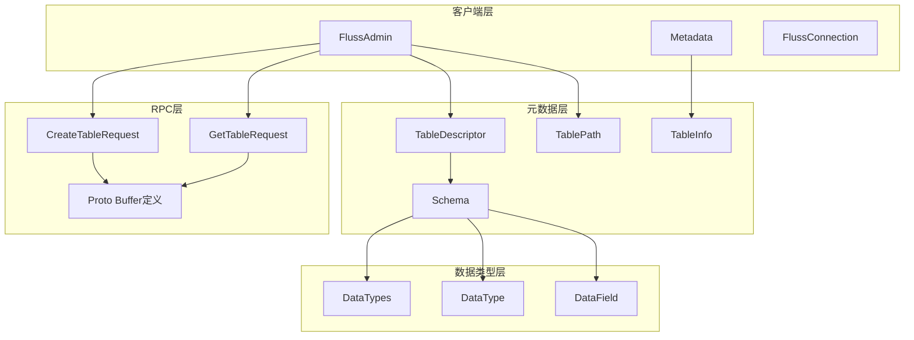
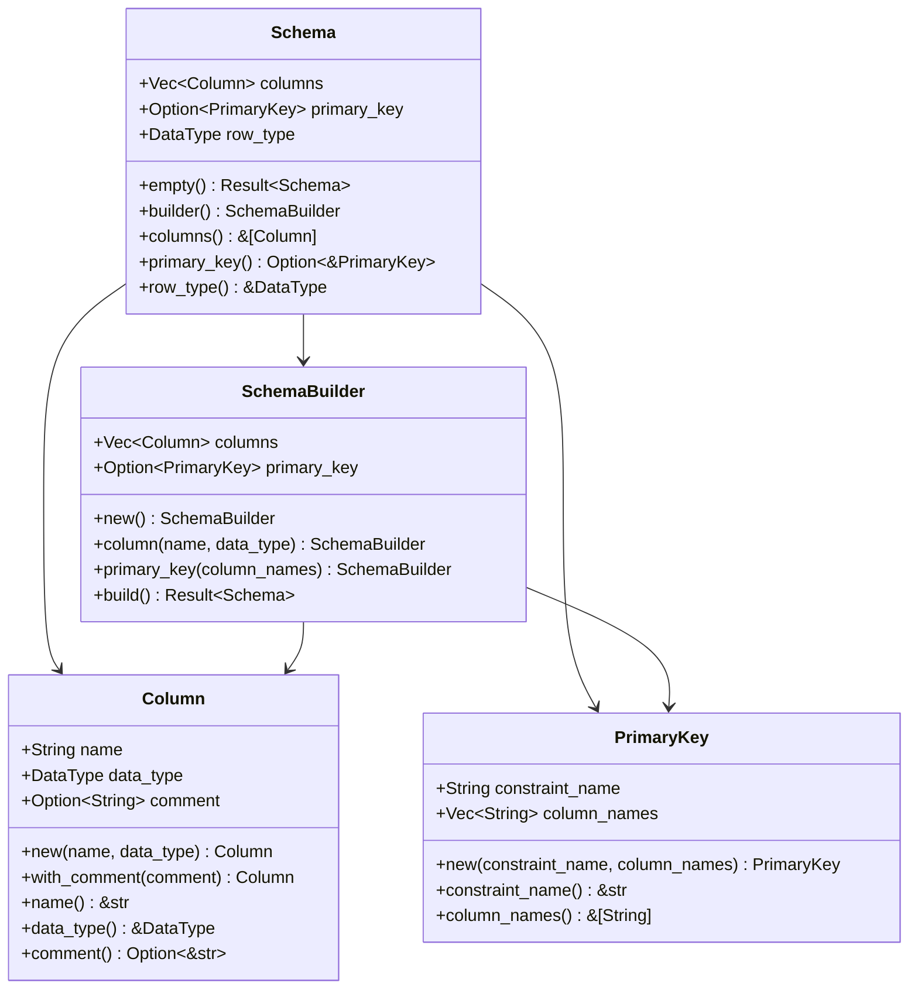
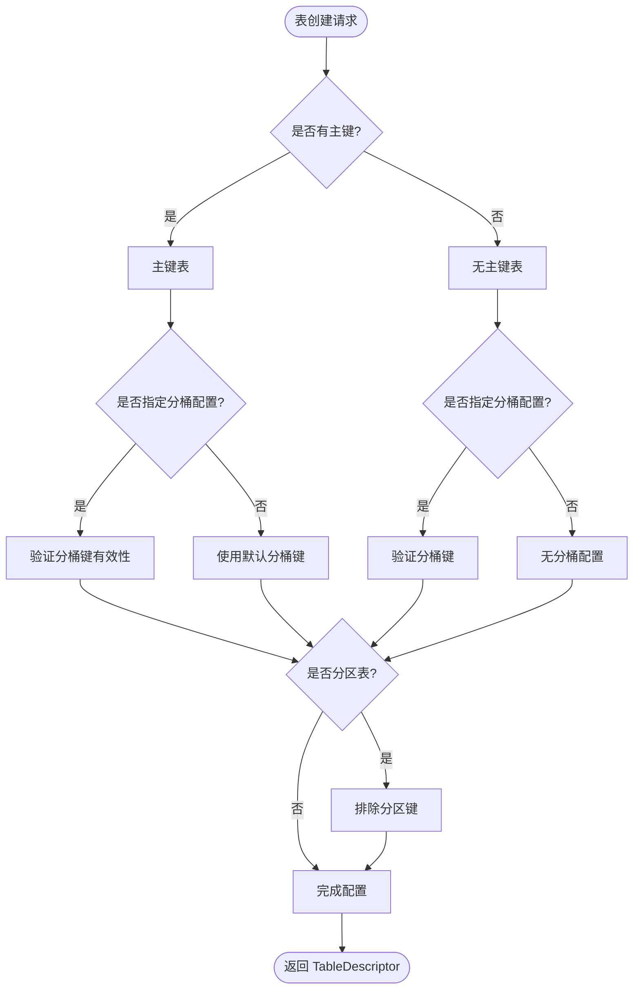
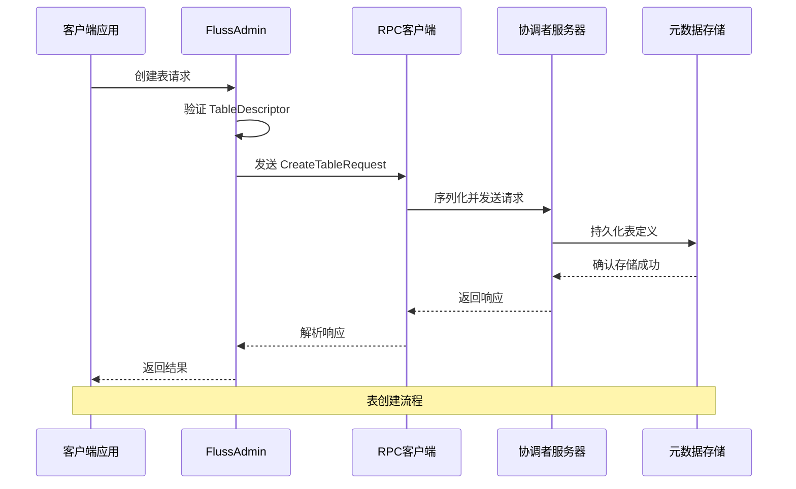
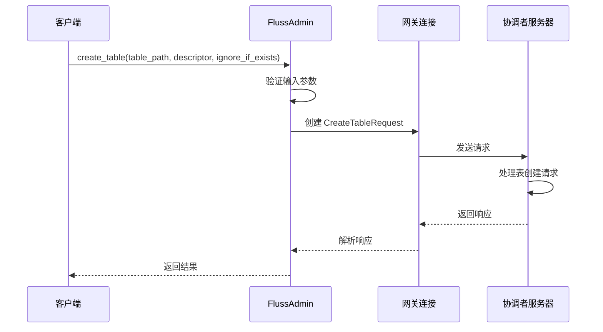
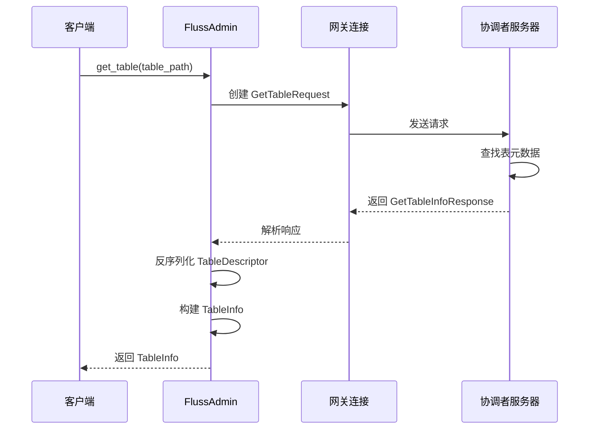
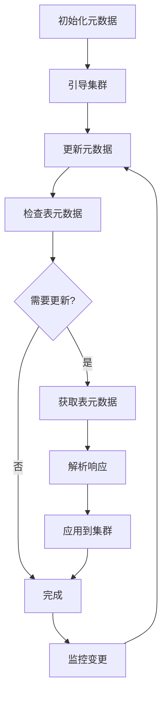
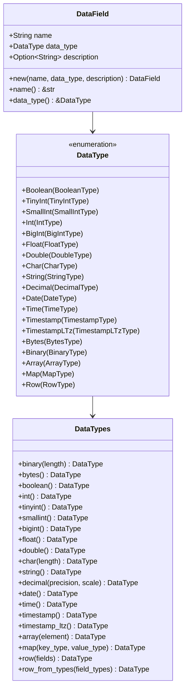
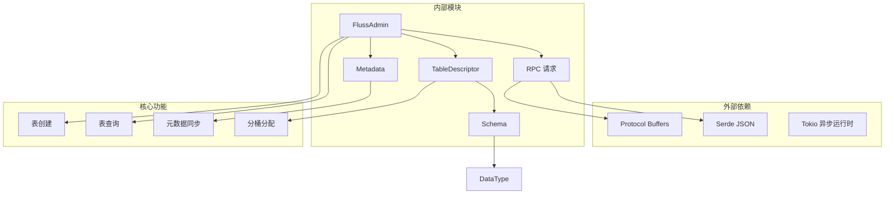
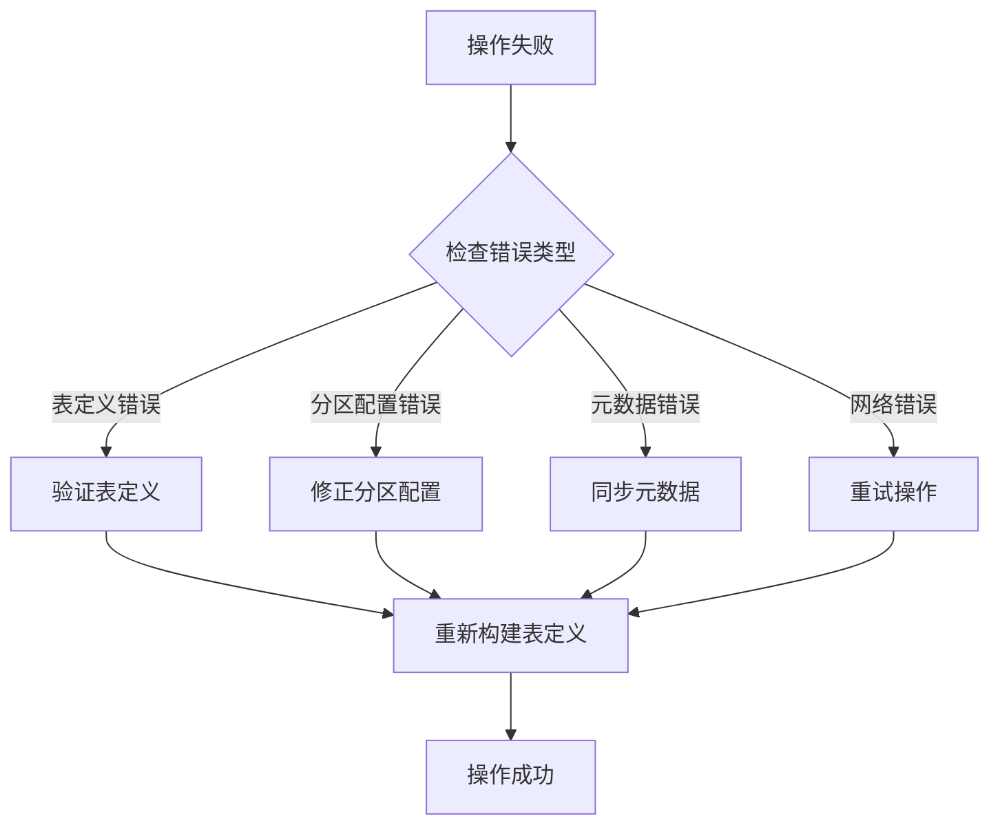

# 表管理功能

<cite>
**本文档引用的文件**
- [table.rs](file://crates/fluss/src/metadata/table.rs)
- [admin.rs](file://crates/fluss/src/client/admin.rs)
- [metadata.rs](file://crates/fluss/src/client/metadata.rs)
- [create_table.rs](file://crates/fluss/src/rpc/message/create_table.rs)
- [get_table.rs](file://crates/fluss/src/rpc/message/get_table.rs)
- [fluss_api.proto](file://crates/fluss/src/proto/fluss_api.proto)
- [example_table.rs](file://crates/examples/src/example_table.rs)
- [datatype.rs](file://crates/fluss/src/metadata/datatype.rs)
</cite>

## 目录
1. [简介](#简介)
2. [项目结构](#项目结构)
3. [核心组件](#核心组件)
4. [架构概览](#架构概览)
5. [详细组件分析](#详细组件分析)
6. [依赖关系分析](#依赖关系分析)
7. [性能考虑](#性能考虑)
8. [故障排除指南](#故障排除指南)
9. [结论](#结论)

## 简介

Fluss 是一个高性能的日志流处理系统，表管理功能是其核心组件之一。本文档详细介绍了表的创建、查询、删除等操作的实现细节和使用模式，深入解释了 TableDescriptor 的构建方法，包括 Schema 定义、分区策略、分桶配置等参数。同时涵盖了表路径（TablePath）的概念和使用方式，表状态管理、元数据同步、错误处理策略等内容。

## 项目结构

Fluss 的表管理功能主要分布在以下模块中：

**图表来源**
- [admin.rs](file://crates/fluss/src/client/admin.rs#L28-L94)
- [table.rs](file://crates/fluss/src/metadata/table.rs#L287-L374)
- [create_table.rs](file://crates/fluss/src/rpc/message/create_table.rs#L32-L51)

**章节来源**
- [admin.rs](file://crates/fluss/src/client/admin.rs#L1-L94)
- [table.rs](file://crates/fluss/src/metadata/table.rs#L1-L921)

## 核心组件

### TableDescriptor 构建器

TableDescriptor 是表的核心描述符，提供了完整的表定义信息。它包含以下关键组件：

- **Schema**: 表的列定义和主键约束
- **分区键**: 用于表分区的列集合
- **分桶配置**: 分桶数量和分桶键
- **属性配置**: 表的各种属性设置
- **注释**: 表的描述信息

### Schema 定义系统

Schema 提供了灵活的表结构定义能力：

**图表来源**
- [table.rs](file://crates/fluss/src/metadata/table.rs#L93-L144)
- [table.rs](file://crates/fluss/src/metadata/table.rs#L146-L268)

### TablePath 路径管理

TablePath 提供了统一的表标识符管理：

- **数据库名称**: 表所属的数据库
- **表名称**: 表的唯一标识符
- **显示格式**: 数据库名.表名的字符串格式

### 分桶和分区策略

系统支持灵活的分桶和分区配置：

**图表来源**
- [table.rs](file://crates/fluss/src/metadata/table.rs#L510-L564)

**章节来源**
- [table.rs](file://crates/fluss/src/metadata/table.rs#L270-L565)
- [table.rs](file://crates/fluss/src/metadata/table.rs#L603-L632)

## 架构概览

Fluss 的表管理采用分层架构设计，确保了良好的可扩展性和维护性：

**图表来源**
- [admin.rs](file://crates/fluss/src/client/admin.rs#L52-L67)
- [create_table.rs](file://crates/fluss/src/rpc/message/create_table.rs#L37-L50)

**章节来源**
- [admin.rs](file://crates/fluss/src/client/admin.rs#L34-L94)
- [metadata.rs](file://crates/fluss/src/client/metadata.rs#L35-L109)

## 详细组件分析

### FlussAdmin 管理器

FlussAdmin 是客户端的主要入口点，提供了表管理的核心功能：

#### 创建表操作

**图表来源**
- [admin.rs](file://crates/fluss/src/client/admin.rs#L52-L67)
- [create_table.rs](file://crates/fluss/src/rpc/message/create_table.rs#L37-L50)

#### 查询表信息

**图表来源**
- [admin.rs](file://crates/fluss/src/client/admin.rs#L69-L92)
- [get_table.rs](file://crates/fluss/src/rpc/message/get_table.rs#L34-L44)

**章节来源**
- [admin.rs](file://crates/fluss/src/client/admin.rs#L28-L94)

### 元数据同步机制

Metadata 组件负责维护集群状态和表元数据的同步：

**图表来源**
- [metadata.rs](file://crates/fluss/src/client/metadata.rs#L35-L94)

**章节来源**
- [metadata.rs](file://crates/fluss/src/client/metadata.rs#L29-L110)

### 数据类型系统

Fluss 支持丰富的数据类型定义：

**图表来源**
- [datatype.rs](file://crates/fluss/src/metadata/datatype.rs#L23-L44)
- [datatype.rs](file://crates/fluss/src/metadata/datatype.rs#L649-L787)

**章节来源**
- [datatype.rs](file://crates/fluss/src/metadata/datatype.rs#L1-L815)

## 依赖关系分析

表管理功能涉及多个层次的依赖关系：

**图表来源**
- [admin.rs](file://crates/fluss/src/client/admin.rs#L18-L32)
- [metadata.rs](file://crates/fluss/src/client/metadata.rs#L18-L27)

**章节来源**
- [table.rs](file://crates/fluss/src/metadata/table.rs#L18-L25)
- [admin.rs](file://crates/fluss/src/client/admin.rs#L18-L32)

## 性能考虑

### 分桶优化策略

1. **分桶数量选择**: 建议根据数据量和并发写入需求选择合适的分桶数量
2. **分桶键设计**: 主键表的分桶键应避免与分区键冲突
3. **负载均衡**: 合理的分桶配置可以提高系统的整体吞吐量

### 元数据缓存

1. **本地缓存**: Metadata 组件维护集群状态的本地缓存
2. **增量更新**: 支持增量元数据更新，减少全量同步开销
3. **失效策略**: 实现合理的缓存失效和刷新策略

### RPC 通信优化

1. **连接复用**: RpcClient 支持连接池和连接复用
2. **批量操作**: 支持批量元数据更新操作
3. **超时控制**: 合理设置 RPC 调用超时时间

## 故障排除指南

### 常见错误类型

1. **表定义错误**: 包括重复列名、无效的主键配置等
2. **分区配置错误**: 分区键与分桶键冲突
3. **元数据同步失败**: 集群状态不一致导致的操作失败

### 错误处理策略

**章节来源**
- [table.rs](file://crates/fluss/src/metadata/table.rs#L220-L267)
- [table.rs](file://crates/fluss/src/metadata/table.rs#L514-L564)

## 结论

Fluss 的表管理功能通过精心设计的架构和完善的错误处理机制，为用户提供了强大而易用的表管理能力。其核心特点包括：

1. **灵活的表定义**: 支持复杂的 Schema 定义和多种数据类型
2. **智能的分桶策略**: 自动化的分桶键推导和冲突检测
3. **可靠的元数据管理**: 完整的元数据同步和缓存机制
4. **高效的 RPC 通信**: 优化的网络通信和错误恢复机制

通过本文档的详细说明，开发者可以更好地理解和使用 Fluss 的表管理功能，构建高效的数据处理应用。