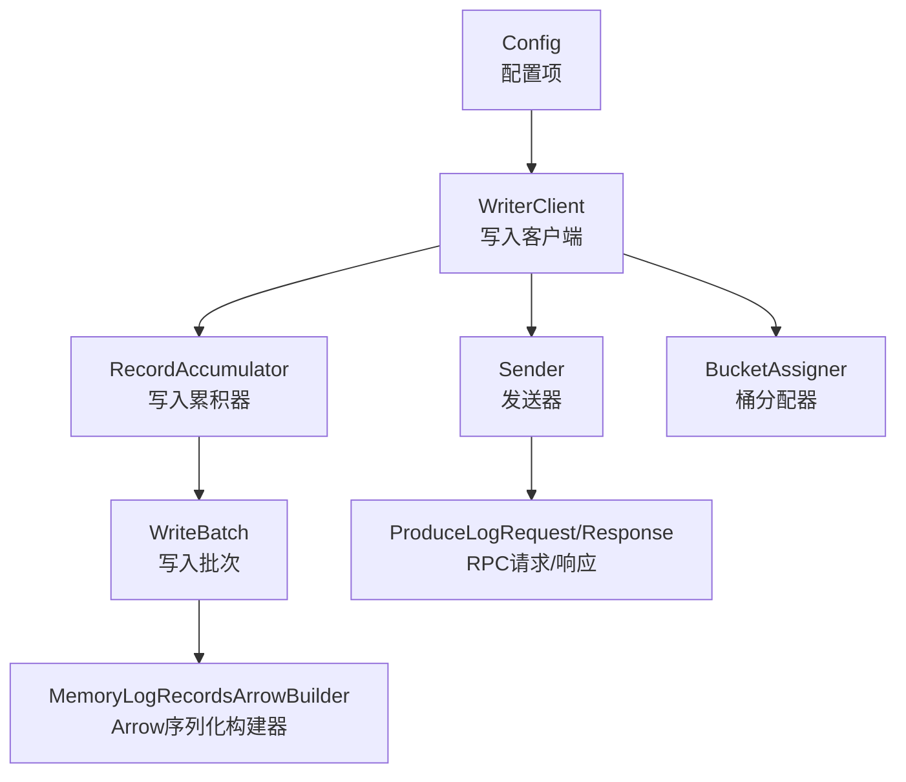
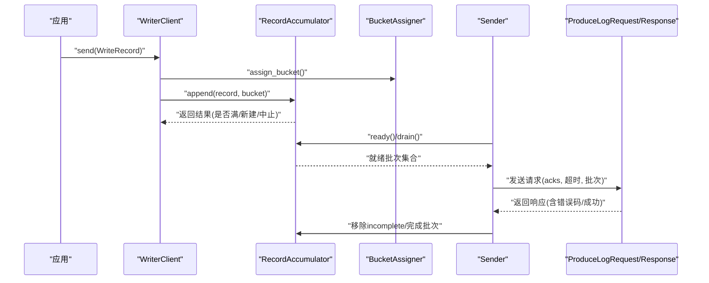
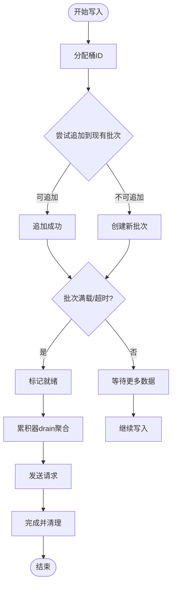
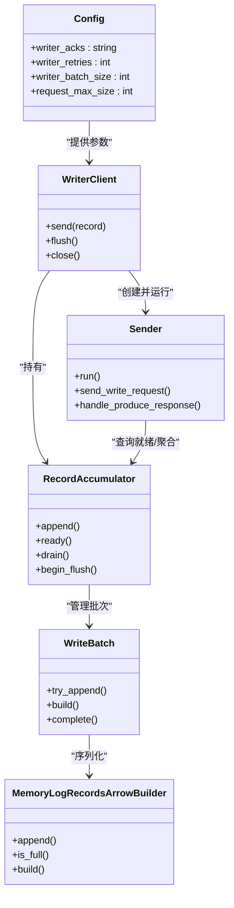

# 写入配置

<cite>
**本文引用的文件**
- [config.rs](file://crates/fluss/src/config.rs)
- [writer_client.rs](file://crates/fluss/src/client/write/writer_client.rs)
- [accumulator.rs](file://crates/fluss/src/client/write/accumulator.rs)
- [batch.rs](file://crates/fluss/src/client/write/batch.rs)
- [sender.rs](file://crates/fluss/src/client/write/sender.rs)
- [bucket_assigner.rs](file://crates/fluss/src/client/write/bucket_assigner.rs)
- [arrow.rs](file://crates/fluss/src/record/arrow.rs)
- [writer.rs](file://crates/fluss/src/client/table/writer.rs)
</cite>

## 目录
1. [简介](#简介)
2. [项目结构](#项目结构)
3. [核心组件](#核心组件)
4. [架构总览](#架构总览)
5. [详细组件分析](#详细组件分析)
6. [依赖关系分析](#依赖关系分析)
7. [性能考量](#性能考量)
8. [故障排查指南](#故障排查指南)
9. [结论](#结论)
10. [附录：常见写入场景配置示例](#附录常见写入场景配置示例)

## 简介
本文件围绕写入配置进行系统性说明，重点覆盖以下方面：
- writer_acks 参数的可选值与一致性/性能影响
- writer_retries 的重试次数与失败处理
- writer_batch_size 的批处理大小原理与权衡
- 写入缓冲区、压缩与序列化参数
- 面向高吞吐量、实时写入、批量导入等场景的配置建议

## 项目结构
写入路径涉及配置定义、客户端封装、累积器、批次构建、发送器以及表层写入接口等模块。下图展示与写入配置直接相关的模块关系与调用链。

**图表来源**
- [config.rs](file://crates/fluss/src/config.rs#L21-L39)
- [writer_client.rs](file://crates/fluss/src/client/write/writer_client.rs#L32-L76)
- [accumulator.rs](file://crates/fluss/src/client/write/accumulator.rs#L35-L61)
- [batch.rs](file://crates/fluss/src/client/write/batch.rs#L67-L128)
- [arrow.rs](file://crates/fluss/src/record/arrow.rs#L92-L150)
- [sender.rs](file://crates/fluss/src/client/write/sender.rs#L31-L60)

**章节来源**
- [config.rs](file://crates/fluss/src/config.rs#L21-L39)
- [writer_client.rs](file://crates/fluss/src/client/write/writer_client.rs#L32-L76)

## 核心组件
- 配置项
  - writer_acks：写入确认级别，支持字符串“all”或数字（例如"0"、"1"）
  - writer_retries：最大重试次数
  - writer_batch_size：单个批次记录数上限（用于批次构建器）
  - request_max_size：单次请求最大字节数（用于累积器/发送器的批次聚合）
- 客户端与发送
  - WriterClient：负责桶分配、累积写入、触发发送
  - Sender：周期性检查就绪节点，聚合批次并发起RPC请求
  - RecordAccumulator：按表/桶维护批次队列，超时或满载触发发送
  - WriteBatch/ArrowLogWriteBatch：批次容器与Arrow序列化构建
  - MemoryLogRecordsArrowBuilder：基于Arrow的序列化与校验和计算
- 桶分配
  - StickyBucketAssigner：粘性桶分配，避免频繁切换

**章节来源**
- [config.rs](file://crates/fluss/src/config.rs#L21-L39)
- [writer_client.rs](file://crates/fluss/src/client/write/writer_client.rs#L32-L76)
- [sender.rs](file://crates/fluss/src/client/write/sender.rs#L31-L60)
- [accumulator.rs](file://crates/fluss/src/client/write/accumulator.rs#L35-L61)
- [batch.rs](file://crates/fluss/src/client/write/batch.rs#L67-L128)
- [arrow.rs](file://crates/fluss/src/record/arrow.rs#L92-L150)
- [bucket_assigner.rs](file://crates/fluss/src/client/write/bucket_assigner.rs#L31-L102)

## 架构总览
写入流程从应用侧发起，经由WriterClient进入RecordAccumulator累积，达到条件后由Sender聚合并发送到目标节点；服务端返回响应后完成批次收尾。

**图表来源**
- [writer_client.rs](file://crates/fluss/src/client/write/writer_client.rs#L89-L123)
- [accumulator.rs](file://crates/fluss/src/client/write/accumulator.rs#L128-L162)
- [sender.rs](file://crates/fluss/src/client/write/sender.rs#L120-L167)

## 详细组件分析

### writer_acks 参数与一致性/性能
- 可选值
  - 字符串“all”：映射为内部-1，表示需要所有分区副本确认
  - 数字字符串：解析为i16，典型取值"0"(无需确认)、"1"(仅Leader确认)
- 在客户端侧的转换
  - WriterClient在初始化Sender时，将配置中的writer_acks转换为i16传入
- 对一致性与性能的影响
  - 更高的确认级别（如“all”）提升持久性保障，但会增加往返延迟与失败重试概率
  - 较低确认级别（如"0"/"1"）降低延迟，但牺牲部分持久性保证
- 注意
  - 当前发送逻辑未显式使用该参数进行退避或指数回退；具体重试策略由上层调用方或服务端行为决定

**章节来源**
- [writer_client.rs](file://crates/fluss/src/client/write/writer_client.rs#L79-L87)
- [sender.rs](file://crates/fluss/src/client/write/sender.rs#L160-L163)

### writer_retries 重试次数与失败处理
- 配置含义
  - writer_retries：最大重试次数，用于控制发送失败时的重试上限
- 实现现状
  - 配置项已注入Sender构造函数；当前handle_produce_response中对错误码存在待办标记，尚未实现具体的错误分类与退避策略
- 建议
  - 结合业务对一致性要求，设置合理重试上限
  - 若需指数退避，可在handle_produce_response中补充策略，并结合acks与错误类型进行差异化处理

**章节来源**
- [config.rs](file://crates/fluss/src/config.rs#L34-L35)
- [sender.rs](file://crates/fluss/src/client/write/sender.rs#L43-L60)
- [sender.rs](file://crates/fluss/src/client/write/sender.rs#L169-L186)

### writer_batch_size 批处理大小原理
- 配置含义
  - writer_batch_size：单个批次记录数上限，用于Arrow序列化构建器判断是否满载
- 实际使用点
  - MemoryLogRecordsArrowBuilder在append时依据默认最大记录数阈值进行满载判断
  - 累积器在批次满载或超时后触发发送
- 影响
  - 更大的批次可提升吞吐、降低请求频次，但会增加端到端延迟与内存占用
  - 更小的批次能降低延迟，但可能增加网络开销与调度成本

**章节来源**
- [config.rs](file://crates/fluss/src/config.rs#L37-L38)
- [arrow.rs](file://crates/fluss/src/record/arrow.rs#L138-L140)
- [accumulator.rs](file://crates/fluss/src/client/write/accumulator.rs#L155-L162)

### 写入缓冲区、压缩与序列化
- 缓冲区
  - RecordAccumulator按表/桶维护批次队列，支持超时触发与满载触发
  - 发送前通过Sender聚合至request_max_size以内
- 序列化
  - 使用Arrow IPC流进行序列化，批次头部包含长度、魔数、CRC等字段
  - 支持按schema_id区分模式，记录变更类型、批次序号、记录数量等
- 压缩
  - 当前序列化实现未见显式压缩逻辑；若需压缩，可在批次构建或RPC层扩展

**章节来源**
- [accumulator.rs](file://crates/fluss/src/client/write/accumulator.rs#L244-L333)
- [batch.rs](file://crates/fluss/src/client/write/batch.rs#L115-L119)
- [arrow.rs](file://crates/fluss/src/record/arrow.rs#L150-L185)
- [arrow.rs](file://crates/fluss/src/record/arrow.rs#L187-L211)

### 写入流程与决策逻辑
- 粘性桶分配
  - StickyBucketAssigner在首次选择后保持不变，减少跨桶切换带来的复杂度
- 批次创建与追加
  - 先尝试在现有批次追加，否则创建新批次并登记为“未完成”
- 就绪判定与发送
  - Sender周期检查累积器就绪节点，聚合批次并发送；完成后清理in-flight与未完成列表

**图表来源**
- [bucket_assigner.rs](file://crates/fluss/src/client/write/bucket_assigner.rs#L85-L102)
- [accumulator.rs](file://crates/fluss/src/client/write/accumulator.rs#L63-L126)
- [sender.rs](file://crates/fluss/src/client/write/sender.rs#L120-L167)

## 依赖关系分析
- 组件耦合
  - WriterClient依赖Config、Metadata、RecordAccumulator与Sender
  - Sender依赖Metadata、RecordAccumulator与RPC连接
  - RecordAccumulator与WriteBatch/ArrowBuilder强耦合，负责内存与时间维度的调度
- 关键依赖链
  - Config → WriterClient → Sender/RecordAccumulator → WriteBatch → ArrowBuilder
- 外部依赖
  - Arrow IPC序列化、CRC32C校验、RPC请求/响应

**图表来源**
- [config.rs](file://crates/fluss/src/config.rs#L21-L39)
- [writer_client.rs](file://crates/fluss/src/client/write/writer_client.rs#L42-L76)
- [sender.rs](file://crates/fluss/src/client/write/sender.rs#L42-L60)
- [accumulator.rs](file://crates/fluss/src/client/write/accumulator.rs#L48-L61)
- [batch.rs](file://crates/fluss/src/client/write/batch.rs#L67-L128)
- [arrow.rs](file://crates/fluss/src/record/arrow.rs#L92-L150)

**章节来源**
- [config.rs](file://crates/fluss/src/config.rs#L21-L39)
- [writer_client.rs](file://crates/fluss/src/client/write/writer_client.rs#L42-L76)
- [sender.rs](file://crates/fluss/src/client/write/sender.rs#L42-L60)
- [accumulator.rs](file://crates/fluss/src/client/write/accumulator.rs#L48-L61)
- [batch.rs](file://crates/fluss/src/client/write/batch.rs#L67-L128)
- [arrow.rs](file://crates/fluss/src/record/arrow.rs#L92-L150)

## 性能考量
- 吞吐与延迟权衡
  - 增大writer_batch_size可提升吞吐，但会增加端到端延迟与内存占用
  - 减小writer_batch_size可降低延迟，但可能增加请求次数与调度开销
- 请求大小限制
  - request_max_size用于Sender聚合上限，避免单次请求过大导致失败
- 确认级别
  - 提升acks级别可增强持久性，但会增加网络往返与潜在重试成本
- 重试策略
  - 当前未实现指数退避；建议根据业务SLA在handle_produce_response中补充策略

**章节来源**
- [config.rs](file://crates/fluss/src/config.rs#L28-L38)
- [sender.rs](file://crates/fluss/src/client/write/sender.rs#L91-L98)
- [arrow.rs](file://crates/fluss/src/record/arrow.rs#L138-L140)

## 故障排查指南
- 常见问题定位
  - 写入阻塞：检查RecordAccumulator就绪判定与超时阈值，确认是否有未知Leader表
  - 发送失败：查看handle_produce_response中的错误码分支，当前存在待办标记
  - 批次未完成：确认flush流程与未完成批次清理逻辑
- 建议步骤
  - 开启日志观察Sender轮询间隔与就绪节点集合
  - 检查writer_retries与acks配置是否满足一致性需求
  - 验证writer_batch_size与request_max_size的组合是否合理

**章节来源**
- [sender.rs](file://crates/fluss/src/client/write/sender.rs#L72-L106)
- [sender.rs](file://crates/fluss/src/client/write/sender.rs#L169-L186)
- [accumulator.rs](file://crates/fluss/src/client/write/accumulator.rs#L367-L372)

## 结论
- writer_acks、writer_retries、writer_batch_size与request_max_size共同决定了写入的一致性、延迟与吞吐
- 当前实现中，acks与重试策略存在进一步完善的空间；批次大小主要通过Arrow构建器阈值生效
- 建议结合业务场景调整上述参数，并在错误处理与退避策略上持续优化

## 附录：常见写入场景配置示例
- 高吞吐量写入
  - 目标：最大化吞吐，可接受一定延迟
  - 建议：增大writer_batch_size与request_max_size；适度提高writer_retries；确认级别可设为"1"
- 实时写入
  - 目标：降低端到端延迟
  - 建议：减小writer_batch_size；保持较短的累积器超时；确认级别可设为"1"或"0"
- 批量导入
  - 目标：快速导入大量数据
  - 建议：大幅提高writer_batch_size与request_max_size；设置较高writer_retries；确认级别可设为"1"

[本节为概念性建议，不直接分析具体文件，故无章节来源]