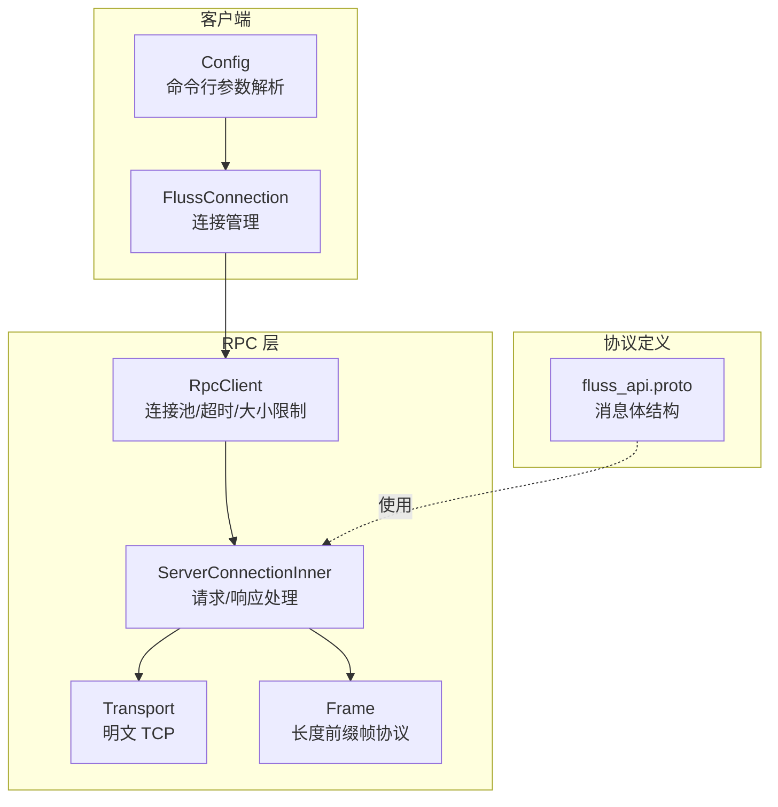
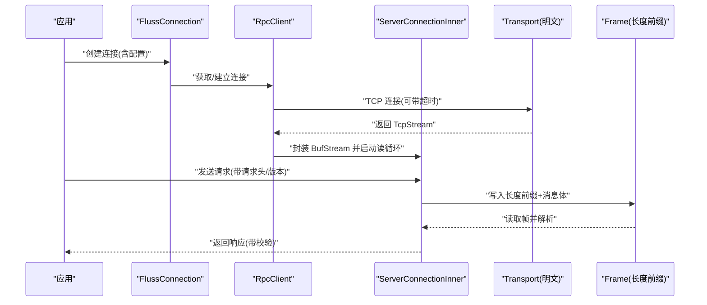
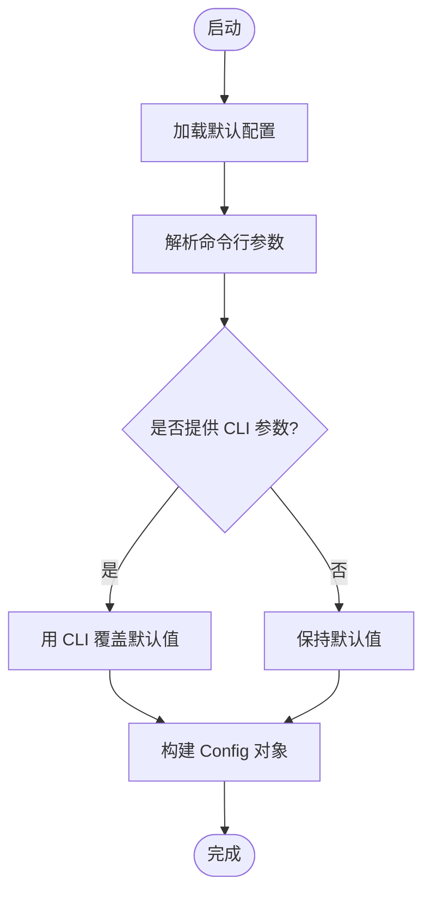
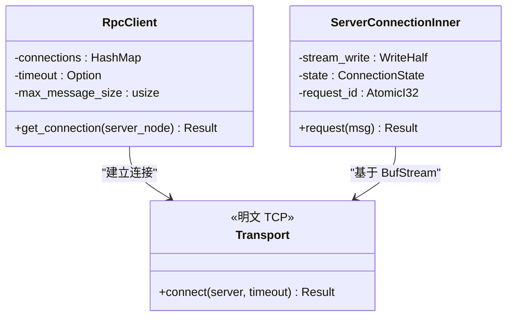
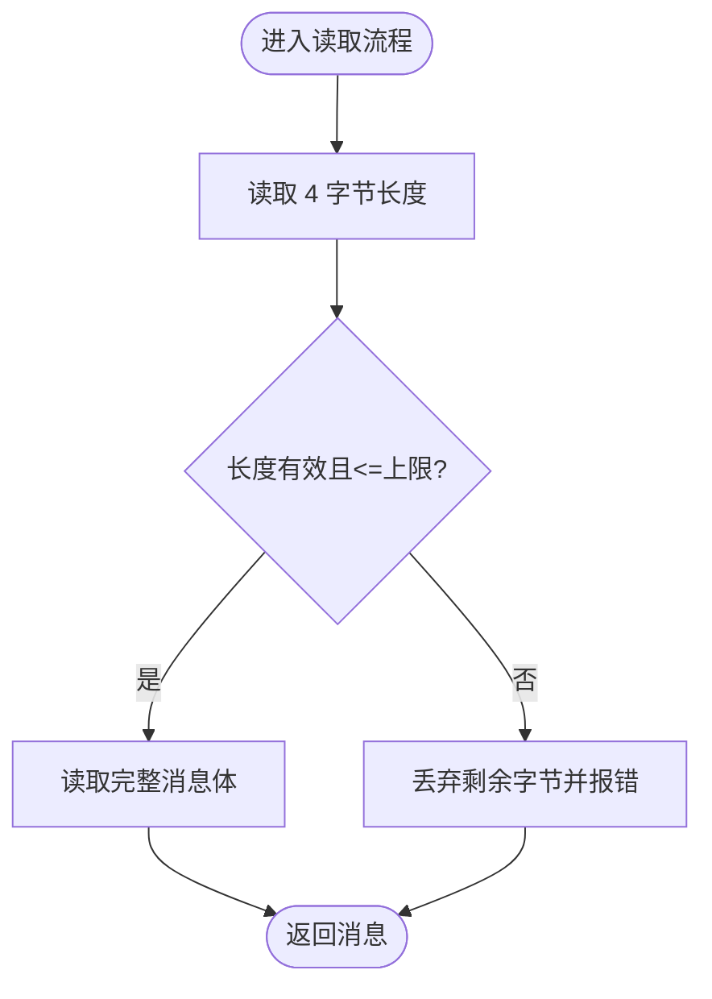
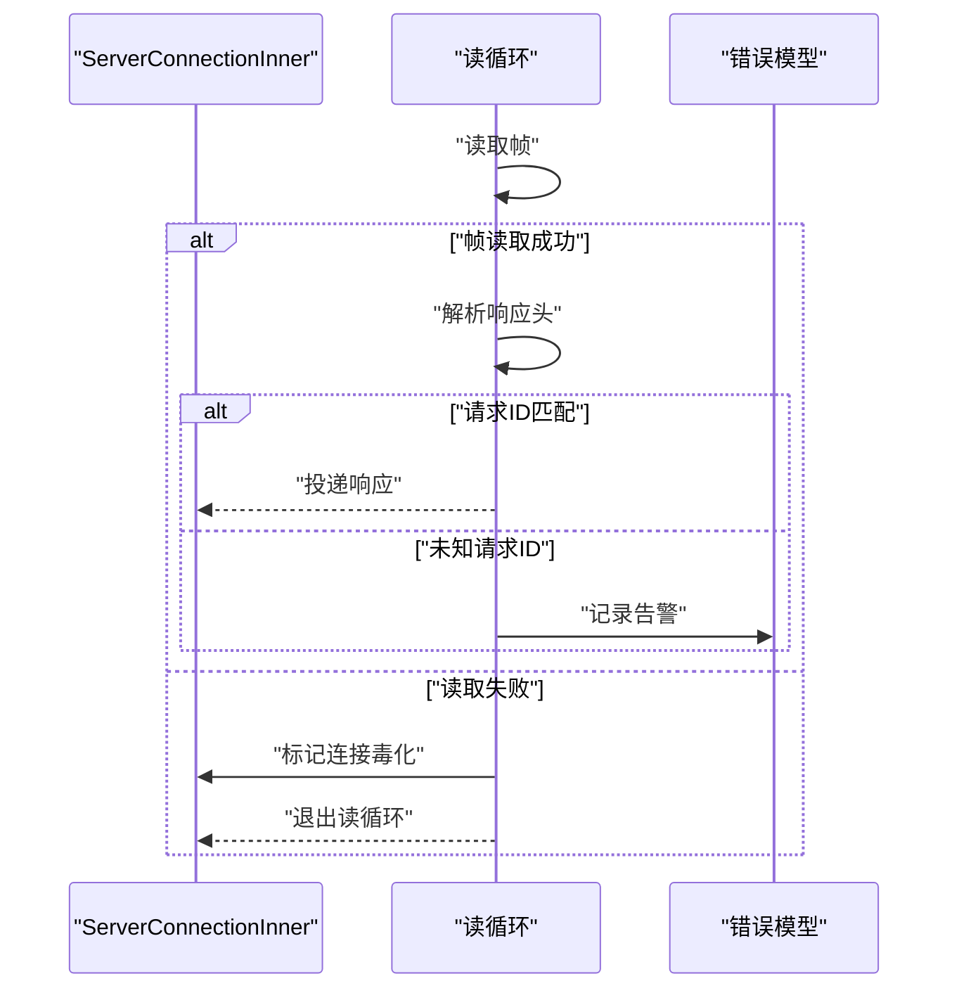
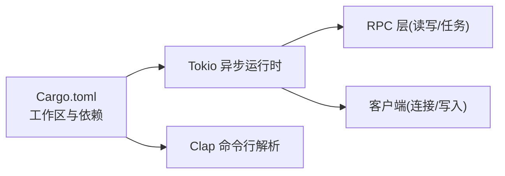

# 安全配置

<cite>
**本文引用的文件**
- [config.rs](file://crates/fluss/src/config.rs)
- [transport.rs](file://crates/fluss/src/rpc/transport.rs)
- [server_connection.rs](file://crates/fluss/src/rpc/server_connection.rs)
- [frame.rs](file://crates/fluss/src/rpc/frame.rs)
- [error.rs](file://crates/fluss/src/rpc/error.rs)
- [connection.rs](file://crates/fluss/src/client/connection.rs)
- [Cargo.toml](file://Cargo.toml)
- [fluss_api.proto](file://crates/fluss/src/proto/fluss_api.proto)
</cite>

## 目录
1. [简介](#简介)
2. [项目结构](#项目结构)
3. [核心组件](#核心组件)
4. [架构总览](#架构总览)
5. [详细组件分析](#详细组件分析)
6. [依赖关系分析](#依赖关系分析)
7. [性能考量](#性能考量)
8. [故障排查指南](#故障排查指南)
9. [结论](#结论)
10. [附录](#附录)

## 简介
本文件聚焦于代码库中的“安全配置”主题，围绕以下目标展开：
- 认证凭据配置：当前实现不包含用户名/密码或令牌认证逻辑，需在应用层或外部系统中完成（例如通过操作系统凭证、容器注入、代理网关等）。
- TLS/SSL 配置：当前实现仅支持明文 TCP 连接，未内置 TLS/SSL 支持；如需加密传输，应在部署层面使用反向代理或隧道。
- 网络安全参数：连接加密、数据传输安全、中间人攻击防护均依赖外部设施；内部实现具备消息大小限制与读写校验以降低资源滥用风险。
- 最佳实践：生产环境建议通过反向代理启用 TLS、限制入站访问、最小权限原则、定期轮换密钥与证书。
- 优先级与覆盖规则：命令行参数优先于默认值；运行时错误通过统一错误类型传播。
- 排错方法：结合错误类型与日志定位连接、帧格式、超时等问题。

## 项目结构
与安全配置直接相关的模块主要分布在以下位置：
- 客户端配置与连接：config.rs、client/connection.rs
- RPC 传输与连接：rpc/transport.rs、rpc/server_connection.rs
- 消息编解码与帧协议：rpc/frame.rs、rpc/message/mod.rs、proto/fluss_api.proto
- 错误模型：rpc/error.rs
- 工作区依赖：Cargo.toml

图表来源
- [config.rs](file://crates/fluss/src/config.rs#L21-L39)
- [connection.rs](file://crates/fluss/src/client/connection.rs#L30-L82)
- [server_connection.rs](file://crates/fluss/src/rpc/server_connection.rs#L47-L96)
- [transport.rs](file://crates/fluss/src/rpc/transport.rs#L26-L83)
- [frame.rs](file://crates/fluss/src/rpc/frame.rs#L34-L106)
- [fluss_api.proto](file://crates/fluss/src/proto/fluss_api.proto#L23-L51)

章节来源
- [config.rs](file://crates/fluss/src/config.rs#L21-L39)
- [connection.rs](file://crates/fluss/src/client/connection.rs#L30-L82)
- [server_connection.rs](file://crates/fluss/src/rpc/server_connection.rs#L47-L96)
- [transport.rs](file://crates/fluss/src/rpc/transport.rs#L26-L83)
- [frame.rs](file://crates/fluss/src/rpc/frame.rs#L34-L106)
- [fluss_api.proto](file://crates/fluss/src/proto/fluss_api.proto#L23-L51)

## 核心组件
- 配置对象 Config
  - 提供 bootstrap_server、请求最大尺寸、ACK 策略、重试次数、批大小等参数。
  - 命令行参数通过解析器生成，支持从 CLI 覆盖默认值。
- 传输层 Transport
  - 当前仅支持明文 TCP 连接，未内置 TLS。
- RPC 客户端与连接
  - RpcClient 维护连接池、超时与最大消息大小。
  - ServerConnectionInner 负责请求/响应的并发状态、取消安全发送、错误毒化处理。
- 帧协议与消息编解码
  - 帧协议采用长度前缀（i32）+ 消息体，具备最大消息大小限制与越界处理。
  - 协议消息由 proto 文件定义，客户端通过版本化读写接口进行序列化/反序列化。

章节来源
- [config.rs](file://crates/fluss/src/config.rs#L21-L39)
- [transport.rs](file://crates/fluss/src/rpc/transport.rs#L26-L83)
- [server_connection.rs](file://crates/fluss/src/rpc/server_connection.rs#L47-L96)
- [frame.rs](file://crates/fluss/src/rpc/frame.rs#L34-L106)
- [fluss_api.proto](file://crates/fluss/src/proto/fluss_api.proto#L23-L51)

## 架构总览
下图展示客户端到服务端的调用链路，强调明文传输与帧协议：

图表来源
- [connection.rs](file://crates/fluss/src/client/connection.rs#L37-L52)
- [server_connection.rs](file://crates/fluss/src/rpc/server_connection.rs#L64-L96)
- [transport.rs](file://crates/fluss/src/rpc/transport.rs#L68-L82)
- [frame.rs](file://crates/fluss/src/rpc/frame.rs#L34-L106)

## 详细组件分析

### 配置与优先级
- 参数来源
  - 默认值：在结构体字段上定义。
  - 命令行覆盖：通过解析器注解，CLI 传参优先于默认值。
- 关键安全相关参数
  - 请求最大尺寸：限制单次消息大小，避免内存滥用。
  - ACK 策略与重试：影响一致性与可用性权衡。
  - 批大小：影响吞吐与延迟。
- 优先级与覆盖规则
  - CLI 参数覆盖默认值；运行时未显式设置则使用默认。
  - 配置对象在客户端初始化时传递给连接与写入器。

图表来源
- [config.rs](file://crates/fluss/src/config.rs#L21-L39)

章节来源
- [config.rs](file://crates/fluss/src/config.rs#L21-L39)

### 传输与连接安全
- 当前实现
  - Transport 仅封装 TcpStream，未集成 TLS。
  - RpcClient 支持可选超时与最大消息大小，连接池按服务器节点 UID 缓存。
- 安全建议
  - 生产环境通过反向代理或专用网关启用 TLS，确保端到端加密。
  - 限制入站访问，仅允许受信网络与服务账户访问。
  - 在代理层实施双向认证与证书固定策略，抵御中间人攻击。

图表来源
- [transport.rs](file://crates/fluss/src/rpc/transport.rs#L26-L83)
- [server_connection.rs](file://crates/fluss/src/rpc/server_connection.rs#L47-L96)

章节来源
- [transport.rs](file://crates/fluss/src/rpc/transport.rs#L26-L83)
- [server_connection.rs](file://crates/fluss/src/rpc/server_connection.rs#L47-L96)

### 帧协议与数据传输安全
- 帧协议
  - 写入：先写入 i32 长度，再写入消息体。
  - 读取：先读取长度，检查是否超过最大消息大小，再读取完整消息体。
  - 越界处理：当消息过大时丢弃多余字节并返回错误。
- 数据传输安全
  - 帧协议本身不提供加密；加密需在传输层（代理/TLS）或应用层（自定义加密封装）实现。
  - 通过最大消息大小限制与读写校验，降低资源耗尽与协议错位风险。

图表来源
- [frame.rs](file://crates/fluss/src/rpc/frame.rs#L45-L76)

章节来源
- [frame.rs](file://crates/fluss/src/rpc/frame.rs#L34-L106)

### 错误处理与安全事件
- 错误类型
  - 连接错误、读写帧错误、IO 错误、连接毒化、消息尾部残留等。
- 处理策略
  - 连接毒化：一旦发生帧错位或读取异常，连接状态被标记为毒化，后续请求立即失败。
  - 取消安全：发送过程对取消进行保护，避免半发消息导致协议错位。
  - 日志与告警：读取头部失败或未知请求 ID 时记录警告，便于排查。

图表来源
- [server_connection.rs](file://crates/fluss/src/rpc/server_connection.rs#L172-L222)
- [error.rs](file://crates/fluss/src/rpc/error.rs#L23-L50)

章节来源
- [server_connection.rs](file://crates/fluss/src/rpc/server_connection.rs#L112-L145)
- [error.rs](file://crates/fluss/src/rpc/error.rs#L23-L50)

### 协议与认证
- 协议定义
  - proto 文件定义了元数据、写入、拉取等请求/响应的消息结构。
- 认证机制
  - 当前代码库未实现用户名/密码或令牌认证；认证应在应用层或外部设施完成（如代理、Kerberos、mTLS 等）。

章节来源
- [fluss_api.proto](file://crates/fluss/src/proto/fluss_api.proto#L23-L51)

## 依赖关系分析
- 工作区与依赖
  - 工作区定义了成员 crate 与共享依赖，Tokio 提供异步 I/O 与任务调度能力。
  - 客户端与 RPC 层广泛使用异步读写与任务协作。

图表来源
- [Cargo.toml](file://Cargo.toml#L29-L36)

章节来源
- [Cargo.toml](file://Cargo.toml#L29-L36)

## 性能考量
- 连接复用：RpcClient 按服务器节点缓存连接，减少握手开销。
- 超时控制：可选超时避免长时间阻塞。
- 帧大小限制：防止大消息占用过多内存与带宽。
- 取消安全：发送过程不受任务取消影响，提升稳定性。

## 故障排查指南
- 连接超时/失败
  - 检查 bootstrap_server 地址与可达性。
  - 确认代理/TLS 层配置正确（若启用）。
- 帧错误/消息过大
  - 调整请求最大尺寸参数，确认上游未发送超大消息。
  - 观察日志中关于“消息过大”或“负长度”的提示。
- 连接毒化
  - 出现毒化后，连接会被标记为不可用，需重建连接。
  - 检查网络抖动、对端异常或协议错位原因。
- 取消导致的半发
  - 确保发送路径具备取消安全包装，避免半发消息破坏协议。

章节来源
- [server_connection.rs](file://crates/fluss/src/rpc/server_connection.rs#L289-L311)
- [frame.rs](file://crates/fluss/src/rpc/frame.rs#L45-L76)
- [error.rs](file://crates/fluss/src/rpc/error.rs#L23-L50)

## 结论
- 当前代码库未内置认证与 TLS 支持，安全相关需求需通过外部设施（代理/TLS、认证网关）满足。
- 内部实现了稳健的帧协议与错误处理，具备消息大小限制与取消安全特性，有助于在生产环境中稳定运行。
- 建议在部署层面强化传输层加密与访问控制，并遵循最小权限原则与证书轮换策略。

## 附录
- 最佳实践清单
  - 启用 TLS：通过反向代理或专用网关强制 TLS，开启强加密套件与证书固定。
  - 限制入站：仅允许受信网络访问，使用防火墙与网络策略。
  - 最小权限：服务账户仅授予必要权限，定期轮换密钥与证书。
  - 监控告警：记录连接失败、帧错误、毒化事件，设置阈值告警。
  - 参数优化：根据业务负载调整请求最大尺寸、批大小与重试策略。