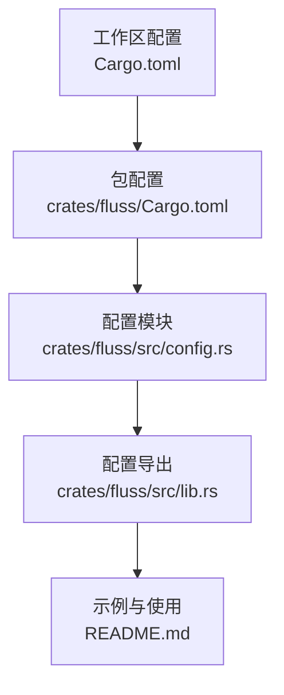
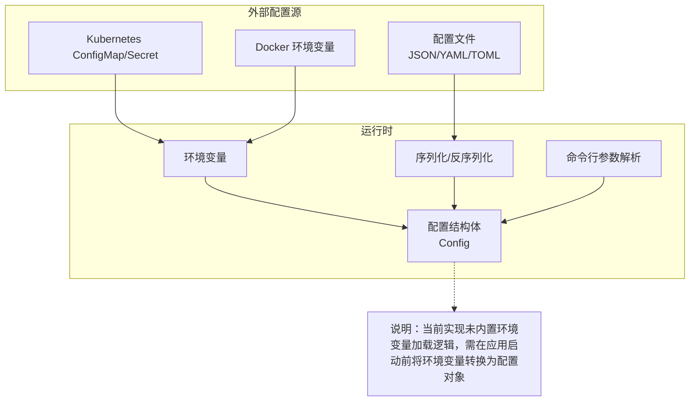
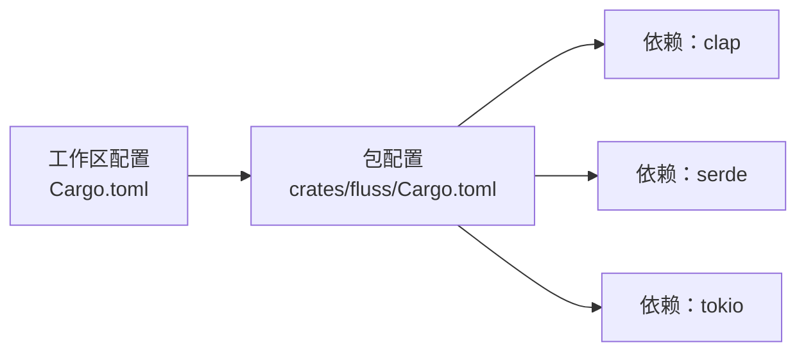

# 环境变量配置

<cite>
**本文引用的文件**
- [crates/fluss/src/config.rs](file://crates/fluss/src/config.rs)
- [crates/fluss/src/lib.rs](file://crates/fluss/src/lib.rs)
- [crates/fluss/Cargo.toml](file://crates/fluss/Cargo.toml)
- [Cargo.toml](file://Cargo.toml)
- [README.md](file://README.md)
</cite>

## 目录
1. [简介](#简介)
2. [项目结构](#项目结构)
3. [核心组件](#核心组件)
4. [架构总览](#架构总览)
5. [详细组件分析](#详细组件分析)
6. [依赖分析](#依赖分析)
7. [性能考虑](#性能考虑)
8. [故障排查指南](#故障排查指南)
9. [结论](#结论)
10. [附录](#附录)

## 简介
本文件聚焦于“环境变量配置”主题，系统性说明如何通过环境变量覆盖配置参数，包括变量命名规则、格式要求、与配置文件的优先级关系与合并规则，并提供常用环境变量清单与使用示例（如 FLUSS_BOOTSTRAP_SERVER、FLUSS_REQUEST_MAX_SIZE 等）。同时覆盖容器化环境下的配置管理方法（Docker、Kubernetes），以及配置验证与错误处理机制。

当前仓库中，配置定义位于配置模块，采用命令行参数解析器与序列化支持，但未发现显式的环境变量加载逻辑。因此，本文在“现有实现”的基础上，给出可落地的实践建议与最佳实践，帮助在不修改现有代码的前提下实现环境变量覆盖与容器化部署。

## 项目结构
围绕“环境变量配置”，本仓库的关键位置如下：
- 配置定义：crates/fluss/src/config.rs
- 配置模块导出：crates/fluss/src/lib.rs
- 工作区与包配置：Cargo.toml、crates/fluss/Cargo.toml
- 示例与使用参考：README.md

图表来源
- [Cargo.toml](file://Cargo.toml#L29-L36)
- [crates/fluss/Cargo.toml](file://crates/fluss/Cargo.toml#L18-L55)
- [crates/fluss/src/config.rs](file://crates/fluss/src/config.rs#L21-L39)
- [crates/fluss/src/lib.rs](file://crates/fluss/src/lib.rs#L26-L26)
- [README.md](file://README.md#L33-L125)

章节来源
- [Cargo.toml](file://Cargo.toml#L29-L36)
- [crates/fluss/Cargo.toml](file://crates/fluss/Cargo.toml#L18-L55)
- [crates/fluss/src/config.rs](file://crates/fluss/src/config.rs#L21-L39)
- [crates/fluss/src/lib.rs](file://crates/fluss/src/lib.rs#L26-L26)
- [README.md](file://README.md#L33-L125)

## 核心组件
- 配置结构体：包含以下字段（默认值来源于注解）：
  - bootstrap_server：可选字符串，用于指定连接地址
  - request_max_size：整型，默认值为 10MB
  - writer_acks：字符串，默认值为 "all"
  - writer_retries：整型，默认值为最大整数
  - writer_batch_size：整型，默认值为 2MB
- 命令行参数解析：通过派生宏支持 CLI 参数输入
- 序列化支持：支持序列化与反序列化，便于 JSON/YAML 等配置文件读取

章节来源
- [crates/fluss/src/config.rs](file://crates/fluss/src/config.rs#L21-L39)

## 架构总览
下图展示“环境变量配置”在当前代码中的位置与可能的扩展点（以现有配置结构为基础）：

图表来源
- [crates/fluss/src/config.rs](file://crates/fluss/src/config.rs#L21-L39)

## 详细组件分析

### 配置结构与字段说明
- 字段与默认值
  - bootstrap_server：可空字符串，用于连接目标
  - request_max_size：字节单位的请求大小上限
  - writer_acks：写入确认策略（字符串）
  - writer_retries：重试次数上限
  - writer_batch_size：批大小（字节）

- 字段来源与默认值由派生宏与注解提供，便于后续扩展环境变量映射

章节来源
- [crates/fluss/src/config.rs](file://crates/fluss/src/config.rs#L21-L39)

### 环境变量命名规则与映射建议
- 命名规范
  - 建议统一使用前缀 FLUSS_，例如：FLUSS_BOOTSTRAP_SERVER、FLUSS_REQUEST_MAX_SIZE
  - 将配置字段名转为大写，短横线替换为下划线
- 映射策略
  - 在应用启动阶段，读取环境变量并填充到配置对象
  - 对于数值型字段，进行类型转换与边界校验
  - 对于字符串字段，注意空值与默认值处理
- 优先级建议
  - 环境变量 > 配置文件 > 默认值
  - 若配置文件与环境变量同时存在，以环境变量为准
- 合并规则
  - 可选字段：仅当环境变量非空时覆盖
  - 数值字段：若超出合理范围则回退到默认值或报错
  - 字符串字段：允许自定义，但需遵循业务约束

说明：以上为基于现有配置结构的工程化建议，当前仓库未包含环境变量加载的具体实现代码。

### 常用环境变量清单与示例
- FLUSS_BOOTSTRAP_SERVER
  - 类型：字符串
  - 作用：指定集群连接地址
  - 示例：FLUSS_BOOTSTRAP_SERVER=127.0.0.1:9123
- FLUSS_REQUEST_MAX_SIZE
  - 类型：整数（字节）
  - 作用：限制请求最大大小
  - 示例：FLUSS_REQUEST_MAX_SIZE=10485760
- FLUSS_WRITER_ACKS
  - 类型：字符串
  - 作用：写入确认策略
  - 示例：FLUSS_WRITER_ACKS=all
- FLUSS_WRITER_RETRIES
  - 类型：整数
  - 作用：写入重试次数
  - 示例：FLUSS_WRITER_RETRIES=3
- FLUSS_WRITER_BATCH_SIZE
  - 类型：整数（字节）
  - 作用：批处理大小
  - 示例：FLUSS_WRITER_BATCH_SIZE=2097152

使用示例（概念性说明）
- Docker
  - docker run -e FLUSS_BOOTSTRAP_SERVER=host:port your-image
- Kubernetes
  - 使用 ConfigMap/Secret 注入环境变量
  - 在 Deployment 的 env 中声明对应键值

说明：以上为通用实践建议，具体实现需结合应用启动流程与配置加载逻辑。

### 容器化环境下的配置管理
- Docker
  - 通过 -e 或 env-file 提供环境变量
  - 注意敏感信息使用 Secret
- Kubernetes
  - ConfigMap：存放非敏感配置
  - Secret：存放密码、证书等敏感数据
  - 通过 env 或 envFrom 注入到 Pod
- 最佳实践
  - 将环境变量映射到配置对象后，统一进行校验
  - 在容器启动前完成配置加载，避免运行时失败

说明：本节为通用容器化配置实践，当前仓库未包含具体注入实现。

### 配置验证与错误处理机制
- 输入校验
  - 数值字段：检查范围与类型转换
  - 字符串字段：检查空值与格式
- 错误处理
  - 转换失败：返回明确的错误信息，提示具体字段与期望格式
  - 越界值：回退到默认值或拒绝启动
- 日志与可观测性
  - 记录最终生效的配置项
  - 区分默认值、文件值与环境变量值

说明：本节为通用工程实践建议，当前仓库未包含具体校验与错误处理实现。

## 依赖分析
- 配置模块依赖
  - 派生宏：提供命令行参数解析能力
  - 序列化：支持 JSON/YAML 等配置文件读取
- 工作区与包配置
  - 工作区统一版本与特性
  - 包内依赖包括序列化、异步运行时等

图表来源
- [crates/fluss/Cargo.toml](file://crates/fluss/Cargo.toml#L25-L47)
- [Cargo.toml](file://Cargo.toml#L29-L36)

章节来源
- [crates/fluss/Cargo.toml](file://crates/fluss/Cargo.toml#L25-L47)
- [Cargo.toml](file://Cargo.toml#L29-L36)

## 性能考虑
- 环境变量读取与解析应在启动阶段完成，避免重复计算
- 配置变更应尽量减少运行时开销，必要时通过热更新或重启策略处理
- 批处理大小与请求大小应结合网络与存储能力调优

说明：本节为通用性能建议，当前仓库未包含具体性能实现细节。

## 故障排查指南
- 症状：连接失败或超时
  - 排查：确认 FLUSS_BOOTSTRAP_SERVER 是否正确
  - 复现：尝试使用默认端口与本地回环地址验证
- 症状：请求被拒绝或超限
  - 排查：检查 FLUSS_REQUEST_MAX_SIZE 是否过小
  - 处理：适当增大该值或拆分请求
- 症状：写入不稳定
  - 排查：核对 FLUSS_WRITER_RETRIES 与 FLUSS_WRITER_ACKS
  - 处理：根据一致性需求调整确认策略与重试次数
- 症状：批处理过大导致内存压力
  - 排查：检查 FLUSS_WRITER_BATCH_SIZE
  - 处理：降低批大小或增加分区数量

说明：本节为通用排障建议，当前仓库未包含具体错误处理实现。

## 结论
- 当前仓库提供了清晰的配置结构与默认值，但未内置环境变量加载逻辑
- 建议在应用启动阶段实现“环境变量 → 配置对象”的映射与校验
- 通过统一的命名规范与优先级策略，确保在容器化环境中稳定可靠地覆盖配置
- 将配置验证与错误处理纳入启动流程，提升系统的可运维性

## 附录
- 相关文件路径
  - 配置定义：crates/fluss/src/config.rs
  - 配置导出：crates/fluss/src/lib.rs
  - 包配置：crates/fluss/Cargo.toml
  - 工作区配置：Cargo.toml
  - 示例与使用：README.md