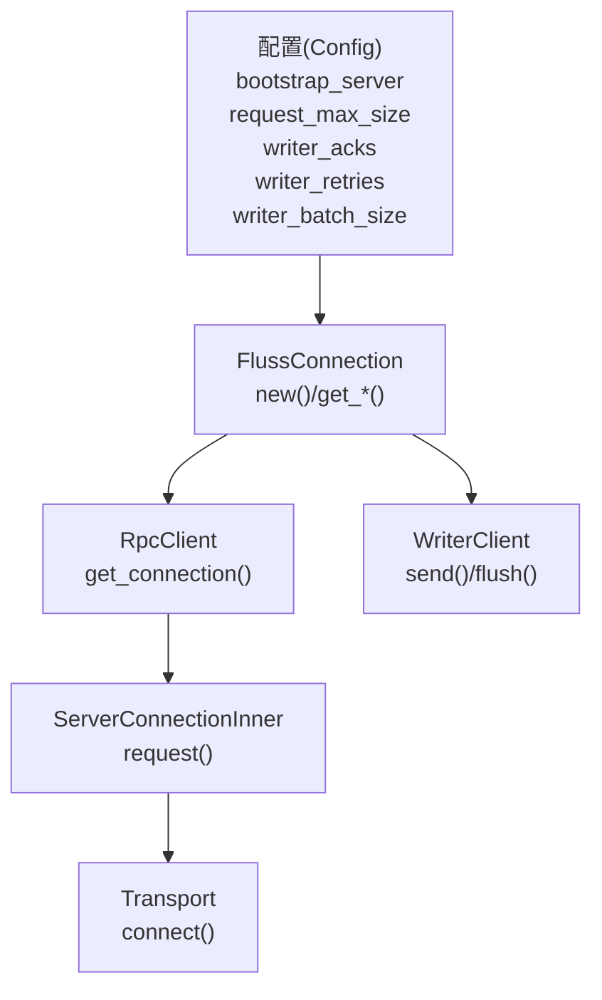
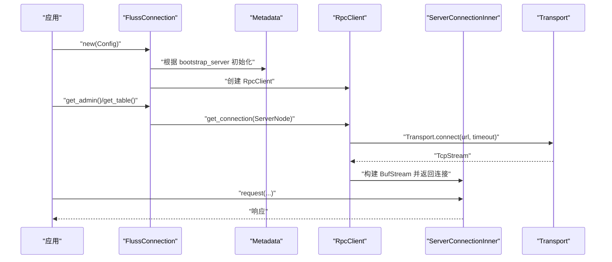
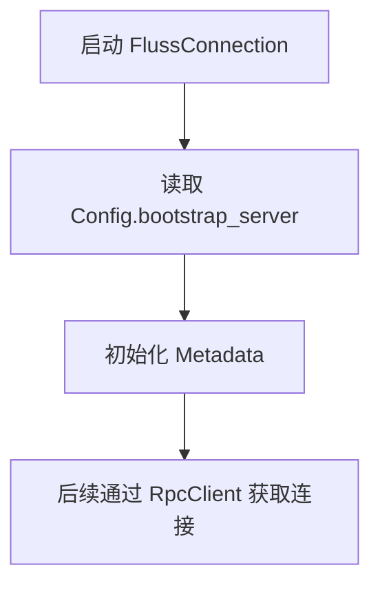
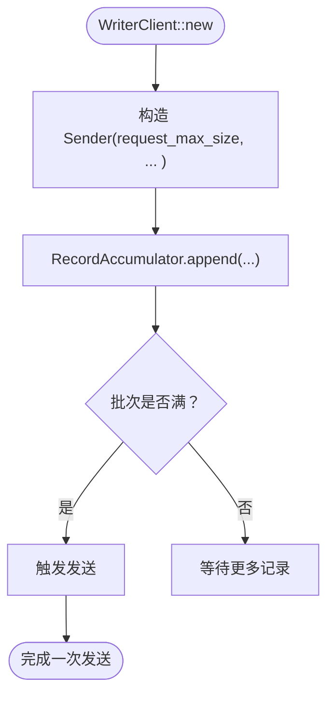
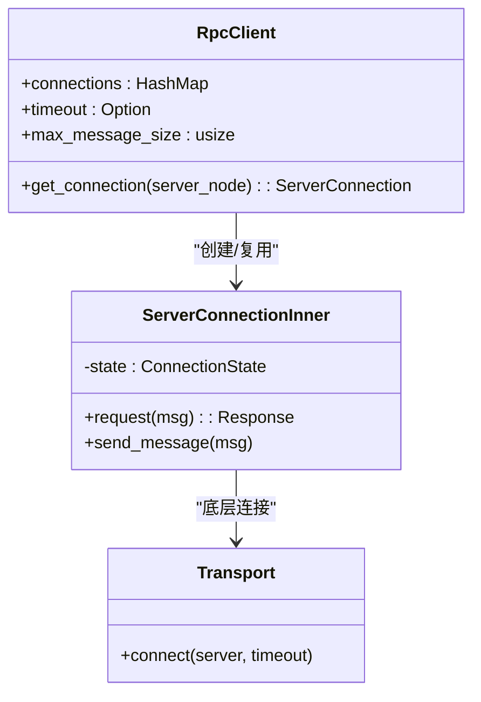
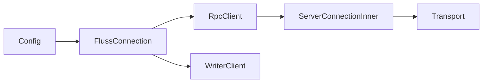

# 连接参数配置

<cite>
**本文引用的文件**
- [config.rs](file://crates/fluss/src/config.rs)
- [connection.rs](file://crates/fluss/src/client/connection.rs)
- [writer_client.rs](file://crates/fluss/src/client/write/writer_client.rs)
- [server_connection.rs](file://crates/fluss/src/rpc/server_connection.rs)
- [transport.rs](file://crates/fluss/src/rpc/transport.rs)
- [admin.rs](file://crates/fluss/src/client/admin.rs)
- [lib.rs](file://crates/fluss/src/lib.rs)
</cite>

## 目录
1. [简介](#简介)
2. [项目结构](#项目结构)
3. [核心组件](#核心组件)
4. [架构总览](#架构总览)
5. [详细组件分析](#详细组件分析)
6. [依赖关系分析](#依赖关系分析)
7. [性能考量](#性能考量)
8. [故障排查指南](#故障排查指南)
9. [结论](#结论)
10. [附录：配置示例与最佳实践](#附录配置示例与最佳实践)

## 简介
本文件聚焦于连接参数配置，围绕以下主题展开：
- bootstrap_server 参数的作用与配置（单节点与多节点集群）
- 请求最大尺寸 request_max_size 的含义、默认值与调优建议
- 连接超时、重连策略、心跳检测等连接管理参数现状与建议
- 不同网络环境下的配置示例与最佳实践
- 连接池与并发连接数限制等高级配置选项

## 项目结构
与连接参数相关的核心模块分布如下：
- 配置定义：config.rs
- 客户端连接入口：client/connection.rs
- 写入客户端与发送器：client/write/writer_client.rs
- RPC 客户端与连接状态机：rpc/server_connection.rs
- 传输层封装：rpc/transport.rs
- 管理接口（Admin）：client/admin.rs
- 库入口：lib.rs

图表来源
- [config.rs](file://crates/fluss/src/config.rs#L21-L39)
- [connection.rs](file://crates/fluss/src/client/connection.rs#L30-L82)
- [server_connection.rs](file://crates/fluss/src/rpc/server_connection.rs#L47-L96)
- [transport.rs](file://crates/fluss/src/rpc/transport.rs#L67-L82)
- [writer_client.rs](file://crates/fluss/src/client/write/writer_client.rs#L42-L77)

章节来源
- [lib.rs](file://crates/fluss/src/lib.rs#L18-L37)

## 核心组件
- Config：集中定义连接与写入相关参数，包括 bootstrap_server、request_max_size、writer_acks、writer_retries、writer_batch_size。
- FlussConnection：负责初始化元数据与 RPC 客户端，并按需创建 WriterClient。
- RpcClient：维护到各服务节点的连接映射，提供连接获取与复用能力。
- ServerConnectionInner：基于 BufStream 的读写通道，负责请求/响应编解码与状态管理。
- Transport：对底层 TCP 连接进行封装，支持可选超时。
- WriterClient：写入侧客户端，聚合 RecordAccumulator 与 Sender，消费 request_max_size 等参数。

章节来源
- [config.rs](file://crates/fluss/src/config.rs#L21-L39)
- [connection.rs](file://crates/fluss/src/client/connection.rs#L30-L82)
- [server_connection.rs](file://crates/fluss/src/rpc/server_connection.rs#L47-L96)
- [transport.rs](file://crates/fluss/src/rpc/transport.rs#L67-L82)
- [writer_client.rs](file://crates/fluss/src/client/write/writer_client.rs#L42-L77)

## 架构总览
下图展示了从应用配置到实际网络交互的关键路径，以及参数在链路中的传递与使用。

图表来源
- [connection.rs](file://crates/fluss/src/client/connection.rs#L37-L52)
- [server_connection.rs](file://crates/fluss/src/rpc/server_connection.rs#L64-L96)
- [transport.rs](file://crates/fluss/src/rpc/transport.rs#L67-L82)

## 详细组件分析

### bootstrap_server 参数
- 作用
  - 指定初始连接地址，用于发现集群元信息与协调者节点。
  - FlussConnection 在初始化时会基于该地址创建 Metadata 实例。
- 单节点配置
  - 值为单一主机:端口形式，例如 host:port。
- 多节点集群配置
  - 支持以逗号分隔的多个地址，例如 host1:port,host2:port,host3:port。
  - RpcClient 通过 ServerNode 的 URL 解析与连接管理，内部会按节点 UID 缓存连接。
- 使用位置
  - FlussConnection::new 会读取 Config.bootstrap_server 并传给 Metadata 初始化。
  - RpcClient::get_connection 会基于 ServerNode.url() 进行连接建立。

图表来源
- [connection.rs](file://crates/fluss/src/client/connection.rs#L37-L52)
- [server_connection.rs](file://crates/fluss/src/rpc/server_connection.rs#L84-L96)

章节来源
- [connection.rs](file://crates/fluss/src/client/connection.rs#L37-L52)
- [server_connection.rs](file://crates/fluss/src/rpc/server_connection.rs#L84-L96)

### request_max_size 参数
- 含义
  - 控制单次请求的最大字节数，用于 Sender 侧批量组装与发送控制。
- 默认值
  - 在 Config 中定义为较大的默认值，确保大多数场景无需调整。
- 调优建议
  - 与 writer_batch_size、网络 MTU、带宽与延迟匹配。
  - 若业务消息体较大或批次数较多，适当提高以减少拆包与往返次数。
  - 注意与服务端接收限制保持一致，避免被拒绝。
- 使用位置
  - WriterClient::new 将 request_max_size 传入 Sender 构造函数。
  - Sender 在批量聚合与发送时以此作为上限约束。

图表来源
- [writer_client.rs](file://crates/fluss/src/client/write/writer_client.rs#L48-L55)

章节来源
- [config.rs](file://crates/fluss/src/config.rs#L28-L29)
- [writer_client.rs](file://crates/fluss/src/client/write/writer_client.rs#L48-L55)

### 连接超时、重连策略与心跳检测
- 连接超时
  - Transport::connect 支持可选超时；RpcClient 当前未设置全局超时，因此默认不启用超时。
  - 可通过扩展 RpcClient 字段并在 Transport::connect 传入超时来启用。
- 重连策略
  - RpcClient 维护按节点 UID 的连接缓存；若连接异常，当前实现不会自动移除旧连接，需要显式重建或上层逻辑处理。
- 心跳检测
  - 代码中未见显式心跳机制；如需保活，可在应用层定期发起轻量请求或扩展连接层实现。
- 状态与错误传播
  - ServerConnectionInner 在读取失败或发送失败时会“毒化”连接，向所有活跃请求广播错误，避免半同步状态。

图表来源
- [server_connection.rs](file://crates/fluss/src/rpc/server_connection.rs#L47-L96)
- [transport.rs](file://crates/fluss/src/rpc/transport.rs#L67-L82)

章节来源
- [server_connection.rs](file://crates/fluss/src/rpc/server_connection.rs#L47-L96)
- [transport.rs](file://crates/fluss/src/rpc/transport.rs#L67-L82)

### 连接池与并发连接数
- 连接池
  - RpcClient 内部以节点 UID 为键维护连接映射，实现按节点的连接池化。
- 并发连接数
  - 代码未暴露显式的最大并发连接数配置项；可通过控制同时访问的节点数量与任务并发度间接限制。
- 最佳实践
  - 对于高并发写入，建议合理划分表分区与桶，使负载均匀分布在多个节点上，避免单点过载。

章节来源
- [server_connection.rs](file://crates/fluss/src/rpc/server_connection.rs#L47-L96)

### 其他相关参数与行为
- writer_acks
  - 支持字符串 "all" 或数字，影响写入确认策略；"all" 映射为特定确认级别。
- writer_retries
  - 写入重试次数上限，默认较大值，适合弱网络环境。
- writer_batch_size
  - 批大小默认较大，有助于提升吞吐，需与 request_max_size 协调。

章节来源
- [config.rs](file://crates/fluss/src/config.rs#L31-L38)
- [writer_client.rs](file://crates/fluss/src/client/write/writer_client.rs#L79-L87)

## 依赖关系分析
- FlussConnection 依赖 Config 提供的 bootstrap_server 与 request_max_size。
- RpcClient 依赖 Transport 进行底层连接，ServerConnectionInner 负责请求/响应处理。
- WriterClient 依赖 Metadata 与 RpcClient，将 request_max_size 等参数传递给 Sender。

图表来源
- [config.rs](file://crates/fluss/src/config.rs#L21-L39)
- [connection.rs](file://crates/fluss/src/client/connection.rs#L30-L82)
- [server_connection.rs](file://crates/fluss/src/rpc/server_connection.rs#L47-L96)
- [transport.rs](file://crates/fluss/src/rpc/transport.rs#L67-L82)
- [writer_client.rs](file://crates/fluss/src/client/write/writer_client.rs#L42-L77)

章节来源
- [lib.rs](file://crates/fluss/src/lib.rs#L18-L37)

## 性能考量
- request_max_size 与 writer_batch_size 的协同
  - 较大的 request_max_size 可降低请求次数，但会增加单次发送时间与内存占用。
  - 适配网络 MTU 与带宽，避免过大导致拥塞或丢包。
- writer_retries
  - 在弱网络环境下提高成功率，但会增加端到端延迟；应结合业务容忍度权衡。
- 连接复用
  - RpcClient 的按节点连接池可显著降低握手开销；注意避免过多并发连接导致资源争用。
- 超时与背压
  - 建议在应用层引入请求级超时与背压策略，防止阻塞堆积。

## 故障排查指南
- 连接超时
  - 现状：RpcClient 未设置全局超时。
  - 排查：检查网络连通性、DNS 解析、防火墙策略；必要时扩展 RpcClient 以支持超时。
- 连接“毒化”
  - 现状：读/写错误会导致连接状态变为 Poison，后续请求直接失败。
  - 排查：定位异常源头（磁盘、网络抖动、服务端限流），重建连接或等待恢复。
- 请求被拒
  - 现象：超过 request_max_size 的请求可能被拒绝。
  - 排查：降低单条消息大小或提高 request_max_size，确保与服务端一致。
- 写入确认异常
  - 现象：writer_acks 配置不当可能导致确认级别不符合预期。
  - 排查：核对配置值，确保与业务一致性要求匹配。

章节来源
- [server_connection.rs](file://crates/fluss/src/rpc/server_connection.rs#L122-L144)
- [transport.rs](file://crates/fluss/src/rpc/transport.rs#L73-L82)
- [writer_client.rs](file://crates/fluss/src/client/write/writer_client.rs#L79-L87)

## 结论
- bootstrap_server 是连接起点，支持单节点与多节点配置。
- request_max_size 是影响吞吐与延迟的关键参数，需结合业务与网络环境调优。
- 当前实现未内置全局连接超时与心跳机制，建议在应用层或扩展 RpcClient/RpcServer 层补充。
- 通过连接池与合理的批处理策略，可在多数场景下获得稳定性能。

## 附录：配置示例与最佳实践
- 本地开发
  - bootstrap_server：localhost:port 或 127.0.0.1:port
  - request_max_size：默认值通常足够；若单条消息较大，适度提高
  - writer_batch_size：默认值即可；若写入频率低，可略增以提升吞吐
  - writer_retries：默认值已较高，一般无需调整
- 测试环境
  - bootstrap_server：使用内网域名或固定 IP 列表
  - request_max_size：根据测试目标消息大小设定，验证边界条件
  - writer_retries：可适度降低以更快暴露网络问题
- 生产环境
  - bootstrap_server：多节点地址列表，确保高可用
  - request_max_size：结合服务端限制与网络状况，平衡吞吐与延迟
  - writer_retries：根据 SLA 要求设置，避免过度重试造成积压
  - writer_batch_size：与 request_max_size 协同，避免过大批次导致尾延迟
- 连接与并发
  - 通过连接池按节点复用连接；控制并发写入任务数量，避免单节点过载
  - 如需超时与心跳，建议扩展 RpcClient/RpcServer 层以满足生产需求