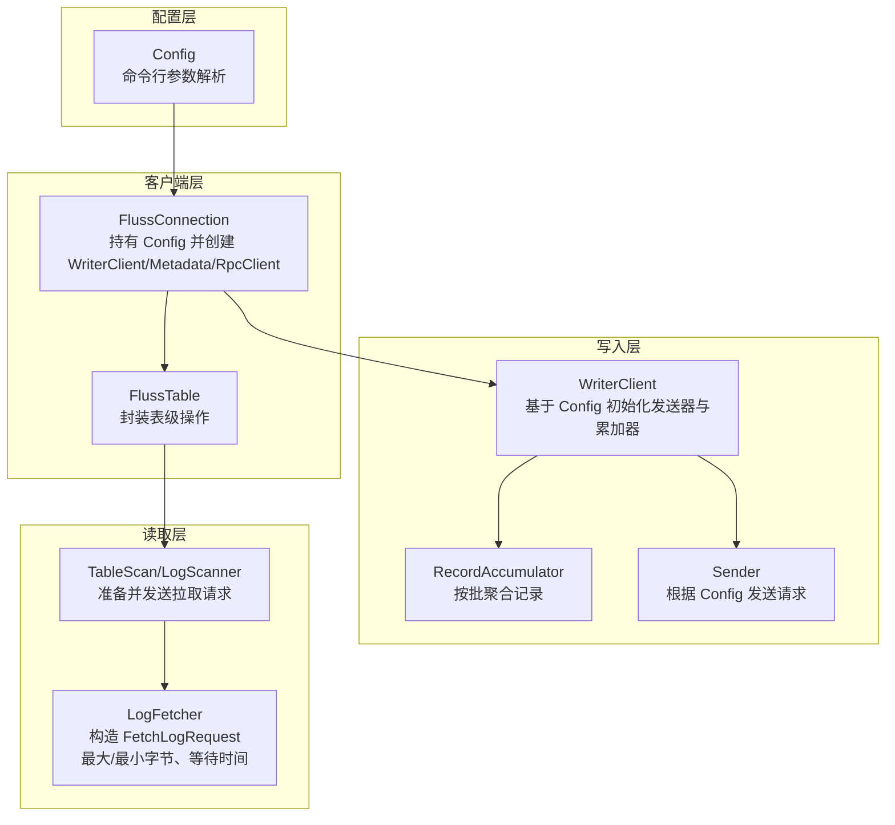
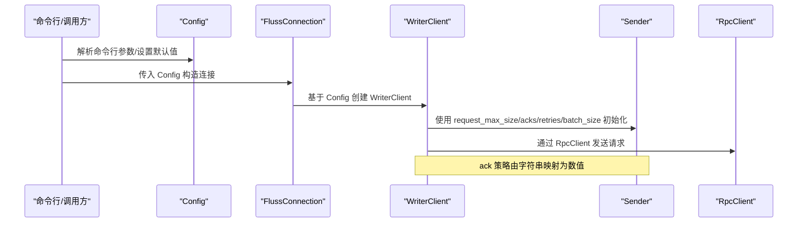
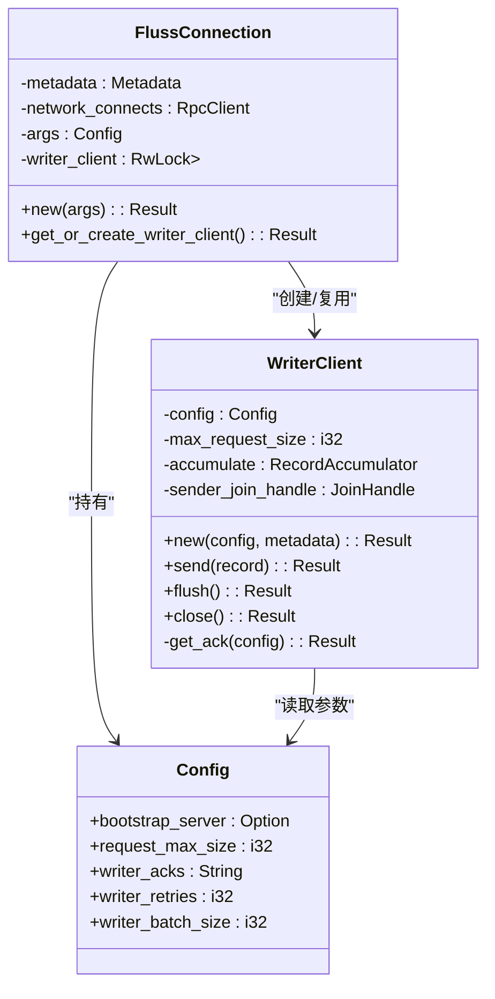
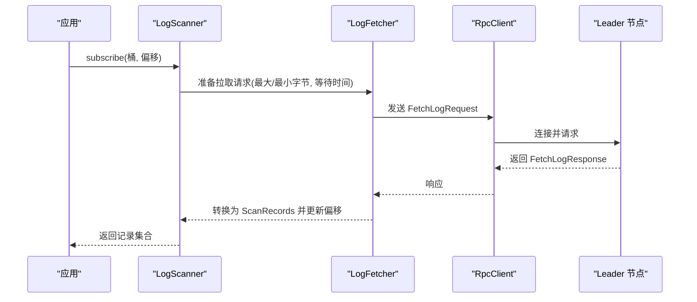
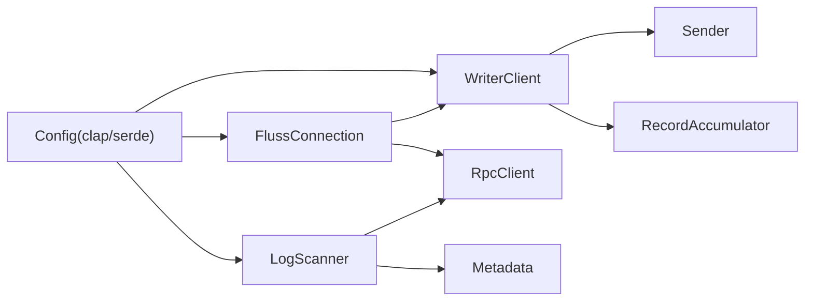

# 配置管理

<cite>
**本文引用的文件**
- [crates/fluss/src/config.rs](file://crates/fluss/src/config.rs)
- [crates/fluss/src/lib.rs](file://crates/fluss/src/lib.rs)
- [crates/fluss/src/client/connection.rs](file://crates/fluss/src/client/connection.rs)
- [crates/fluss/src/client/write/writer_client.rs](file://crates/fluss/src/client/write/writer_client.rs)
- [crates/fluss/src/client/write/batch.rs](file://crates/fluss/src/client/write/batch.rs)
- [crates/fluss/src/client/table/scanner.rs](file://crates/fluss/src/client/table/scanner.rs)
- [crates/fluss/src/client/table/mod.rs](file://crates/fluss/src/client/table/mod.rs)
- [crates/examples/src/example_table.rs](file://crates/examples/src/example_table.rs)
- [crates/fluss/Cargo.toml](file://crates/fluss/Cargo.toml)
</cite>

## 目录
1. [简介](#简介)
2. [项目结构](#项目结构)
3. [核心组件](#核心组件)
4. [架构总览](#架构总览)
5. [详细组件分析](#详细组件分析)
6. [依赖分析](#依赖分析)
7. [性能考虑](#性能考虑)
8. [故障排查指南](#故障排查指南)
9. [结论](#结论)
10. [附录：常见配置场景与最佳实践](#附录常见配置场景与最佳实践)

## 简介
本文件系统性梳理 Fluss 客户端配置管理，覆盖以下方面：
- 客户端配置参数：连接参数（bootstrap 服务器、请求最大尺寸）、写入策略（ack 策略、重试次数、批大小）、读取参数（拉取等待时间、最小/最大字节数、订阅偏移）。
- 配置加载机制：命令行参数解析、默认值设定、运行时覆盖。
- 动态配置与热重载：当前实现中配置在连接建立时注入，不支持运行时热重载；可通过重建连接以应用新配置。
- 安全配置：当前未发现显式 TLS/认证配置项，需结合部署环境或扩展实现。
- 性能调优与最佳实践：基于现有参数给出优化建议与典型场景配置思路。

## 项目结构
Fluss 的配置定义位于核心模块，通过命令行参数解析生成默认配置，并在客户端初始化阶段注入到连接与写入器中。读取侧通过扫描器与拉取器组合完成数据消费。

图表来源
- [crates/fluss/src/config.rs](file://crates/fluss/src/config.rs#L21-L39)
- [crates/fluss/src/client/connection.rs](file://crates/fluss/src/client/connection.rs#L30-L52)
- [crates/fluss/src/client/write/writer_client.rs](file://crates/fluss/src/client/write/writer_client.rs#L42-L77)
- [crates/fluss/src/client/table/scanner.rs](file://crates/fluss/src/client/table/scanner.rs#L119-L244)

章节来源
- [crates/fluss/src/lib.rs](file://crates/fluss/src/lib.rs#L18-L37)
- [crates/fluss/Cargo.toml](file://crates/fluss/Cargo.toml#L25-L47)

## 核心组件
- 配置模型 Config：定义连接与写入相关参数，支持命令行解析与序列化。
- 连接 FlussConnection：持有 Config，负责创建 Metadata、RpcClient 与 WriterClient。
- 写入器 WriterClient：依据 Config 初始化发送器与累加器，处理 ack 策略、重试次数与批大小。
- 扫描器 TableScan/LogScanner：负责构建拉取请求，控制最大/最小字节数与等待时间。

章节来源
- [crates/fluss/src/config.rs](file://crates/fluss/src/config.rs#L21-L39)
- [crates/fluss/src/client/connection.rs](file://crates/fluss/src/client/connection.rs#L30-L52)
- [crates/fluss/src/client/write/writer_client.rs](file://crates/fluss/src/client/write/writer_client.rs#L42-L87)
- [crates/fluss/src/client/table/scanner.rs](file://crates/fluss/src/client/table/scanner.rs#L119-L244)

## 架构总览
下图展示配置在客户端生命周期中的传递路径与关键决策点。

图表来源
- [crates/fluss/src/config.rs](file://crates/fluss/src/config.rs#L21-L39)
- [crates/fluss/src/client/connection.rs](file://crates/fluss/src/client/connection.rs#L37-L52)
- [crates/fluss/src/client/write/writer_client.rs](file://crates/fluss/src/client/write/writer_client.rs#L42-L87)

## 详细组件分析

### 配置模型与加载机制
- 参数定义与默认值
  - bootstrap_server：可选，用于初始化 Metadata。
  - request_max_size：i32，默认较大值，限制单次请求体大小。
  - writer_acks：String，默认 "all"，支持数字字符串映射为具体 ack 数。
  - writer_retries：i32，默认极大值，表示最大重试次数。
  - writer_batch_size：i32，默认中等值，影响批聚合上限。
- 加载方式
  - 通过命令行参数解析生成 Config 实例。
  - 示例中可在调用方显式设置 bootstrap_server 后传入连接构造函数。
- 序列化/反序列化
  - 支持 serde 序列化，便于持久化或跨进程传递。

章节来源
- [crates/fluss/src/config.rs](file://crates/fluss/src/config.rs#L21-L39)
- [crates/examples/src/example_table.rs](file://crates/examples/src/example_table.rs#L28-L32)

### 连接与写入器初始化
- FlussConnection 持有 Config，并据此创建 Metadata、RpcClient 与 WriterClient。
- WriterClient 从 Config 中读取 request_max_size、acks、retries 等参数，初始化发送器与累加器。
- ack 策略解析：字符串 "all" 映射为特定数值，其他字符串尝试解析为 i16；非法输入会返回错误。

图表来源
- [crates/fluss/src/config.rs](file://crates/fluss/src/config.rs#L21-L39)
- [crates/fluss/src/client/connection.rs](file://crates/fluss/src/client/connection.rs#L30-L52)
- [crates/fluss/src/client/write/writer_client.rs](file://crates/fluss/src/client/write/writer_client.rs#L32-L87)

章节来源
- [crates/fluss/src/client/connection.rs](file://crates/fluss/src/client/connection.rs#L37-L82)
- [crates/fluss/src/client/write/writer_client.rs](file://crates/fluss/src/client/write/writer_client.rs#L42-L87)

### 写入批处理与发送
- 批大小与聚合
  - WriterClient 将 Config 的 writer_batch_size 用于批聚合上限判断。
  - 批构建由 ArrowLogWriteBatch 负责，内部使用 ArrowBuilder 进行追加与封顶。
- 发送策略
  - Sender 接收 request_max_size、acks、retries 等参数，驱动发送循环与重试逻辑。
- 结果处理
  - 批完成后通过广播通知结果句柄，上层可等待确认。

图表来源
- [crates/fluss/src/client/write/writer_client.rs](file://crates/fluss/src/client/write/writer_client.rs#L89-L123)
- [crates/fluss/src/client/write/batch.rs](file://crates/fluss/src/client/write/batch.rs#L135-L176)

章节来源
- [crates/fluss/src/client/write/writer_client.rs](file://crates/fluss/src/client/write/writer_client.rs#L89-L141)
- [crates/fluss/src/client/write/batch.rs](file://crates/fluss/src/client/write/batch.rs#L135-L176)

### 读取参数与拉取流程
- 拉取请求参数
  - 最大/最小字节数：整体请求的最大与最小字节数常量。
  - 等待时间：最大等待时间为常量，避免过长阻塞。
- 订阅与偏移
  - 通过 subscribe 指定桶与起始偏移，内部维护每个桶的偏移状态。
- 数据转换
  - 拉取响应后转换为 Arrow 行格式，更新桶偏移。

图表来源
- [crates/fluss/src/client/table/scanner.rs](file://crates/fluss/src/client/table/scanner.rs#L95-L107)
- [crates/fluss/src/client/table/scanner.rs](file://crates/fluss/src/client/table/scanner.rs#L175-L244)

章节来源
- [crates/fluss/src/client/table/scanner.rs](file://crates/fluss/src/client/table/scanner.rs#L32-L37)
- [crates/fluss/src/client/table/scanner.rs](file://crates/fluss/src/client/table/scanner.rs#L175-L244)

### 配置参数一览与默认值
- 连接参数
  - bootstrap_server：可选；用于初始化 Metadata。
- 写入策略
  - request_max_size：i32，默认较大值，限制单次请求体大小。
  - writer_acks：String，默认 "all"；支持数字字符串映射为 i16。
  - writer_retries：i32，默认极大值，表示最大重试次数。
  - writer_batch_size：i32，默认中等值，影响批聚合上限。
- 读取参数（常量）
  - LOG_FETCH_MAX_BYTES：整体请求最大字节数常量。
  - LOG_FETCH_MIN_BYTES：整体请求最小字节数常量。
  - LOG_FETCH_WAIT_MAX_TIME：最大等待时间常量。

章节来源
- [crates/fluss/src/config.rs](file://crates/fluss/src/config.rs#L21-L39)
- [crates/fluss/src/client/table/scanner.rs](file://crates/fluss/src/client/table/scanner.rs#L32-L37)

## 依赖分析
- 配置依赖
  - Config 依赖 clap 与 serde，支持命令行解析与序列化。
  - 运行时依赖 tokio、dashmap、parking_lot 等库。
- 组件耦合
  - FlussConnection 依赖 Config 与 RpcClient/Metadata/WriterClient。
  - WriterClient 依赖 Config 与 Sender/RecordAccumulator。
  - 扫描器依赖 RpcClient 与 Metadata。

图表来源
- [crates/fluss/src/config.rs](file://crates/fluss/src/config.rs#L18-L19)
- [crates/fluss/src/client/connection.rs](file://crates/fluss/src/client/connection.rs#L18-L25)
- [crates/fluss/src/client/write/writer_client.rs](file://crates/fluss/src/client/write/writer_client.rs#L18-L27)
- [crates/fluss/src/client/table/scanner.rs](file://crates/fluss/src/client/table/scanner.rs#L18-L25)

章节来源
- [crates/fluss/Cargo.toml](file://crates/fluss/Cargo.toml#L25-L47)

## 性能考虑
- 批大小与内存占用
  - writer_batch_size 影响批内记录数量与内存占用，适当增大可提升吞吐但增加延迟。
- 请求体大小限制
  - request_max_size 控制单次请求上限，避免过大导致网络拥塞或服务端拒绝。
- ack 策略与可靠性
  - "all" 表示需要全部副本确认，可靠性高但可能降低写入速度；数字值越小越快但风险越高。
- 重试策略
  - writer_retries 过大可能导致堆积与放大退避；建议结合网络状况与业务容忍度设置。
- 读取等待与吞吐
  - LOG_FETCH_WAIT_MAX_TIME 与最小/最大字节数影响拉取频率与批量大小，需权衡延迟与带宽。
- 建议
  - 高吞吐写入：适度提高 request_max_size 与 writer_batch_size，合理设置 ack 为较小正数。
  - 低延迟读取：减小等待时间常量对应的等待窗口，配合较小最大字节以更快返回。
  - 生产部署：结合监控指标调整批大小与 ack，启用有限重试并观察失败率与延迟分布。

[本节为通用性能指导，不直接分析具体文件]

## 故障排查指南
- ack 策略解析失败
  - 当 writer_acks 非 "all" 且无法解析为 i16 时会报错。请检查字符串是否为合法数字。
- 连接初始化失败
  - bootstrap_server 为空会导致 Metadata 初始化失败。请确保在连接前设置有效地址。
- 写入阻塞或延迟过高
  - 检查 writer_batch_size 是否过小导致频繁发送；检查 request_max_size 是否过小导致拆分。
- 读取无数据或延迟高
  - 检查 subscribe 的桶与偏移是否正确；核对 LOG_FETCH_WAIT_MAX_TIME 与最小/最大字节数设置。

章节来源
- [crates/fluss/src/client/write/writer_client.rs](file://crates/fluss/src/client/write/writer_client.rs#L79-L87)
- [crates/fluss/src/client/connection.rs](file://crates/fluss/src/client/connection.rs#L40-L44)

## 结论
- 当前配置模型以命令行参数为主，具备合理的默认值与基本的序列化能力。
- 写入侧通过 ack、重试与批大小实现可靠与高效的写入；读取侧通过拉取参数控制延迟与吞吐。
- 配置在连接创建时生效，不支持运行时热重载；如需变更，需重建连接。
- 安全配置（TLS/认证）在当前版本未见显式支持，建议结合部署环境进行加固。

[本节为总结，不直接分析具体文件]

## 附录：常见配置场景与最佳实践
- 高吞吐量写入
  - 提升 request_max_size 与 writer_batch_size，降低 ack 数值以换取更高吞吐。
  - 合理设置 writer_retries，避免过度重试造成堆积。
- 低延迟读取
  - 减小等待时间常量对应的等待窗口，配合较小最大字节以更快返回。
  - 在 subscribe 时选择合适的桶与偏移，减少无效拉取。
- 生产环境部署
  - 明确 bootstrap_server 地址，确保网络连通性与稳定性。
  - 结合监控指标持续调优批大小与 ack，平衡延迟与可靠性。
  - 如需安全传输，建议在部署层面启用 TLS/认证，或扩展配置项以支持。

[本节为通用实践建议，不直接分析具体文件]