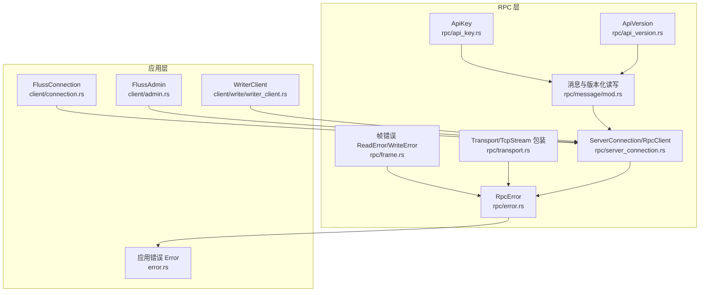
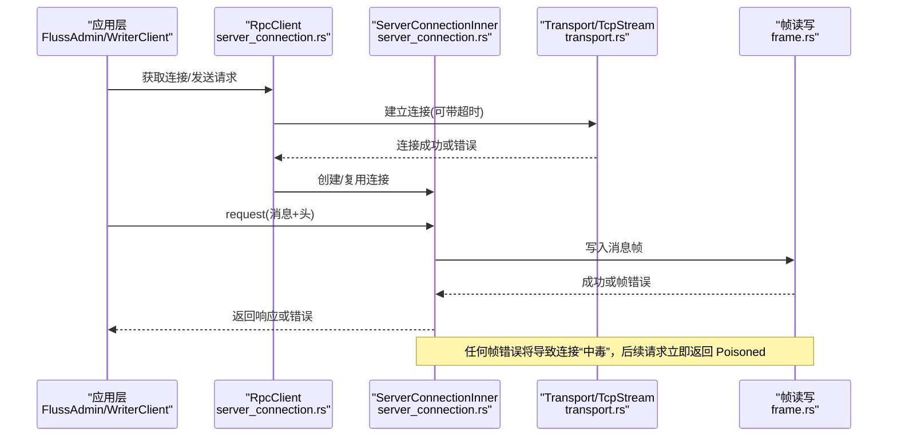
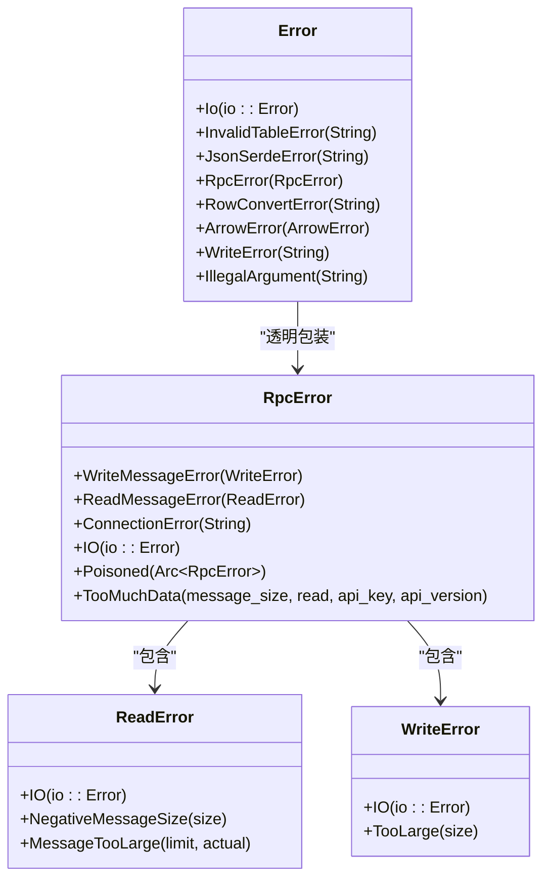
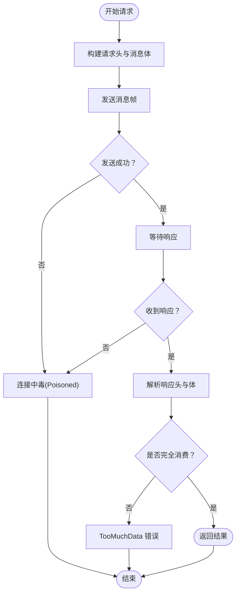
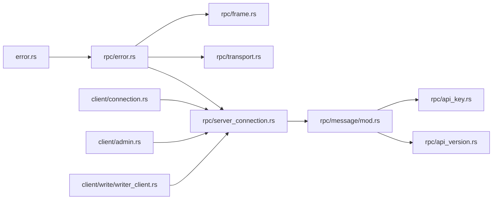

# RPC 错误处理

<cite>
**本文引用的文件**
- [crates/fluss/src/rpc/error.rs](file://crates/fluss/src/rpc/error.rs)
- [crates/fluss/src/error.rs](file://crates/fluss/src/error.rs)
- [crates/fluss/src/rpc/mod.rs](file://crates/fluss/src/rpc/mod.rs)
- [crates/fluss/src/rpc/frame.rs](file://crates/fluss/src/rpc/frame.rs)
- [crates/fluss/src/rpc/transport.rs](file://crates/fluss/src/rpc/transport.rs)
- [crates/fluss/src/rpc/server_connection.rs](file://crates/fluss/src/rpc/server_connection.rs)
- [crates/fluss/src/rpc/message/mod.rs](file://crates/fluss/src/rpc/message/mod.rs)
- [crates/fluss/src/rpc/api_key.rs](file://crates/fluss/src/rpc/api_key.rs)
- [crates/fluss/src/rpc/api_version.rs](file://crates/fluss/src/rpc/api_version.rs)
- [crates/fluss/src/client/connection.rs](file://crates/fluss/src/client/connection.rs)
- [crates/fluss/src/client/admin.rs](file://crates/fluss/src/client/admin.rs)
- [crates/fluss/src/client/write/writer_client.rs](file://crates/fluss/src/client/write/writer_client.rs)
</cite>

## 目录
1. [引言](#引言)
2. [项目结构](#项目结构)
3. [核心组件](#核心组件)
4. [架构总览](#架构总览)
5. [详细组件分析](#详细组件分析)
6. [依赖分析](#依赖分析)
7. [性能考虑](#性能考虑)
8. [故障排查指南](#故障排查指南)
9. [结论](#结论)
10. [附录](#附录)

## 引言
本文件系统性梳理 Fluss Rust 实现中的 RPC 错误处理机制，覆盖网络层错误、协议层错误与服务器错误的分类与处理策略；深入解析 RpcError 的继承关系与错误传播路径，阐明透明错误包装、错误链传递与上下文信息保留方式；并结合常见 RPC 场景（连接超时、请求失败、响应解析错误、服务器内部错误）给出可落地的重试策略、退避算法与故障转移建议。文档同时提供关键流程的时序图与类图，帮助读者快速把握实现细节。

## 项目结构
RPC 错误处理主要分布在以下模块：
- 错误定义：rpc/error.rs 定义 RpcError；顶层 error.rs 定义应用级 Error，并通过透明包装暴露 RpcError。
- 协议与帧：rpc/frame.rs 定义读写帧的错误类型；rpc/message/mod.rs 提供版本化读写接口与宏。
- 传输与连接：rpc/transport.rs 提供基于 TCP 的 Transport；rpc/server_connection.rs 实现连接池、请求-响应路由、错误传播与“中毒”流处理。
- API 元数据：rpc/api_key.rs、rpc/api_version.rs 提供 API Key 与版本范围定义。
- 客户端集成：client/connection.rs、client/admin.rs、client/write/writer_client.rs 展示上层如何使用 RpcClient 与 ServerConnection，并在业务层进行错误处理与重试。

图表来源
- [crates/fluss/src/rpc/error.rs](file://crates/fluss/src/rpc/error.rs#L23-L50)
- [crates/fluss/src/rpc/frame.rs](file://crates/fluss/src/rpc/frame.rs#L21-L106)
- [crates/fluss/src/rpc/transport.rs](file://crates/fluss/src/rpc/transport.rs#L26-L83)
- [crates/fluss/src/rpc/server_connection.rs](file://crates/fluss/src/rpc/server_connection.rs#L46-L312)
- [crates/fluss/src/rpc/message/mod.rs](file://crates/fluss/src/rpc/message/mod.rs#L37-L97)
- [crates/fluss/src/rpc/api_key.rs](file://crates/fluss/src/rpc/api_key.rs#L20-L54)
- [crates/fluss/src/rpc/api_version.rs](file://crates/fluss/src/rpc/api_version.rs#L18-L54)
- [crates/fluss/src/error.rs](file://crates/fluss/src/error.rs#L25-L50)
- [crates/fluss/src/client/connection.rs](file://crates/fluss/src/client/connection.rs#L30-L82)
- [crates/fluss/src/client/admin.rs](file://crates/fluss/src/client/admin.rs#L27-L93)
- [crates/fluss/src/client/write/writer_client.rs](file://crates/fluss/src/client/write/writer_client.rs#L31-L147)

章节来源
- [crates/fluss/src/rpc/mod.rs](file://crates/fluss/src/rpc/mod.rs#L18-L31)

## 核心组件
- RpcError：统一的 RPC 层错误枚举，包含帧写入/读取错误、连接错误、IO 错误、连接“中毒”以及消息尾部残留数据等。通过 #[from] 与 #[transparent] 实现与底层错误类型的自动转换与透明包装。
- ReadError/WriteError：帧协议层错误，涵盖 IO、负长度、过大消息、消息过长等。
- Transport：对 TcpStream 的薄封装，支持带超时的连接建立。
- ServerConnection/RpcClient：连接池与请求分发，负责请求 ID 分配、响应路由、错误传播与“中毒”流处理。
- 应用错误 Error：顶层错误类型，通过 #[from] 将 RpcError 透明包装为应用层错误，便于上层统一处理。

章节来源
- [crates/fluss/src/rpc/error.rs](file://crates/fluss/src/rpc/error.rs#L23-L50)
- [crates/fluss/src/rpc/frame.rs](file://crates/fluss/src/rpc/frame.rs#L21-L106)
- [crates/fluss/src/rpc/transport.rs](file://crates/fluss/src/rpc/transport.rs#L67-L82)
- [crates/fluss/src/rpc/server_connection.rs](file://crates/fluss/src/rpc/server_connection.rs#L46-L312)
- [crates/fluss/src/error.rs](file://crates/fluss/src/error.rs#L25-L50)

## 架构总览
RPC 错误处理贯穿“传输—帧协议—消息—连接—应用”多层。下图展示从客户端发起请求到错误传播的关键节点与路径。

图表来源
- [crates/fluss/src/rpc/server_connection.rs](file://crates/fluss/src/rpc/server_connection.rs#L84-L96)
- [crates/fluss/src/rpc/transport.rs](file://crates/fluss/src/rpc/transport.rs#L67-L82)
- [crates/fluss/src/rpc/frame.rs](file://crates/fluss/src/rpc/frame.rs#L93-L106)
- [crates/fluss/src/rpc/server_connection.rs](file://crates/fluss/src/rpc/server_connection.rs#L289-L312)

## 详细组件分析

### 错误类型与继承关系
RpcError 统一承载 RPC 层错误，具备如下特性：
- 透明包装：通过 #[from] 自动将 ReadError/WriteError、std::io::Error 转换为 RpcError。
- 上下文保留：TooMuchData 携带 api_key、api_version 等元信息，便于定位问题。
- 连接“中毒”：Poisoned 用于传播致命错误，阻断后续请求，避免帧同步错乱。

图表来源
- [crates/fluss/src/rpc/error.rs](file://crates/fluss/src/rpc/error.rs#L23-L50)
- [crates/fluss/src/rpc/frame.rs](file://crates/fluss/src/rpc/frame.rs#L21-L106)
- [crates/fluss/src/error.rs](file://crates/fluss/src/error.rs#L25-L50)

章节来源
- [crates/fluss/src/rpc/error.rs](file://crates/fluss/src/rpc/error.rs#L23-L50)
- [crates/fluss/src/rpc/frame.rs](file://crates/fluss/src/rpc/frame.rs#L21-L106)
- [crates/fluss/src/error.rs](file://crates/fluss/src/error.rs#L25-L50)

### 连接与请求生命周期中的错误传播
- 连接阶段：Transport::connect 支持超时；超时返回 ConnectionError，由上层决定是否重试。
- 发送阶段：CancellationSafeFuture 确保写入不可被取消；一旦发送失败，立即“中毒”连接，后续请求直接返回 Poisoned。
- 接收阶段：读取线程持续消费响应；若读取失败，同样“中毒”并终止读循环。
- 响应解析：请求函数在收到响应后检查是否完全消费，否则返回 TooMuchData。

图表来源
- [crates/fluss/src/rpc/server_connection.rs](file://crates/fluss/src/rpc/server_connection.rs#L233-L287)
- [crates/fluss/src/rpc/server_connection.rs](file://crates/fluss/src/rpc/server_connection.rs#L289-L312)
- [crates/fluss/src/rpc/frame.rs](file://crates/fluss/src/rpc/frame.rs#L45-L76)

章节来源
- [crates/fluss/src/rpc/server_connection.rs](file://crates/fluss/src/rpc/server_connection.rs#L172-L222)
- [crates/fluss/src/rpc/server_connection.rs](file://crates/fluss/src/rpc/server_connection.rs#L233-L287)
- [crates/fluss/src/rpc/server_connection.rs](file://crates/fluss/src/rpc/server_connection.rs#L289-L312)

### 常见 RPC 错误场景与处理策略
- 连接超时
  - 触发点：Transport::connect_timeout 在超时后返回 ConnectionError。
  - 处理建议：指数退避重试；区分可重试与不可重试错误；达到最大重试次数后降级或熔断。
- 请求失败（发送失败）
  - 触发点：send_message_inner 失败，触发“中毒”，后续请求立即返回 Poisoned。
  - 处理建议：立即切换到备用连接；对未完成请求执行补偿或回滚；在读线程中也应检测并提前退出。
- 响应解析错误（消息尾部残留）
  - 触发点：请求函数在解析完成后检查读取字节数与消息总长度，不一致则返回 TooMuchData。
  - 处理建议：记录 api_key/api_version 以便定位协议版本问题；必要时触发“中毒”以避免后续帧错位。
- 服务器内部错误
  - 触发点：服务端返回非语义错误（例如协议不匹配、版本不支持），通常在响应头解析或业务体解析阶段体现。
  - 处理建议：区分可恢复与不可恢复错误；对可恢复错误采用退避重试；对不可恢复错误返回给调用方并记录上下文。

章节来源
- [crates/fluss/src/rpc/transport.rs](file://crates/fluss/src/rpc/transport.rs#L73-L82)
- [crates/fluss/src/rpc/server_connection.rs](file://crates/fluss/src/rpc/server_connection.rs#L289-L312)
- [crates/fluss/src/rpc/error.rs](file://crates/fluss/src/rpc/error.rs#L41-L49)

### 透明错误包装、错误链传递与上下文保留
- 透明包装：RpcError 与 Error 均使用 #[from] 或 #[transparent]，确保底层错误无需手动映射即可向上抛出。
- 错误链传递：Poisoned 使用 Arc<RpcError> 保存原始错误，形成稳定的错误链，便于日志与监控收集。
- 上下文保留：TooMuchData 附带 api_key、api_version、消息长度等字段，便于快速定位问题。

章节来源
- [crates/fluss/src/rpc/error.rs](file://crates/fluss/src/rpc/error.rs#L23-L50)
- [crates/fluss/src/error.rs](file://crates/fluss/src/error.rs#L25-L50)

### 重试策略、退避算法与故障转移
- 重试策略
  - 可重试错误：连接超时、读写临时失败、网络瞬断。
  - 不可重试错误：协议不匹配、参数非法、TooMuchData（可能需要“中毒”保护）。
- 退避算法
  - 基础退避：固定间隔重试若干次。
  - 指数退避：每次重试间隔翻倍，上限设置为合理值，避免雪崩。
  - 指数退避+抖动：在指数退避基础上加入随机抖动，降低全局重试风暴概率。
- 故障转移
  - 连接池：RpcClient 维护按服务端节点的连接映射，失败时清理旧连接并重建。
  - 多副本/多分区：WriterClient 在发送前根据桶分配器选择目标节点，失败时切换到其他节点。
  - 读线程保护：读取线程遇到错误即“中毒”，避免后续请求继续使用已损坏的流。

章节来源
- [crates/fluss/src/rpc/server_connection.rs](file://crates/fluss/src/rpc/server_connection.rs#L64-L96)
- [crates/fluss/src/client/write/writer_client.rs](file://crates/fluss/src/client/write/writer_client.rs#L48-L66)

## 依赖分析
RPC 错误处理模块之间的依赖关系如下：

图表来源
- [crates/fluss/src/rpc/error.rs](file://crates/fluss/src/rpc/error.rs#L18-L21)
- [crates/fluss/src/rpc/frame.rs](file://crates/fluss/src/rpc/frame.rs#L18-L19)
- [crates/fluss/src/rpc/transport.rs](file://crates/fluss/src/rpc/transport.rs#L18-L24)
- [crates/fluss/src/rpc/server_connection.rs](file://crates/fluss/src/rpc/server_connection.rs#L18-L38)
- [crates/fluss/src/rpc/message/mod.rs](file://crates/fluss/src/rpc/message/mod.rs#L18-L28)
- [crates/fluss/src/rpc/api_key.rs](file://crates/fluss/src/rpc/api_key.rs#L18-L28)
- [crates/fluss/src/rpc/api_version.rs](file://crates/fluss/src/rpc/api_version.rs#L18-L25)
- [crates/fluss/src/error.rs](file://crates/fluss/src/error.rs#L18-L21)
- [crates/fluss/src/client/connection.rs](file://crates/fluss/src/client/connection.rs#L23-L28)
- [crates/fluss/src/client/admin.rs](file://crates/fluss/src/client/admin.rs#L20-L25)
- [crates/fluss/src/client/write/writer_client.rs](file://crates/fluss/src/client/write/writer_client.rs#L21-L27)

章节来源
- [crates/fluss/src/rpc/mod.rs](file://crates/fluss/src/rpc/mod.rs#L18-L31)

## 性能考虑
- 帧大小限制：读写路径均对消息长度进行校验，防止内存暴涨与 DoS 攻击。
- 非阻塞 I/O：基于 Tokio 的异步读写与缓冲流，提升吞吐量。
- 连接复用：RpcClient 维护连接池，减少握手开销。
- “中毒”保护：一旦发生帧错误，立即标记连接为 Poisoned 并通知所有活跃请求，避免无效重试与资源浪费。

章节来源
- [crates/fluss/src/rpc/frame.rs](file://crates/fluss/src/rpc/frame.rs#L50-L71)
- [crates/fluss/src/rpc/server_connection.rs](file://crates/fluss/src/rpc/server_connection.rs#L122-L144)

## 故障排查指南
- 连接超时
  - 现象：RpcError::ConnectionError，通常来自 Transport::connect_timeout。
  - 排查：检查网络连通性、防火墙、DNS 解析、服务端负载与健康状态。
- 帧错误
  - 现象：RpcError::ReadMessageError 或 RpcError::WriteMessageError。
  - 排查：确认消息长度计算、版本兼容性、最大消息大小配置；必要时开启更详细的日志。
- 太多数据
  - 现象：RpcError::TooMuchData，携带 api_key 与 api_version。
  - 排查：核对请求/响应序列化逻辑，确保版本一致；必要时触发“中毒”保护。
- 连接“中毒”
  - 现象：RpcError::Poisoned，后续请求立即失败。
  - 排查：检查上游错误链，确认是否因帧错误导致；清理旧连接并重建新连接。

章节来源
- [crates/fluss/src/rpc/transport.rs](file://crates/fluss/src/rpc/transport.rs#L73-L82)
- [crates/fluss/src/rpc/frame.rs](file://crates/fluss/src/rpc/frame.rs#L21-L32)
- [crates/fluss/src/rpc/error.rs](file://crates/fluss/src/rpc/error.rs#L41-L49)
- [crates/fluss/src/rpc/server_connection.rs](file://crates/fluss/src/rpc/server_connection.rs#L122-L144)

## 结论
本项目在 RPC 层实现了清晰的错误分类与传播机制：通过 RpcError 统一承载网络与协议错误，借助透明包装与错误链保留上下文；通过“中毒”保护避免帧错位引发的级联失败；通过连接池与异步 I/O 提升可靠性与性能。上层应用可在业务层面结合退避与故障转移策略，进一步增强鲁棒性。

## 附录
- API Key 与版本：用于标识请求类型与版本范围，有助于在解析错误时定位问题。
- 客户端集成：FlussConnection、FlussAdmin、WriterClient 展示了如何在高层使用 RpcClient 与 ServerConnection，并在业务层进行错误处理与重试。

章节来源
- [crates/fluss/src/rpc/api_key.rs](file://crates/fluss/src/rpc/api_key.rs#L20-L54)
- [crates/fluss/src/rpc/api_version.rs](file://crates/fluss/src/rpc/api_version.rs#L18-L54)
- [crates/fluss/src/client/connection.rs](file://crates/fluss/src/client/connection.rs#L30-L82)
- [crates/fluss/src/client/admin.rs](file://crates/fluss/src/client/admin.rs#L27-L93)
- [crates/fluss/src/client/write/writer_client.rs](file://crates/fluss/src/client/write/writer_client.rs#L31-L147)