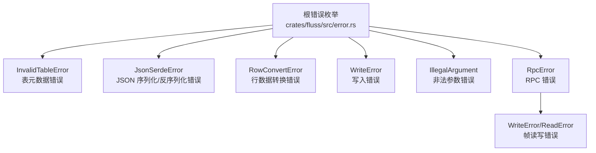
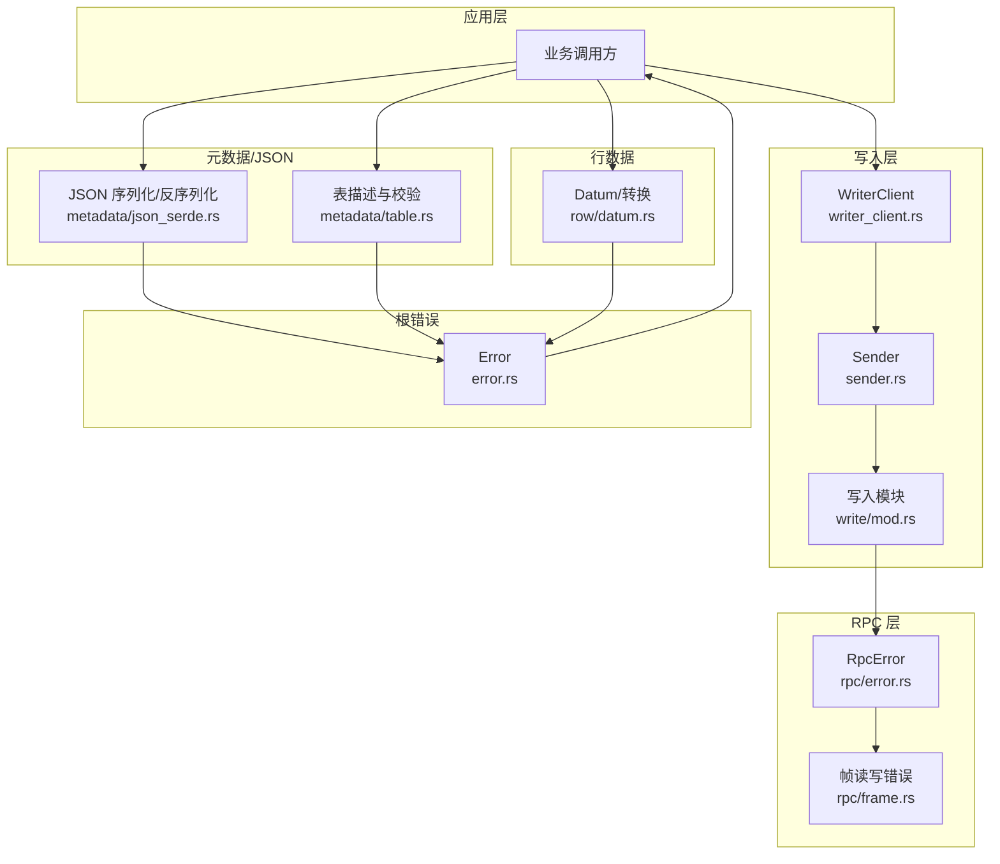
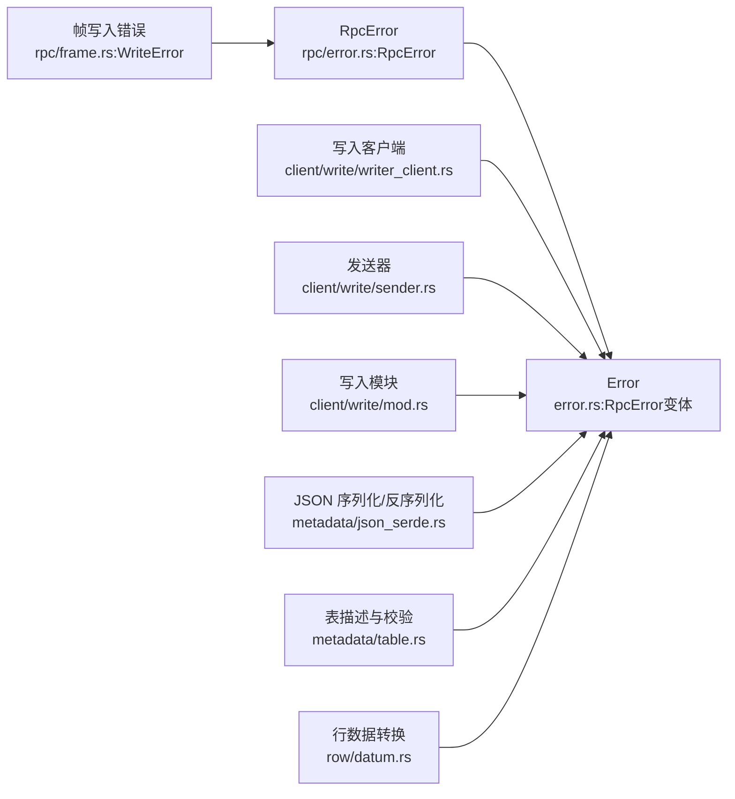

# 客户端错误类型

<cite>
**本文引用的文件**
- [crates/fluss/src/error.rs](file://crates/fluss/src/error.rs)
- [crates/fluss/src/rpc/error.rs](file://crates/fluss/src/rpc/error.rs)
- [crates/fluss/src/rpc/frame.rs](file://crates/fluss/src/rpc/frame.rs)
- [crates/fluss/src/metadata/json_serde.rs](file://crates/fluss/src/metadata/json_serde.rs)
- [crates/fluss/src/metadata/table.rs](file://crates/fluss/src/metadata/table.rs)
- [crates/fluss/src/row/datum.rs](file://crates/fluss/src/row/datum.rs)
- [crates/fluss/src/client/write/mod.rs](file://crates/fluss/src/client/write/mod.rs)
- [crates/fluss/src/client/write/sender.rs](file://crates/fluss/src/client/write/sender.rs)
- [crates/fluss/src/client/write/writer_client.rs](file://crates/fluss/src/client/write/writer_client.rs)
</cite>

## 目录
1. [简介](#简介)
2. [项目结构](#项目结构)
3. [核心组件](#核心组件)
4. [架构总览](#架构总览)
5. [详细组件分析](#详细组件分析)
6. [依赖关系分析](#依赖关系分析)
7. [性能考量](#性能考量)
8. [故障排查指南](#故障排查指南)
9. [结论](#结论)

## 简介
本文件系统性梳理 Fluss Rust 客户端中的错误类型与处理方式，重点覆盖以下错误类别及其触发条件、错误信息格式、典型场景、诊断方法与最佳实践：
- InvalidTableError：表元数据相关错误（如列重复、主键缺失或不合法、分桶/分区配置冲突等）
- JsonSerdeError：JSON 序列化/反序列化错误（如字段缺失、类型未知、格式不正确等）
- RowConvertError：行数据转换错误（如 Datum 类型与 Arrow 构建器不匹配）
- WriteError：写入流程错误（如 RPC 帧写入过大、网络写入失败、目标节点缺失等）
- IllegalArgument：非法参数错误（如参数格式或取值不合法）

同时给出错误识别与诊断方法、错误码含义、错误消息解析与上下文提取技巧，并通过代码路径示例展示如何捕获与处理这些错误。

## 项目结构
Fluss 客户端的错误体系由统一的错误枚举与子模块错误共同构成：
- 根级错误：集中于 crates/fluss/src/error.rs，聚合各类错误来源并统一对外暴露
- RPC 层错误：位于 crates/fluss/src/rpc/error.rs，封装连接、帧读写、消息长度等错误
- 写入层错误：在写入客户端与发送器中将底层错误映射为 WriteError 或 IllegalArgument
- 元数据与 JSON 序列化：在 crates/fluss/src/metadata/json_serde.rs 中抛出 JsonSerdeError 与 InvalidTableError
- 行数据转换：在 crates/fluss/src/row/datum.rs 中抛出 RowConvertError

**图表来源**
- [crates/fluss/src/error.rs](file://crates/fluss/src/error.rs#L25-L50)
- [crates/fluss/src/rpc/error.rs](file://crates/fluss/src/rpc/error.rs#L23-L50)
- [crates/fluss/src/rpc/frame.rs](file://crates/fluss/src/rpc/frame.rs#L79-L106)

**章节来源**
- [crates/fluss/src/error.rs](file://crates/fluss/src/error.rs#L25-L50)

## 核心组件
- 根错误枚举与别名
  - 统一结果类型 Result<T> = Result<T, Error>
  - 错误变体包括：Io、InvalidTableError、JsonSerdeError、RpcError、RowConvertError、ArrowError、WriteError、IllegalArgument
- RPC 错误
  - 包含帧写入错误、帧读取错误、连接错误、消息过长、连接被污染等
- 写入错误
  - 将底层帧写入错误与发送/客户端逻辑错误映射为 WriteError 或 IllegalArgument
- JSON 序列化/反序列化
  - 在元数据结构（DataType、Column、Schema、TableDescriptor）的 JSON 转换中抛出 JsonSerdeError
  - 在表描述构建与校验时抛出 InvalidTableError
- 行数据转换
  - Datum 到 Arrow 构建器的转换失败时抛出 RowConvertError

**章节来源**
- [crates/fluss/src/error.rs](file://crates/fluss/src/error.rs#L23-L50)
- [crates/fluss/src/rpc/error.rs](file://crates/fluss/src/rpc/error.rs#L23-L50)
- [crates/fluss/src/rpc/frame.rs](file://crates/fluss/src/rpc/frame.rs#L79-L106)
- [crates/fluss/src/metadata/json_serde.rs](file://crates/fluss/src/metadata/json_serde.rs#L133-L175)
- [crates/fluss/src/metadata/json_serde.rs](file://crates/fluss/src/metadata/json_serde.rs#L259-L294)
- [crates/fluss/src/metadata/json_serde.rs](file://crates/fluss/src/metadata/json_serde.rs#L372-L462)
- [crates/fluss/src/metadata/table.rs](file://crates/fluss/src/metadata/table.rs#L222-L249)
- [crates/fluss/src/metadata/table.rs](file://crates/fluss/src/metadata/table.rs#L441-L451)
- [crates/fluss/src/metadata/table.rs](file://crates/fluss/src/metadata/table.rs#L510-L564)
- [crates/fluss/src/row/datum.rs](file://crates/fluss/src/row/datum.rs#L178-L184)

## 架构总览
下图展示了客户端错误在各层之间的传播与映射关系：

**图表来源**
- [crates/fluss/src/client/write/writer_client.rs](file://crates/fluss/src/client/write/writer_client.rs#L120-L136)
- [crates/fluss/src/client/write/sender.rs](file://crates/fluss/src/client/write/sender.rs#L150-L160)
- [crates/fluss/src/client/write/mod.rs](file://crates/fluss/src/client/write/mod.rs#L55-L70)
- [crates/fluss/src/rpc/error.rs](file://crates/fluss/src/rpc/error.rs#L23-L50)
- [crates/fluss/src/rpc/frame.rs](file://crates/fluss/src/rpc/frame.rs#L79-L106)
- [crates/fluss/src/metadata/json_serde.rs](file://crates/fluss/src/metadata/json_serde.rs#L133-L175)
- [crates/fluss/src/metadata/table.rs](file://crates/fluss/src/metadata/table.rs#L222-L249)
- [crates/fluss/src/row/datum.rs](file://crates/fluss/src/row/datum.rs#L178-L184)
- [crates/fluss/src/error.rs](file://crates/fluss/src/error.rs#L25-L50)

## 详细组件分析

### InvalidTableError：表元数据相关错误
- 触发条件
  - 列名重复
  - 主键列不在 Schema 中
  - 主键列允许为空（自动修正为非空）
  - 分区键与分桶键冲突
  - 分桶键不是主键的子集（排除分区键后）
  - 复制因子属性缺失或无法解析为整数
- 错误信息格式
  - 以字符串形式携带具体错误描述，便于日志记录与用户提示
- 典型场景
  - 创建/更新表时，Schema 配置不合法
  - 指定分桶键与分区键重叠
  - 主键表未设置复制因子或格式不正确
- 解决方案
  - 校验列名唯一性，确保主键列存在于 Schema
  - 分桶键必须是主键集合（去除分区键）的子集
  - 正确设置复制因子为可解析的整数值
- 诊断方法
  - 检查表描述构建过程中的错误分支
  - 关注复制因子解析与分布规范化逻辑
- 代码路径示例
  - [列重复与主键校验](file://crates/fluss/src/metadata/table.rs#L222-L249)
  - [复制因子缺失与解析错误](file://crates/fluss/src/metadata/table.rs#L441-L451)
  - [分桶键与分区键冲突检查](file://crates/fluss/src/metadata/table.rs#L510-L564)

**章节来源**
- [crates/fluss/src/metadata/table.rs](file://crates/fluss/src/metadata/table.rs#L222-L249)
- [crates/fluss/src/metadata/table.rs](file://crates/fluss/src/metadata/table.rs#L441-L451)
- [crates/fluss/src/metadata/table.rs](file://crates/fluss/src/metadata/table.rs#L510-L564)

### JsonSerdeError：JSON 序列化/反序列化错误
- 触发条件
  - 缺少必需字段（如 type、columns、partition_key、properties 等）
  - 字段类型不匹配（如期望数组却得到字符串）
  - 未知的数据类型根名称
- 错误信息格式
  - 字符串描述具体缺失字段或类型不匹配问题
- 典型场景
  - 反序列化 Schema/Column/TableDescriptor 时字段缺失或类型不符
  - DataType 反序列化时遇到未知类型根
- 解决方案
  - 确保 JSON 结构符合元数据规范，字段齐全且类型正确
  - 使用已支持的类型根名称
- 诊断方法
  - 对照 JSON 字段常量与序列化/反序列化实现，定位缺失或类型错误字段
- 代码路径示例
  - [DataType 反序列化：缺少类型字段/未知类型根](file://crates/fluss/src/metadata/json_serde.rs#L133-L175)
  - [Schema 反序列化：缺少 columns 字段或类型不为数组](file://crates/fluss/src/metadata/json_serde.rs#L259-L294)
  - [TableDescriptor 反序列化：缺少必需字段或属性类型不正确](file://crates/fluss/src/metadata/json_serde.rs#L372-L462)

**章节来源**
- [crates/fluss/src/metadata/json_serde.rs](file://crates/fluss/src/metadata/json_serde.rs#L133-L175)
- [crates/fluss/src/metadata/json_serde.rs](file://crates/fluss/src/metadata/json_serde.rs#L259-L294)
- [crates/fluss/src/metadata/json_serde.rs](file://crates/fluss/src/metadata/json_serde.rs#L372-L462)

### RowConvertError：行数据转换错误
- 触发条件
  - Datum 类型与目标 Arrow 构建器类型不匹配，无法进行安全转换
- 错误信息格式
  - 字符串描述“无法将某类型转换为某构建器”
- 典型场景
  - 将 Datum 转换为 Arrow 数组时，类型不一致导致 downcast 失败
- 解决方案
  - 确保 Datum 与目标 Arrow 构建器类型一致；必要时在上层进行类型预校验
- 诊断方法
  - 检查 Datum 的具体类型与目标构建器类型是否匹配
- 代码路径示例
  - [Datum 到 Arrow 构建器转换失败](file://crates/fluss/src/row/datum.rs#L178-L184)

**章节来源**
- [crates/fluss/src/row/datum.rs](file://crates/fluss/src/row/datum.rs#L178-L184)

### WriteError：写入流程错误
- 触发条件
  - RPC 帧写入消息过大（超过限制）
  - 目标节点未找到
  - RPC 连接或帧读写错误
- 错误信息格式
  - 字符串或结构化错误（如“目标节点未找到”）
- 典型场景
  - 发送消息时消息体超限
  - 写入客户端在路由或发送阶段找不到目标节点
  - RPC 层帧写入失败
- 解决方案
  - 控制消息大小，避免超过帧写入限制
  - 校验目标节点可达性与路由配置
  - 捕获并处理 RpcError 后再映射为 WriteError
- 诊断方法
  - 检查帧写入错误类型与消息大小限制
  - 校验发送/客户端的节点选择逻辑
- 代码路径示例
  - [帧写入过大错误](file://crates/fluss/src/rpc/frame.rs#L97-L105)
  - [目标节点未找到](file://crates/fluss/src/client/write/sender.rs#L150-L160)
  - [写入客户端映射错误](file://crates/fluss/src/client/write/writer_client.rs#L120-L136)
  - [写入模块错误映射](file://crates/fluss/src/client/write/mod.rs#L55-L70)

**章节来源**
- [crates/fluss/src/rpc/frame.rs](file://crates/fluss/src/rpc/frame.rs#L97-L105)
- [crates/fluss/src/client/write/sender.rs](file://crates/fluss/src/client/write/sender.rs#L150-L160)
- [crates/fluss/src/client/write/writer_client.rs](file://crates/fluss/src/client/write/writer_client.rs#L120-L136)
- [crates/fluss/src/client/write/mod.rs](file://crates/fluss/src/client/write/mod.rs#L55-L70)

### IllegalArgument：非法参数错误
- 触发条件
  - 参数格式或取值不合法，例如参数无法转换为预期类型
- 错误信息格式
  - 字符串描述非法参数问题
- 典型场景
  - 用户输入或配置参数不符合要求
- 解决方案
  - 在调用前对参数进行严格校验与转换
- 诊断方法
  - 检查参数来源与转换逻辑，定位非法取值点
- 代码路径示例
  - [写入客户端参数非法映射](file://crates/fluss/src/client/write/writer_client.rs#L80-L90)

**章节来源**
- [crates/fluss/src/client/write/writer_client.rs](file://crates/fluss/src/client/write/writer_client.rs#L80-L90)

## 依赖关系分析
- 错误来源与映射
  - RpcError 由帧读写与连接错误派生，最终统一到根错误枚举
  - 写入层在多处将底层错误映射为 WriteError 或 IllegalArgument
  - 元数据与 JSON 层在多种校验失败时抛出 InvalidTableError 与 JsonSerdeError
  - 行数据转换在类型不匹配时抛出 RowConvertError
- 依赖链可视化

**图表来源**
- [crates/fluss/src/rpc/frame.rs](file://crates/fluss/src/rpc/frame.rs#L79-L106)
- [crates/fluss/src/rpc/error.rs](file://crates/fluss/src/rpc/error.rs#L23-L50)
- [crates/fluss/src/error.rs](file://crates/fluss/src/error.rs#L36-L37)
- [crates/fluss/src/client/write/writer_client.rs](file://crates/fluss/src/client/write/writer_client.rs#L120-L136)
- [crates/fluss/src/client/write/sender.rs](file://crates/fluss/src/client/write/sender.rs#L150-L160)
- [crates/fluss/src/client/write/mod.rs](file://crates/fluss/src/client/write/mod.rs#L55-L70)
- [crates/fluss/src/metadata/json_serde.rs](file://crates/fluss/src/metadata/json_serde.rs#L133-L175)
- [crates/fluss/src/metadata/table.rs](file://crates/fluss/src/metadata/table.rs#L222-L249)
- [crates/fluss/src/row/datum.rs](file://crates/fluss/src/row/datum.rs#L178-L184)

**章节来源**
- [crates/fluss/src/error.rs](file://crates/fluss/src/error.rs#L25-L50)
- [crates/fluss/src/rpc/error.rs](file://crates/fluss/src/rpc/error.rs#L23-L50)
- [crates/fluss/src/rpc/frame.rs](file://crates/fluss/src/rpc/frame.rs#L79-L106)
- [crates/fluss/src/client/write/writer_client.rs](file://crates/fluss/src/client/write/writer_client.rs#L120-L136)
- [crates/fluss/src/client/write/sender.rs](file://crates/fluss/src/client/write/sender.rs#L150-L160)
- [crates/fluss/src/client/write/mod.rs](file://crates/fluss/src/client/write/mod.rs#L55-L70)
- [crates/fluss/src/metadata/json_serde.rs](file://crates/fluss/src/metadata/json_serde.rs#L133-L175)
- [crates/fluss/src/metadata/table.rs](file://crates/fluss/src/metadata/table.rs#L222-L249)
- [crates/fluss/src/row/datum.rs](file://crates/fluss/src/row/datum.rs#L178-L184)

## 性能考量
- 错误处理开销
  - 避免在热路径中频繁分配错误对象；优先使用静态错误消息
  - 对于 RPC 帧写入错误，控制消息大小以减少内存占用与拷贝
- 日志与可观测性
  - 记录错误上下文（如 API Key、版本、消息大小），便于快速定位问题
  - 对重复错误进行去重统计，降低日志噪声

## 故障排查指南
- 错误识别与诊断
  - 通过错误枚举类型快速判断来源（表元数据、JSON、行数据、写入、RPC）
  - 提取错误消息中的关键字段（如字段名、类型、大小限制、节点标识）
- 常见排查步骤
  - InvalidTableError：核对列名、主键、分桶/分区键配置与复制因子
  - JsonSerdeError：核对 JSON 字段完整性与类型一致性
  - RowConvertError：核对 Datum 类型与 Arrow 构建器类型匹配
  - WriteError：检查消息大小、目标节点可达性与 RPC 连接状态
  - IllegalArgument：检查参数格式与取值范围
- 上下文信息提取
  - 从 RpcError 中提取 api_key、api_version、message_size、read 等字段
  - 从帧读写错误中提取 limit/actual/size 等字段

**章节来源**
- [crates/fluss/src/rpc/error.rs](file://crates/fluss/src/rpc/error.rs#L41-L49)
- [crates/fluss/src/rpc/frame.rs](file://crates/fluss/src/rpc/frame.rs#L27-L31)
- [crates/fluss/src/rpc/frame.rs](file://crates/fluss/src/rpc/frame.rs#L85-L86)

## 结论
Fluss Rust 客户端的错误体系以统一的根错误枚举为核心，结合 RPC、元数据、行数据与写入层的具体实现，形成清晰的错误来源与传播路径。通过理解各错误类型的触发条件、错误信息格式与典型场景，可以更高效地进行问题定位与修复。建议在生产环境中：
- 在调用前严格校验参数与配置，减少非法参数与表元数据错误
- 在写入前控制消息大小，避免帧写入错误
- 在日志中保留足够的上下文信息，便于快速诊断
- 对常见错误进行分类与告警，提升整体稳定性