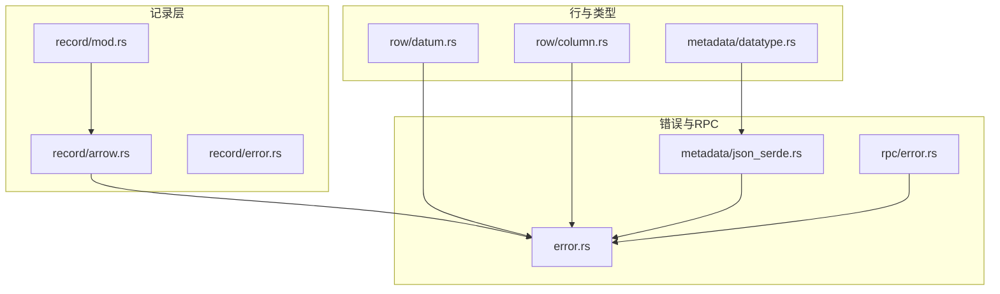
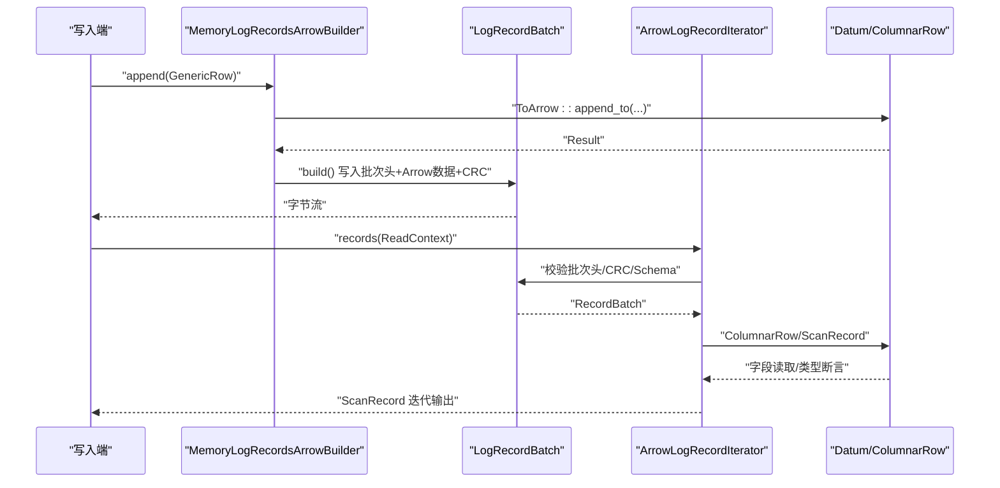
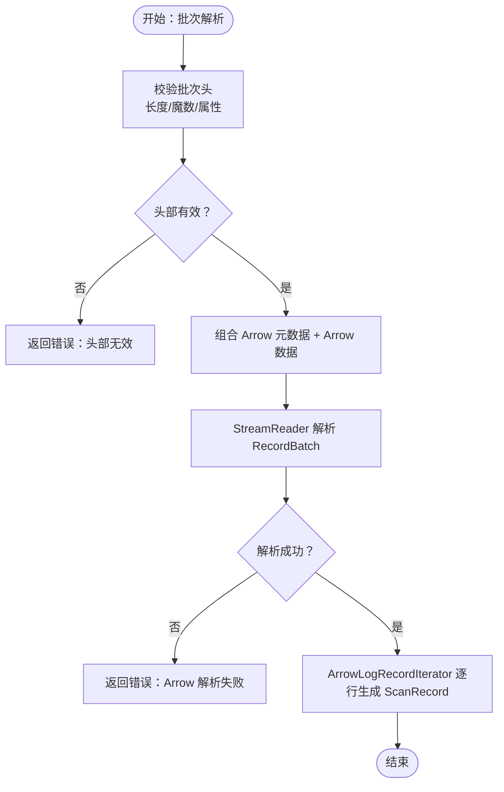
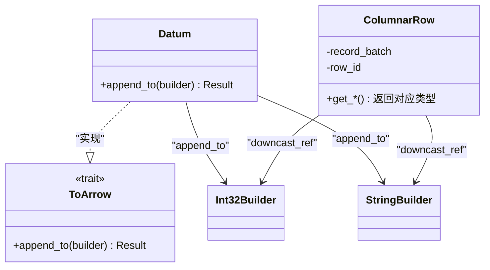
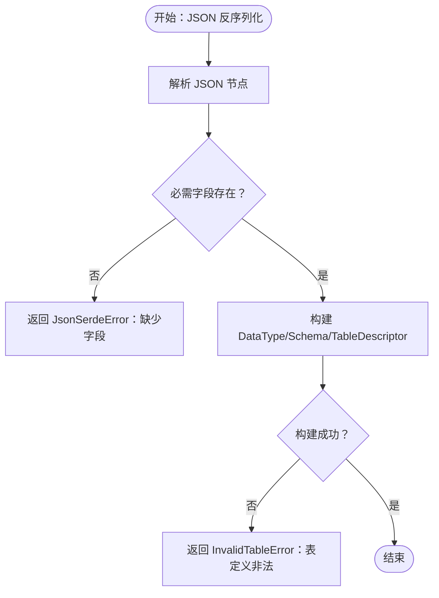
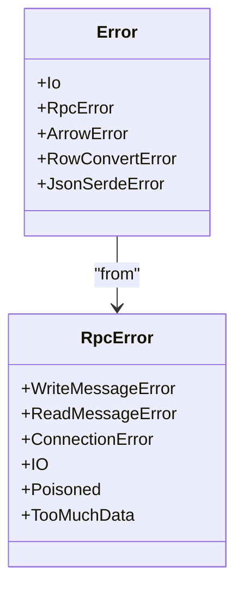
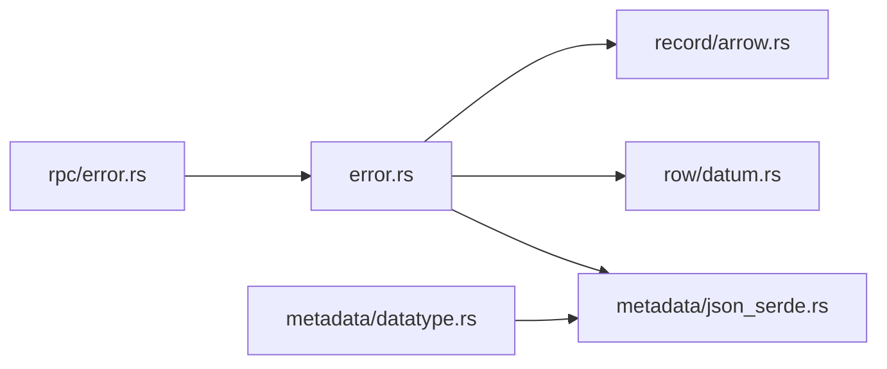

# 记录错误处理

<cite>
**本文引用的文件**
- [crates/fluss/src/error.rs](file://crates/fluss/src/error.rs)
- [crates/fluss/src/record/error.rs](file://crates/fluss/src/record/error.rs)
- [crates/fluss/src/record/arrow.rs](file://crates/fluss/src/record/arrow.rs)
- [crates/fluss/src/record/mod.rs](file://crates/fluss/src/record/mod.rs)
- [crates/fluss/src/rpc/error.rs](file://crates/fluss/src/rpc/error.rs)
- [crates/fluss/src/row/datum.rs](file://crates/fluss/src/row/datum.rs)
- [crates/fluss/src/row/column.rs](file://crates/fluss/src/row/column.rs)
- [crates/fluss/src/metadata/datatype.rs](file://crates/fluss/src/metadata/datatype.rs)
- [crates/fluss/src/metadata/json_serde.rs](file://crates/fluss/src/metadata/json_serde.rs)
</cite>

## 目录
1. [简介](#简介)
2. [项目结构](#项目结构)
3. [核心组件](#核心组件)
4. [架构总览](#架构总览)
5. [详细组件分析](#详细组件分析)
6. [依赖关系分析](#依赖关系分析)
7. [性能考量](#性能考量)
8. [故障排查指南](#故障排查指南)
9. [结论](#结论)

## 简介
本文件聚焦于记录（Record）在序列化与反序列化过程中的错误处理机制，覆盖 Arrow 序列化错误、数据类型转换错误、JSON 反序列化错误以及 RPC 层错误传播。文档从系统架构、关键组件、数据流、处理逻辑、集成点、错误处理与恢复策略等方面进行深入分析，并提供可操作的诊断方法与最佳实践。

## 项目结构
围绕记录错误处理的相关模块主要分布在以下路径：
- 错误类型定义：crates/fluss/src/error.rs
- 记录子模块：crates/fluss/src/record/mod.rs、crates/fluss/src/record/arrow.rs、crates/fluss/src/record/error.rs
- 行与数据类型：crates/fluss/src/row/datum.rs、crates/fluss/src/row/column.rs、crates/fluss/src/metadata/datatype.rs
- JSON 序列化/反序列化：crates/fluss/src/metadata/json_serde.rs
- RPC 错误：crates/fluss/src/rpc/error.rs

**图示来源**
- [crates/fluss/src/record/mod.rs](file://crates/fluss/src/record/mod.rs#L1-L175)
- [crates/fluss/src/record/arrow.rs](file://crates/fluss/src/record/arrow.rs#L1-L546)
- [crates/fluss/src/record/error.rs](file://crates/fluss/src/record/error.rs#L1-L28)
- [crates/fluss/src/error.rs](file://crates/fluss/src/error.rs#L1-L51)
- [crates/fluss/src/rpc/error.rs](file://crates/fluss/src/rpc/error.rs#L1-L51)
- [crates/fluss/src/row/datum.rs](file://crates/fluss/src/row/datum.rs#L1-L288)
- [crates/fluss/src/row/column.rs](file://crates/fluss/src/row/column.rs#L1-L170)
- [crates/fluss/src/metadata/datatype.rs](file://crates/fluss/src/metadata/datatype.rs#L1-L815)
- [crates/fluss/src/metadata/json_serde.rs](file://crates/fluss/src/metadata/json_serde.rs#L1-L465)

**章节来源**
- [crates/fluss/src/record/mod.rs](file://crates/fluss/src/record/mod.rs#L1-L175)
- [crates/fluss/src/record/arrow.rs](file://crates/fluss/src/record/arrow.rs#L1-L546)
- [crates/fluss/src/error.rs](file://crates/fluss/src/error.rs#L1-L51)

## 核心组件
- 错误类型体系：统一通过 Result<T> 包装，支持 ArrowError、Io、RpcError、RowConvertError、JsonSerdeError 等错误源的透明转换与传播。
- 记录批次与迭代器：LogRecordBatch 提供批次头校验、CRC 校验、Arrow 元数据拼接与读取；ArrowLogRecordIterator 将 RecordBatch 转换为 ScanRecord 流。
- 数据类型与转换：Datum 提供类型安全的值封装与 ToArrow 转换接口；ColumnarRow 提供按列式存储的字段访问与类型断言。
- JSON 序列化：DataType/Schema/TableDescriptor 的 JSON 反序列化严格校验字段存在性与类型，出错时返回 JsonSerdeError 或 InvalidTableError。

**章节来源**
- [crates/fluss/src/error.rs](file://crates/fluss/src/error.rs#L25-L50)
- [crates/fluss/src/record/arrow.rs](file://crates/fluss/src/record/arrow.rs#L280-L400)
- [crates/fluss/src/row/datum.rs](file://crates/fluss/src/row/datum.rs#L123-L188)
- [crates/fluss/src/row/column.rs](file://crates/fluss/src/row/column.rs#L50-L170)
- [crates/fluss/src/metadata/json_serde.rs](file://crates/fluss/src/metadata/json_serde.rs#L133-L176)

## 架构总览
记录错误处理贯穿“写入构建 → 批次序列化 → 网络传输 → 读取解析 → 类型转换”的全链路。

**图示来源**
- [crates/fluss/src/record/arrow.rs](file://crates/fluss/src/record/arrow.rs#L92-L230)
- [crates/fluss/src/record/arrow.rs](file://crates/fluss/src/record/arrow.rs#L280-L400)
- [crates/fluss/src/row/datum.rs](file://crates/fluss/src/row/datum.rs#L123-L188)
- [crates/fluss/src/row/column.rs](file://crates/fluss/src/row/column.rs#L50-L170)

## 详细组件分析

### 组件一：记录批次与序列化/反序列化错误
- 批次头与校验：LogRecordBatch 提供批次长度、魔数、时间戳、CRC、SchemaId、属性、偏移量、写入者ID、序列号、记录数等字段解析；提供 ensure_valid 与 is_valid 校验入口。
- Arrow 元数据拼接：ReadContext 将 Schema 序列化为 Arrow 元数据，与 Arrow 数据拼接后由 StreamReader 解析为 RecordBatch。
- 错误来源：ArrowError（来自 Arrow 库）、Io（底层 IO 失败）、RowConvertError（类型转换失败）、JsonSerdeError（JSON 反序列化失败）。

**图示来源**
- [crates/fluss/src/record/arrow.rs](file://crates/fluss/src/record/arrow.rs#L280-L400)
- [crates/fluss/src/record/arrow.rs](file://crates/fluss/src/record/arrow.rs#L449-L463)

**章节来源**
- [crates/fluss/src/record/arrow.rs](file://crates/fluss/src/record/arrow.rs#L280-L400)
- [crates/fluss/src/record/arrow.rs](file://crates/fluss/src/record/arrow.rs#L449-L463)
- [crates/fluss/src/error.rs](file://crates/fluss/src/error.rs#L25-L50)

### 组件二：数据类型转换与字段访问错误
- ToArrow 实现：Datum 通过宏实现对基础类型的 ToArrow 转换，若目标 ArrayBuilder 类型不匹配，返回 RowConvertError。
- 字段访问：ColumnarRow 对各类数组进行 downcast 并断言类型，若类型不匹配直接 panic，避免静默错误。
- 建议：在生产中应在外层捕获 panic 并转换为受控错误，或在调用前进行类型预检查。

**图示来源**
- [crates/fluss/src/row/datum.rs](file://crates/fluss/src/row/datum.rs#L123-L188)
- [crates/fluss/src/row/column.rs](file://crates/fluss/src/row/column.rs#L50-L170)

**章节来源**
- [crates/fluss/src/row/datum.rs](file://crates/fluss/src/row/datum.rs#L123-L188)
- [crates/fluss/src/row/column.rs](file://crates/fluss/src/row/column.rs#L50-L170)

### 组件三：JSON 反序列化与表定义错误
- 字段校验：DataType/Schema/TableDescriptor 的反序列化严格要求必需字段存在且类型正确，缺失或类型不符时返回 JsonSerdeError 或 InvalidTableError。
- 错误传播：上层统一通过 Result 包装，便于在调用栈中逐层透传。

**图示来源**
- [crates/fluss/src/metadata/json_serde.rs](file://crates/fluss/src/metadata/json_serde.rs#L133-L176)
- [crates/fluss/src/metadata/json_serde.rs](file://crates/fluss/src/metadata/json_serde.rs#L202-L223)
- [crates/fluss/src/metadata/json_serde.rs](file://crates/fluss/src/metadata/json_serde.rs#L259-L295)

**章节来源**
- [crates/fluss/src/metadata/json_serde.rs](file://crates/fluss/src/metadata/json_serde.rs#L133-L176)
- [crates/fluss/src/metadata/json_serde.rs](file://crates/fluss/src/metadata/json_serde.rs#L202-L223)
- [crates/fluss/src/metadata/json_serde.rs](file://crates/fluss/src/metadata/json_serde.rs#L259-L295)

### 组件四：RPC 错误与网络层错误
- RPC 错误类型：包含写消息、读帧、连接错误、IO 错误、消息剩余字节过多等场景。
- 错误传播：通过 RpcError::from 将底层错误转换为统一的 RPC 错误，再由全局 Error::from 透明传播到上层。

**图示来源**
- [crates/fluss/src/rpc/error.rs](file://crates/fluss/src/rpc/error.rs#L25-L50)
- [crates/fluss/src/error.rs](file://crates/fluss/src/error.rs#L25-L50)

**章节来源**
- [crates/fluss/src/rpc/error.rs](file://crates/fluss/src/rpc/error.rs#L25-L50)
- [crates/fluss/src/error.rs](file://crates/fluss/src/error.rs#L25-L50)

## 依赖关系分析
- 记录层依赖错误类型体系进行错误传播与包装。
- 行与类型层依赖错误类型体系进行类型转换失败的错误表达。
- JSON 层依赖错误类型体系进行表定义与序列化错误表达。
- RPC 层通过 RpcError 与全局 Error 协同，形成统一错误语义。

**图示来源**
- [crates/fluss/src/error.rs](file://crates/fluss/src/error.rs#L1-L51)
- [crates/fluss/src/record/arrow.rs](file://crates/fluss/src/record/arrow.rs#L1-L546)
- [crates/fluss/src/row/datum.rs](file://crates/fluss/src/row/datum.rs#L1-L288)
- [crates/fluss/src/metadata/json_serde.rs](file://crates/fluss/src/metadata/json_serde.rs#L1-L465)
- [crates/fluss/src/rpc/error.rs](file://crates/fluss/src/rpc/error.rs#L1-L51)
- [crates/fluss/src/metadata/datatype.rs](file://crates/fluss/src/metadata/datatype.rs#L1-L815)

**章节来源**
- [crates/fluss/src/error.rs](file://crates/fluss/src/error.rs#L1-L51)
- [crates/fluss/src/record/arrow.rs](file://crates/fluss/src/record/arrow.rs#L1-L546)
- [crates/fluss/src/row/datum.rs](file://crates/fluss/src/row/datum.rs#L1-L288)
- [crates/fluss/src/metadata/json_serde.rs](file://crates/fluss/src/metadata/json_serde.rs#L1-L465)
- [crates/fluss/src/rpc/error.rs](file://crates/fluss/src/rpc/error.rs#L1-L51)
- [crates/fluss/src/metadata/datatype.rs](file://crates/fluss/src/metadata/datatype.rs#L1-L815)

## 性能考量
- 批次头与 CRC 校验：在解析阶段进行一次性校验，避免后续重复计算。
- Arrow 元数据拼接：尽量复用已序列化的元数据缓冲区，减少内存拷贝。
- 类型转换：ToArrow 使用 downcast 与类型匹配，避免不必要的装箱与解包。
- JSON 反序列化：字段存在性与类型检查在构建初期完成，降低运行期开销。

[本节为通用指导，无需列出具体文件来源]

## 故障排查指南

### 常见错误类型与定位
- ArrowError：通常出现在 RecordBatch 解析、类型不匹配或内存不足等场景。建议检查批次头、CRC、Schema 是否一致。
- RowConvertError：类型转换失败，多因 Datum 与目标 ArrayBuilder 类型不一致。建议核对表结构与数据类型映射。
- JsonSerdeError/InvalidTableError：JSON 反序列化失败，多因字段缺失、类型不符或非法值。建议打印原始 JSON 结构并逐项比对。
- RpcError：网络层错误，包含写消息、读帧、连接错误等。建议检查网络连通性与消息边界。

### 诊断步骤
- 数据验证：在写入前对 Datum 进行类型断言与范围检查，确保与表结构一致。
- 格式检查：确认批次头字段完整、CRC 正确、SchemaId 与元数据匹配。
- 类型推断：通过 ReadContext 生成 Arrow 元数据，结合 RecordBatch 的字段类型进行一致性校验。
- 日志与追踪：在关键路径记录批次大小、SchemaId、时间戳、写入者ID等上下文信息，便于回溯。

### 恢复策略
- 数据清洗：对 RowConvertError 场景，可采用默认值填充或跳过非法记录，同时记录告警日志。
- 格式修复：对 JsonSerdeError/InvalidTableError，优先修正表定义 JSON，确保字段齐全且类型正确。
- 降级处理：在网络不稳定时，采用重试、退避与熔断策略；对 Arrow 解析失败，可降级为逐条解析或分批重试。
- 容错与隔离：对外部依赖（RPC、IO）进行超时与隔离，避免单点故障扩散。

**章节来源**
- [crates/fluss/src/error.rs](file://crates/fluss/src/error.rs#L25-L50)
- [crates/fluss/src/record/arrow.rs](file://crates/fluss/src/record/arrow.rs#L309-L318)
- [crates/fluss/src/row/datum.rs](file://crates/fluss/src/row/datum.rs#L171-L188)
- [crates/fluss/src/metadata/json_serde.rs](file://crates/fluss/src/metadata/json_serde.rs#L133-L176)
- [crates/fluss/src/rpc/error.rs](file://crates/fluss/src/rpc/error.rs#L25-L50)

## 结论
本项目通过统一的错误类型体系与严格的序列化/反序列化流程，实现了对 Arrow、数据类型转换、JSON 与 RPC 层错误的有效管理。建议在生产环境中配合完善的日志与监控，落实数据验证、格式检查与类型推断机制，并针对常见错误制定标准化的恢复策略，以提升系统的稳定性与可维护性。