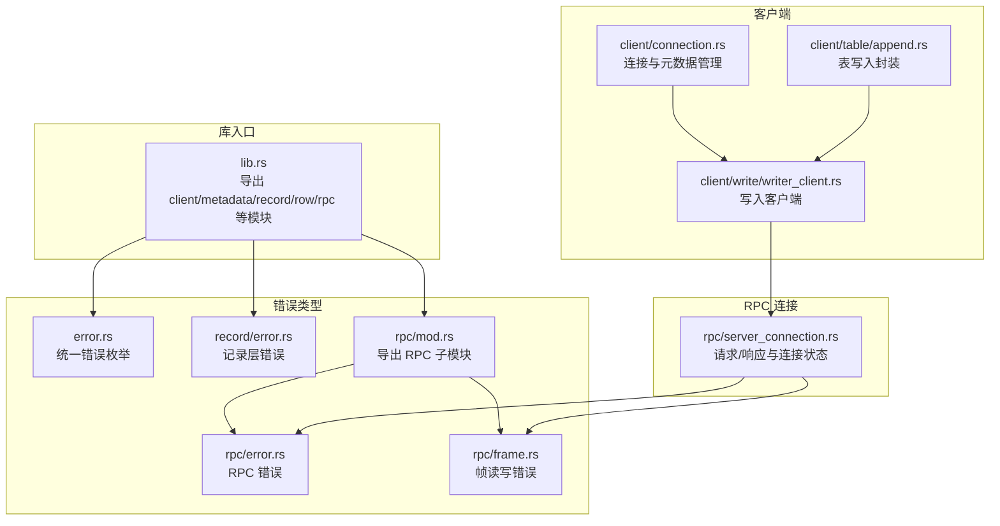
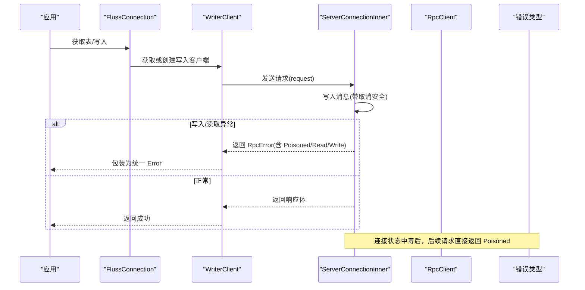
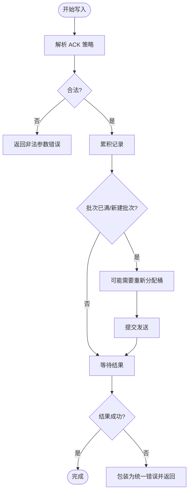
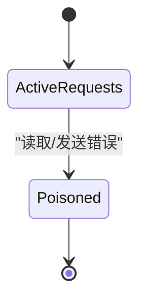
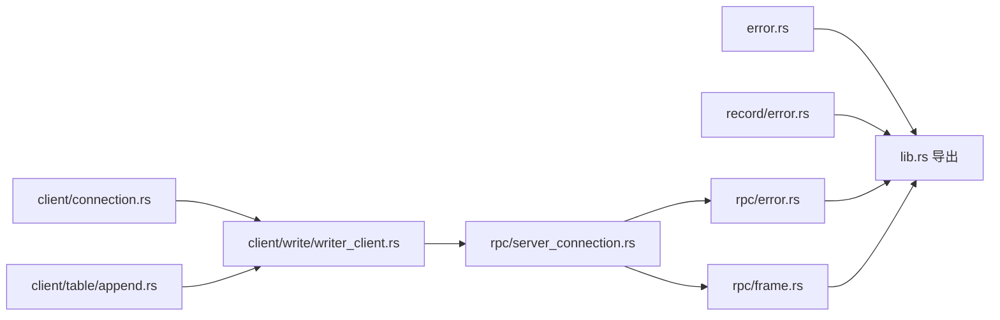

# 错误处理

<cite>
**本文引用的文件**
- [crates/fluss/src/lib.rs](file://crates/fluss/src/lib.rs)
- [crates/fluss/src/error.rs](file://crates/fluss/src/error.rs)
- [crates/fluss/src/record/error.rs](file://crates/fluss/src/record/error.rs)
- [crates/fluss/src/rpc/error.rs](file://crates/fluss/src/rpc/error.rs)
- [crates/fluss/src/rpc/frame.rs](file://crates/fluss/src/rpc/frame.rs)
- [crates/fluss/src/rpc/mod.rs](file://crates/fluss/src/rpc/mod.rs)
- [crates/fluss/src/rpc/server_connection.rs](file://crates/fluss/src/rpc/server_connection.rs)
- [crates/fluss/src/client/connection.rs](file://crates/fluss/src/client/connection.rs)
- [crates/fluss/src/client/write/writer_client.rs](file://crates/fluss/src/client/write/writer_client.rs)
- [crates/fluss/src/client/table/append.rs](file://crates/fluss/src/client/table/append.rs)
</cite>

## 目录
1. [引言](#引言)
2. [项目结构](#项目结构)
3. [核心组件](#核心组件)
4. [架构总览](#架构总览)
5. [详细组件分析](#详细组件分析)
6. [依赖关系分析](#依赖关系分析)
7. [性能考量](#性能考量)
8. [故障排查指南](#故障排查指南)
9. [结论](#结论)
10. [附录：最佳实践与监控告警建议](#附录最佳实践与监控告警建议)

## 引言
本文件系统性梳理 Fluss Rust 客户端的错误类型体系与处理策略，覆盖客户端错误、记录错误、RPC 错误等分类与层次结构；解释错误传播与包装机制（透明包装、上下文保留、堆栈跟踪）；总结常见错误场景与应对策略（网络中断、服务器过载、数据格式错误、权限不足等）；并给出可操作的错误处理最佳实践与监控告警配置建议。

## 项目结构
Fluss 的错误处理围绕统一的错误类型体系展开，核心位于根模块导出与各子模块的错误定义与传播路径中。整体结构如下：



图表来源
- [crates/fluss/src/lib.rs](file://crates/fluss/src/lib.rs#L18-L37)
- [crates/fluss/src/error.rs](file://crates/fluss/src/error.rs#L23-L50)
- [crates/fluss/src/record/error.rs](file://crates/fluss/src/record/error.rs#L21-L27)
- [crates/fluss/src/rpc/mod.rs](file://crates/fluss/src/rpc/mod.rs#L18-L31)
- [crates/fluss/src/rpc/error.rs](file://crates/fluss/src/rpc/error.rs#L23-L50)
- [crates/fluss/src/rpc/frame.rs](file://crates/fluss/src/rpc/frame.rs#L21-L106)
- [crates/fluss/src/client/connection.rs](file://crates/fluss/src/client/connection.rs#L30-L82)
- [crates/fluss/src/client/write/writer_client.rs](file://crates/fluss/src/client/write/writer_client.rs#L31-L147)
- [crates/fluss/src/client/table/append.rs](file://crates/fluss/src/client/table/append.rs#L25-L69)
- [crates/fluss/src/rpc/server_connection.rs](file://crates/fluss/src/rpc/server_connection.rs#L46-L402)

章节来源
- [crates/fluss/src/lib.rs](file://crates/fluss/src/lib.rs#L18-L37)

## 核心组件
- 统一错误类型与别名
  - 在根模块导出统一的 Result 类型别名，便于全库一致地返回错误。
  - 顶层错误枚举覆盖 IO、JSON 序列化、RPC、Arrow、行转换、写入、非法参数等类别，采用透明包装以保留底层堆栈信息。
- 记录层错误
  - 记录模块提供基础的 IO 错误包装，作为上层错误的来源之一。
- RPC 层错误
  - RPC 错误涵盖消息写入失败、读取失败、连接错误、IO 错误、连接中毒、消息长度不匹配等。
  - 帧层错误进一步细化为负数消息大小、消息过大等边界条件。
- 客户端与连接
  - 连接器负责获取元数据、管理 RPC 客户端、按需创建写入客户端。
  - 写入客户端负责累积记录、调度发送、处理 ACK 策略与重试参数。
  - 表写入封装通过写入客户端完成最终的写入与结果等待。

章节来源
- [crates/fluss/src/error.rs](file://crates/fluss/src/error.rs#L23-L50)
- [crates/fluss/src/record/error.rs](file://crates/fluss/src/record/error.rs#L21-L27)
- [crates/fluss/src/rpc/error.rs](file://crates/fluss/src/rpc/error.rs#L23-L50)
- [crates/fluss/src/rpc/frame.rs](file://crates/fluss/src/rpc/frame.rs#L21-L106)
- [crates/fluss/src/client/connection.rs](file://crates/fluss/src/client/connection.rs#L30-L82)
- [crates/fluss/src/client/write/writer_client.rs](file://crates/fluss/src/client/write/writer_client.rs#L31-L147)
- [crates/fluss/src/client/table/append.rs](file://crates/fluss/src/client/table/append.rs#L25-L69)

## 架构总览
下图展示从应用调用到 RPC 请求/响应的错误传播路径，以及连接状态与错误中毒机制如何影响后续请求。



图表来源
- [crates/fluss/src/client/connection.rs](file://crates/fluss/src/client/connection.rs#L62-L81)
- [crates/fluss/src/client/write/writer_client.rs](file://crates/fluss/src/client/write/writer_client.rs#L89-L123)
- [crates/fluss/src/rpc/server_connection.rs](file://crates/fluss/src/rpc/server_connection.rs#L233-L287)
- [crates/fluss/src/rpc/error.rs](file://crates/fluss/src/rpc/error.rs#L25-L50)

## 详细组件分析

### 错误类型层次与传播
- 顶层错误枚举
  - 通过透明包装将 IO、RPC、Arrow 等错误无损传递，同时新增业务语义错误（如 JSON 序列化、行转换、写入、非法参数）。
  - 该设计确保调用方能基于统一 Result 处理，同时保留底层错误的完整上下文。
- RPC 错误
  - 消息写入/读取错误、连接错误、IO 错误、连接中毒、消息长度不匹配等。
  - 连接状态在读取失败时被标记为“中毒”，后续请求直接返回中毒错误，避免进一步破坏。
- 帧层错误
  - 负数消息大小、消息过大等边界条件，用于保护内存与协议一致性。

```mermaid
classDiagram
class Error {
<<enum>>
+Io(io : : Error)
+InvalidTableError(String)
+JsonSerdeError(String)
+RpcError(RpcError)
+RowConvertError(String)
+ArrowError(ArrowError)
+WriteError(String)
+IllegalArgument(String)
}
class RpcError {
<<enum>>
+WriteMessageError(WriteError)
+ReadMessageError(ReadError)
+ConnectionError(String)
+IO(io : : Error)
+Poisoned(Arc~RpcError~)
+TooMuchData{message_size, read, api_key, api_version}
}
class ReadError {
<<enum>>
+IO(io : : Error)
+NegativeMessageSize(size)
+MessageTooLarge(limit, actual)
}
class WriteError {
<<enum>>
+IO(io : : Error)
+TooLarge(size)
}
Error --> RpcError : "透明包装"
RpcError --> WriteError : "包含"
RpcError --> ReadError : "包含"
```

图表来源
- [crates/fluss/src/error.rs](file://crates/fluss/src/error.rs#L25-L50)
- [crates/fluss/src/rpc/error.rs](file://crates/fluss/src/rpc/error.rs#L25-L50)
- [crates/fluss/src/rpc/frame.rs](file://crates/fluss/src/rpc/frame.rs#L21-L106)

章节来源
- [crates/fluss/src/error.rs](file://crates/fluss/src/error.rs#L23-L50)
- [crates/fluss/src/rpc/error.rs](file://crates/fluss/src/rpc/error.rs#L23-L50)
- [crates/fluss/src/rpc/frame.rs](file://crates/fluss/src/rpc/frame.rs#L21-L106)

### 写入流程中的错误处理
- 写入客户端负责：
  - 参数校验（如 ACK 策略解析），非法参数转化为统一错误。
  - 记录累积与批次触发，必要时重新分配桶并重试累积。
  - 发送器运行与关闭，通道发送/等待错误统一包装为写入错误。
- 表写入封装：
  - 将行转换为写入记录，调用写入客户端发送并等待结果，最终将底层结果映射为统一错误。



图表来源
- [crates/fluss/src/client/write/writer_client.rs](file://crates/fluss/src/client/write/writer_client.rs#L79-L87)
- [crates/fluss/src/client/write/writer_client.rs](file://crates/fluss/src/client/write/writer_client.rs#L106-L123)
- [crates/fluss/src/client/table/append.rs](file://crates/fluss/src/client/table/append.rs#L59-L64)

章节来源
- [crates/fluss/src/client/write/writer_client.rs](file://crates/fluss/src/client/write/writer_client.rs#L79-L87)
- [crates/fluss/src/client/write/writer_client.rs](file://crates/fluss/src/client/write/writer_client.rs#L106-L123)
- [crates/fluss/src/client/table/append.rs](file://crates/fluss/src/client/table/append.rs#L59-L64)

### RPC 连接与错误中毒
- 连接池与复用
  - RpcClient 维护按服务节点的连接映射，首次访问时建立连接并缓存。
- 请求/响应与状态机
  - ServerConnectionInner 维护活动请求映射与连接状态，读取线程异步处理响应。
- 错误中毒
  - 读取失败或发送失败会将连接状态置为“中毒”，后续请求直接返回中毒错误，避免半同步状态导致的进一步破坏。
- 取消安全与清理
  - 发送过程采用取消安全包装，防止任务取消导致半写入。
  - 请求取消时清理活动请求状态，避免悬挂状态。



图表来源
- [crates/fluss/src/rpc/server_connection.rs](file://crates/fluss/src/rpc/server_connection.rs#L112-L145)
- [crates/fluss/src/rpc/server_connection.rs](file://crates/fluss/src/rpc/server_connection.rs#L289-L311)
- [crates/fluss/src/rpc/server_connection.rs](file://crates/fluss/src/rpc/server_connection.rs#L369-L402)

章节来源
- [crates/fluss/src/rpc/server_connection.rs](file://crates/fluss/src/rpc/server_connection.rs#L64-L96)
- [crates/fluss/src/rpc/server_connection.rs](file://crates/fluss/src/rpc/server_connection.rs#L112-L145)
- [crates/fluss/src/rpc/server_connection.rs](file://crates/fluss/src/rpc/server_connection.rs#L289-L311)
- [crates/fluss/src/rpc/server_connection.rs](file://crates/fluss/src/rpc/server_connection.rs#L369-L402)

## 依赖关系分析
- 模块耦合
  - 客户端模块依赖 RPC 模块进行网络通信；写入客户端依赖元数据模块获取集群信息；表写入封装依赖写入客户端。
  - 错误类型在顶层集中定义并通过透明包装向下传播，降低跨模块的错误处理复杂度。
- 外部依赖
  - 使用标准库 IO 错误与第三方 thiserror 提供错误派生与透明包装能力。
  - RPC 帧读写依赖 tokio 的异步 IO trait，保证高并发下的稳定性。



图表来源
- [crates/fluss/src/lib.rs](file://crates/fluss/src/lib.rs#L18-L37)
- [crates/fluss/src/error.rs](file://crates/fluss/src/error.rs#L23-L50)
- [crates/fluss/src/record/error.rs](file://crates/fluss/src/record/error.rs#L21-L27)
- [crates/fluss/src/rpc/error.rs](file://crates/fluss/src/rpc/error.rs#L23-L50)
- [crates/fluss/src/rpc/frame.rs](file://crates/fluss/src/rpc/frame.rs#L21-L106)
- [crates/fluss/src/client/connection.rs](file://crates/fluss/src/client/connection.rs#L30-L82)
- [crates/fluss/src/client/write/writer_client.rs](file://crates/fluss/src/client/write/writer_client.rs#L31-L147)
- [crates/fluss/src/client/table/append.rs](file://crates/fluss/src/client/table/append.rs#L25-L69)
- [crates/fluss/src/rpc/server_connection.rs](file://crates/fluss/src/rpc/server_connection.rs#L46-L402)

章节来源
- [crates/fluss/src/lib.rs](file://crates/fluss/src/lib.rs#L18-L37)

## 性能考量
- 错误包装成本
  - 透明包装与字符串化错误对性能影响较小，但应避免在热路径中频繁构造大对象。
- 连接复用与状态机
  - 连接池减少握手开销；错误中毒避免重复尝试，降低无效负载。
- 帧大小限制
  - 通过最大消息大小限制防止内存暴涨，提升系统鲁棒性。

## 故障排查指南
- 常见错误场景与定位要点
  - 网络中断/连接错误
    - 触发点：连接建立失败、IO 错误、连接中毒。
    - 排查：检查服务地址、网络连通性、超时设置；观察连接池是否复用旧连接。
  - 服务器过载
    - 触发点：响应读取失败、超时、消息过大。
    - 排查：增大最大消息大小限制、优化批大小、降低吞吐量或增加副本。
  - 数据格式错误
    - 触发点：帧读取失败、消息长度不匹配、序列化/反序列化错误。
    - 排查：核对 API 版本、消息头/体结构、序列化编码。
  - 权限不足
    - 触发点：服务端返回业务错误（由上层错误承载）。
    - 排查：确认认证与授权配置、用户权限范围。
- 诊断步骤
  - 启用更详细的日志级别，关注连接状态变化与错误中毒事件。
  - 对比请求 ID 与响应 ID，确认是否存在未知请求或乱序。
  - 检查最大消息大小与实际消息大小，避免消息过大导致的读取失败。

章节来源
- [crates/fluss/src/rpc/server_connection.rs](file://crates/fluss/src/rpc/server_connection.rs#L174-L221)
- [crates/fluss/src/rpc/server_connection.rs](file://crates/fluss/src/rpc/server_connection.rs#L278-L285)
- [crates/fluss/src/rpc/frame.rs](file://crates/fluss/src/rpc/frame.rs#L45-L76)
- [crates/fluss/src/rpc/error.rs](file://crates/fluss/src/rpc/error.rs#L38-L49)

## 结论
Fluss Rust 客户端通过统一的错误类型体系与透明包装机制，实现了清晰的错误分类与可追踪的上下文保留。结合连接状态机与取消安全的发送流程，系统在面对网络异常、协议不一致、资源限制等场景时具备良好的鲁棒性。建议在生产环境中配合完善的监控与告警策略，持续观测连接状态、错误分布与延迟指标，以便快速定位与处置问题。

## 附录：最佳实践与监控告警建议
- 错误处理最佳实践
  - 在业务入口统一捕获并记录错误，保留请求 ID、表路径、桶 ID 等上下文。
  - 对可重试错误（如连接错误、读取错误）实施指数退避与抖动，避免雪崩效应。
  - 对不可重试错误（如参数非法、权限不足）快速失败并上报。
  - 使用错误中毒机制避免半同步状态，确保后续请求稳定失败。
- 监控与告警配置建议
  - 指标
    - 错误计数：按错误类型分组统计（IO、RPC、帧错误、写入错误等）。
    - 连接状态：连接数、连接中毒次数、重连次数。
    - 延迟与吞吐：请求延迟分布、每秒请求数、批大小分布。
    - 资源：内存占用、CPU 占用、最大消息大小阈值命中率。
  - 告警
    - 连接中毒次数阈值告警
    - 错误占比异常（如帧错误、读取错误占比上升）
    - 延迟 P99 超阈值
    - 批大小异常（过大导致消息过大，过小导致吞吐下降）