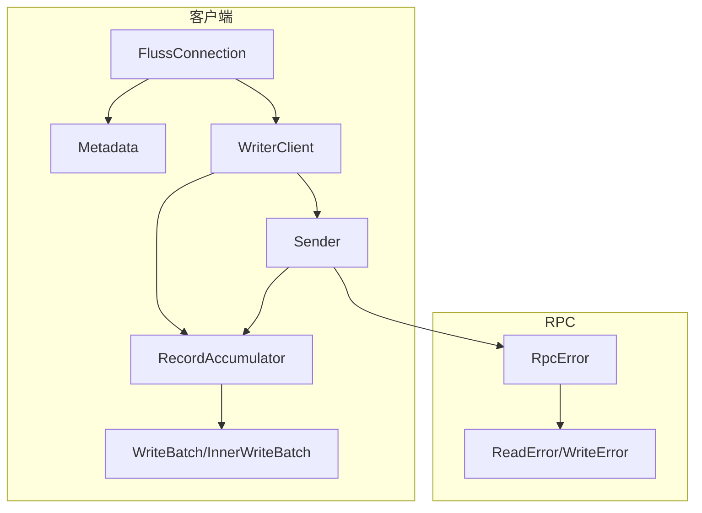
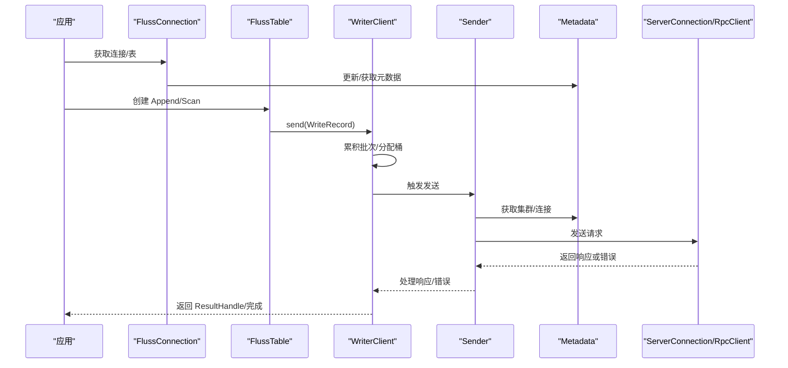
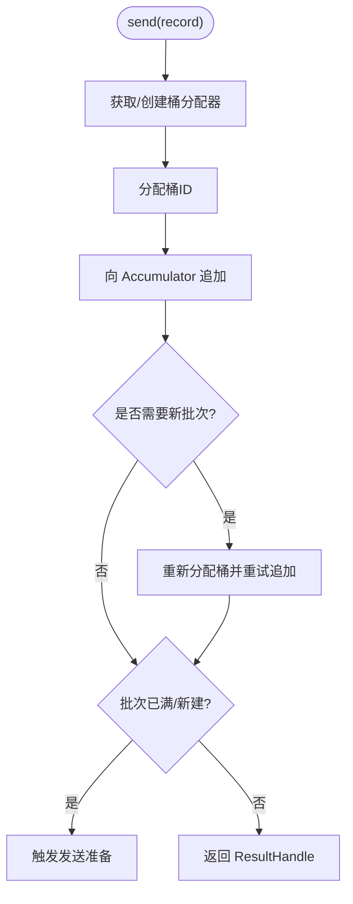
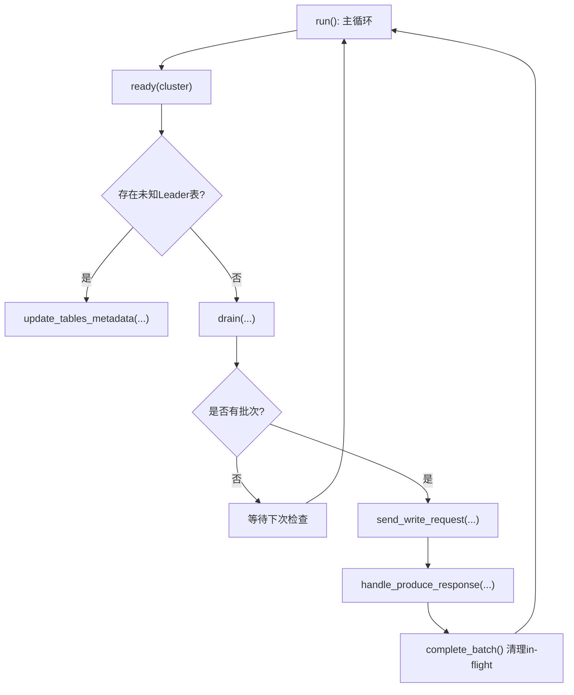
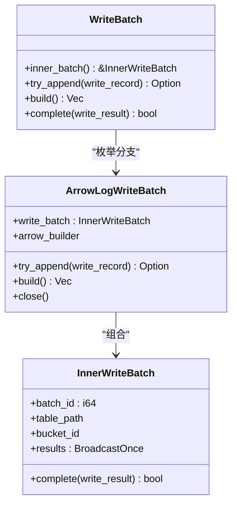
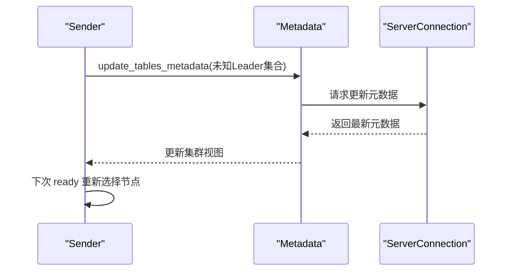
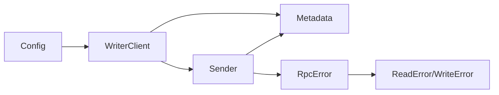

# 错误恢复策略

<cite>
**本文引用的文件**
- [crates/fluss/src/error.rs](file://crates/fluss/src/error.rs)
- [crates/fluss/src/rpc/error.rs](file://crates/fluss/src/rpc/error.rs)
- [crates/fluss/src/rpc/frame.rs](file://crates/fluss/src/rpc/frame.rs)
- [crates/fluss/src/record/error.rs](file://crates/fluss/src/record/error.rs)
- [crates/fluss/src/config.rs](file://crates/fluss/src/config.rs)
- [crates/fluss/src/client/connection.rs](file://crates/fluss/src/client/connection.rs)
- [crates/fluss/src/client/metadata.rs](file://crates/fluss/src/client/metadata.rs)
- [crates/fluss/src/client/write/writer_client.rs](file://crates/fluss/src/client/write/writer_client.rs)
- [crates/fluss/src/client/write/sender.rs](file://crates/fluss/src/client/write/sender.rs)
- [crates/fluss/src/client/write/batch.rs](file://crates/fluss/src/client/write/batch.rs)
- [crates/fluss/src/client/table/mod.rs](file://crates/fluss/src/client/table/mod.rs)
</cite>

## 目录
1. [引言](#引言)
2. [项目结构](#项目结构)
3. [核心组件](#核心组件)
4. [架构总览](#架构总览)
5. [详细组件分析](#详细组件分析)
6. [依赖关系分析](#依赖关系分析)
7. [性能考量](#性能考量)
8. [故障排查指南](#故障排查指南)
9. [结论](#结论)
10. [附录：配置与实施建议](#附录配置与实施建议)

## 引言
本指南聚焦 Fluss 客户端的错误恢复策略，系统阐述重试、降级、故障转移、幂等与事务回滚、状态同步、监控与告警、演练与预案等主题。文档基于代码库的实际实现进行分析，结合架构图与流程图，帮助开发者构建稳健的容错体系。

## 项目结构
Fluss 客户端围绕“连接—元数据—写入器—发送器—批次”链路组织，错误类型主要来自 RPC 层（读写帧、连接、消息大小）、记录序列化、以及上层业务错误。配置项通过 Config 控制写入行为（acks、retries、batch size、请求大小）。

图表来源
- [crates/fluss/src/client/connection.rs](file://crates/fluss/src/client/connection.rs#L30-L82)
- [crates/fluss/src/client/metadata.rs](file://crates/fluss/src/client/metadata.rs#L29-L109)
- [crates/fluss/src/client/write/writer_client.rs](file://crates/fluss/src/client/write/writer_client.rs#L32-L147)
- [crates/fluss/src/client/write/sender.rs](file://crates/fluss/src/client/write/sender.rs#L31-L207)
- [crates/fluss/src/client/write/batch.rs](file://crates/fluss/src/client/write/batch.rs#L28-L176)
- [crates/fluss/src/rpc/error.rs](file://crates/fluss/src/rpc/error.rs#L23-L50)
- [crates/fluss/src/rpc/frame.rs](file://crates/fluss/src/rpc/frame.rs#L21-L106)

章节来源
- [crates/fluss/src/client/connection.rs](file://crates/fluss/src/client/connection.rs#L30-L82)
- [crates/fluss/src/client/metadata.rs](file://crates/fluss/src/client/metadata.rs#L29-L109)
- [crates/fluss/src/config.rs](file://crates/fluss/src/config.rs#L21-L39)

## 核心组件
- 错误模型与分类
  - 应用层错误：表无效、JSON 序列化失败、行转换失败、非法参数等。
  - RPC 层错误：写入/读取帧错误、连接错误、IO 错误、消息过大、数据残留等。
  - 记录层错误：底层 IO 错误。
- 写入路径与恢复点
  - WriterClient 负责累积与调度；Sender 负责将批次发送到目标 TabletServer 并处理响应。
  - 元数据负责集群信息与连接缓存，支持动态更新。
- 配置项对恢复的影响
  - acks、writer_retries、request_max_size、writer_batch_size 等直接影响可靠性与性能。

章节来源
- [crates/fluss/src/error.rs](file://crates/fluss/src/error.rs#L25-L50)
- [crates/fluss/src/rpc/error.rs](file://crates/fluss/src/rpc/error.rs#L23-L50)
- [crates/fluss/src/rpc/frame.rs](file://crates/fluss/src/rpc/frame.rs#L21-L106)
- [crates/fluss/src/record/error.rs](file://crates/fluss/src/record/error.rs#L21-L27)
- [crates/fluss/src/config.rs](file://crates/fluss/src/config.rs#L21-L39)

## 架构总览
下图展示从应用调用到网络请求的关键交互与错误传播路径。

图表来源
- [crates/fluss/src/client/connection.rs](file://crates/fluss/src/client/connection.rs#L37-L81)
- [crates/fluss/src/client/table/mod.rs](file://crates/fluss/src/client/table/mod.rs#L33-L66)
- [crates/fluss/src/client/write/writer_client.rs](file://crates/fluss/src/client/write/writer_client.rs#L89-L123)
- [crates/fluss/src/client/write/sender.rs](file://crates/fluss/src/client/write/sender.rs#L63-L106)
- [crates/fluss/src/client/metadata.rs](file://crates/fluss/src/client/metadata.rs#L66-L99)

## 详细组件分析

### WriterClient：累积与发送协调
- 职责
  - 维护 RecordAccumulator 与 Sender 生命周期。
  - 将写入请求按桶分配，触发批次创建与发送。
  - 提供 flush/close 能力。
- 关键恢复点
  - 当新批次导致记录被拒绝时，会重新分配桶并重试追加。
  - 发送线程通过通道接收关闭信号，优雅退出。
- 与配置的关系
  - acks 解析为 i16（all 或数字），影响 Sender 的确认语义。
  - retries 影响 Sender 的重试次数上限。

图表来源
- [crates/fluss/src/client/write/writer_client.rs](file://crates/fluss/src/client/write/writer_client.rs#L89-L123)

章节来源
- [crates/fluss/src/client/write/writer_client.rs](file://crates/fluss/src/client/write/writer_client.rs#L32-L147)
- [crates/fluss/src/config.rs](file://crates/fluss/src/config.rs#L31-L35)

### Sender：发送循环与响应处理
- 职责
  - 周期性检查 Ready 状态，必要时更新元数据。
  - 按节点聚合批次并发送请求。
  - 处理响应：成功则完成批次并清理 in-flight；失败待实现（当前为占位）。
- 关键恢复点
  - 未知 leader 表触发元数据刷新。
  - 发送失败时可重试（由 retries 参数控制）。
  - in_flight_batches 用于跟踪未完成批次，避免重复发送与资源泄漏。

图表来源
- [crates/fluss/src/client/write/sender.rs](file://crates/fluss/src/client/write/sender.rs#L63-L106)
- [crates/fluss/src/client/metadata.rs](file://crates/fluss/src/client/metadata.rs#L66-L99)

章节来源
- [crates/fluss/src/client/write/sender.rs](file://crates/fluss/src/client/write/sender.rs#L31-L207)

### 批次与结果：幂等与完成广播
- InnerWriteBatch 通过 BroadcastOnce 广播写入结果，确保单次完成。
- WriteBatch 包装具体实现（如 ArrowLog），提供 try_append/build/close 等能力。
- 完成路径：成功时清理 in-flight 与不完整批次；失败路径待完善。

图表来源
- [crates/fluss/src/client/write/batch.rs](file://crates/fluss/src/client/write/batch.rs#L28-L176)

章节来源
- [crates/fluss/src/client/write/batch.rs](file://crates/fluss/src/client/write/batch.rs#L28-L176)

### 元数据与连接：动态更新与连接复用
- 初始化与更新：通过 CoordinatorServer 获取初始元数据；后续按需增量更新。
- 连接管理：通过 RpcClient 缓存连接，减少握手开销。
- 故障转移：当节点不可达或元数据变化时，Sender 在下一次 ready 中刷新并选择新的 leader。

图表来源
- [crates/fluss/src/client/metadata.rs](file://crates/fluss/src/client/metadata.rs#L66-L99)
- [crates/fluss/src/client/write/sender.rs](file://crates/fluss/src/client/write/sender.rs#L76-L81)

章节来源
- [crates/fluss/src/client/metadata.rs](file://crates/fluss/src/client/metadata.rs#L29-L109)

### 错误类型与恢复优先级
- 低优先级（可快速重试）
  - IO/帧写入过大/读取超大：通常为瞬时网络问题或消息尺寸异常，建议指数退避重试。
- 中优先级（需更新元数据后重试）
  - 连接错误/中毒：连接失效，应切换节点并刷新元数据。
  - 数据残留/消息过大：服务端协议不匹配或限流，建议降低请求大小或调整阈值。
- 高优先级（需降级或阻断）
  - 非法参数/表无效/JSON 序列化失败：输入错误，应立即阻断并告警，避免放大错误。
  - Arrow/行转换错误：Schema 不一致或数据损坏，需隔离并上报。

章节来源
- [crates/fluss/src/error.rs](file://crates/fluss/src/error.rs#L25-L50)
- [crates/fluss/src/rpc/error.rs](file://crates/fluss/src/rpc/error.rs#L23-L50)
- [crates/fluss/src/rpc/frame.rs](file://crates/fluss/src/rpc/frame.rs#L21-L106)
- [crates/fluss/src/record/error.rs](file://crates/fluss/src/record/error.rs#L21-L27)

## 依赖关系分析
- WriterClient 依赖 Metadata 与 Sender；Sender 依赖 Metadata 与连接层；错误在链路中逐层透传。
- 配置通过 Config 注入到 WriterClient/Sender，决定重试次数、确认语义与请求大小。

图表来源
- [crates/fluss/src/config.rs](file://crates/fluss/src/config.rs#L21-L39)
- [crates/fluss/src/client/write/writer_client.rs](file://crates/fluss/src/client/write/writer_client.rs#L42-L76)
- [crates/fluss/src/client/write/sender.rs](file://crates/fluss/src/client/write/sender.rs#L42-L61)
- [crates/fluss/src/rpc/error.rs](file://crates/fluss/src/rpc/error.rs#L23-L50)
- [crates/fluss/src/rpc/frame.rs](file://crates/fluss/src/rpc/frame.rs#L21-L106)

章节来源
- [crates/fluss/src/config.rs](file://crates/fluss/src/config.rs#L21-L39)
- [crates/fluss/src/client/write/writer_client.rs](file://crates/fluss/src/client/write/writer_client.rs#L42-L76)
- [crates/fluss/src/client/write/sender.rs](file://crates/fluss/src/client/write/sender.rs#L42-L61)

## 性能考量
- 吞吐与延迟权衡
  - 增大批体（writer_batch_size）可提升吞吐但增加尾延迟；减小可降低尾延迟但可能增加请求频次。
  - request_max_size 限制单次请求大小，避免内存峰值过高。
- 可靠性与重试
  - 增加 retries 提升成功率但增加重传流量与延迟；acks=all 最强一致性但可能降低可用性。
- 元数据刷新
  - 未知 leader 时的元数据刷新会引入额外 RTT，应尽量减少不必要的刷新。

## 故障排查指南
- 常见症状与定位
  - 写入阻塞：检查 Sender 的 ready 循环是否因未知 leader 或无就绪节点而休眠。
  - 连接失败：查看 RpcError 的连接错误与中毒；确认元数据是否已更新。
  - 帧错误：关注 ReadError/WriteError 的消息过大、负长度等；核对客户端/服务端版本与大小限制。
  - 结果未完成：确认 InnerWriteBatch 是否正确广播；检查 in_flight_batches 是否被清理。
- 快速修复步骤
  - 降低 request_max_size 或 writer_batch_size，观察是否缓解。
  - 切换 bootstrap_server 或刷新元数据，验证新 leader 是否可用。
  - 临时提高 writer_retries，观察是否能渡过瞬时抖动。
- 日志与可观测性
  - 在 Sender 的 send_write_request 与 handle_produce_response 周围增加日志，记录批次数、桶分布、错误码。
  - 对 RpcError 的 Poisoned 场景，记录原始错误以便根因分析。

章节来源
- [crates/fluss/src/client/write/sender.rs](file://crates/fluss/src/client/write/sender.rs#L120-L167)
- [crates/fluss/src/rpc/error.rs](file://crates/fluss/src/rpc/error.rs#L23-L50)
- [crates/fluss/src/rpc/frame.rs](file://crates/fluss/src/rpc/frame.rs#L21-L106)
- [crates/fluss/src/client/write/batch.rs](file://crates/fluss/src/client/write/batch.rs#L55-L65)

## 结论
Fluss 客户端通过“累积—发送—响应处理—元数据刷新”的闭环实现了基础的错误恢复能力。实际部署中应结合业务特性合理配置 acks、retries、batch size 与请求大小，并完善响应错误处理与监控告警，以达成高可用与高性能的平衡。

## 附录：配置与实施建议

### 配置项与恢复策略映射
- writer_acks
  - all：强一致，适合对丢失敏感场景；在分区故障时可能降低可用性。
  - 数字：折中策略；根据分区数量与 SLA 选择。
- writer_retries
  - 建议开启有限重试，配合指数退避；避免无限重试放大拥塞。
- request_max_size
  - 与网络 MTU、GC 压力、服务端限制共同决定；过大易 OOM，过小增加 RTT。
- writer_batch_size
  - 适配典型记录大小；过小导致频繁发送，过大影响尾延迟。

章节来源
- [crates/fluss/src/config.rs](file://crates/fluss/src/config.rs#L21-L39)
- [crates/fluss/src/client/write/writer_client.rs](file://crates/fluss/src/client/write/writer_client.rs#L79-L87)
- [crates/fluss/src/client/write/sender.rs](file://crates/fluss/src/client/write/sender.rs#L42-L61)

### 监控与告警建议
- 指标
  - 错误计数：按错误类型分组（IO、连接、帧、RPC、应用）。
  - 延迟分布：P50/P95/P99 写入延迟与元数据刷新延迟。
  - 吞吐：MB/s 与消息数/秒。
  - 重试率：重试次数/总请求数。
  - 元数据刷新频率：未知 leader 比例。
- 告警阈值示例
  - 连接错误率 > 0.1%/分钟
  - 写入 P99 延迟 > 1s
  - 重试率 > 5%
  - 元数据刷新频率 > 1 次/10s
- 建议
  - 将 Sender 的错误处理完善为明确的错误码映射与重试策略。
  - 在 handle_produce_response 中记录每个桶的错误码，便于定位分区级故障。

章节来源
- [crates/fluss/src/client/write/sender.rs](file://crates/fluss/src/client/write/sender.rs#L169-L186)
- [crates/fluss/src/rpc/error.rs](file://crates/fluss/src/rpc/error.rs#L23-L50)

### 幂等性与事务回滚
- 幂等性
  - 借助 InnerWriteBatch 的单次广播与批次完成标记，确保上层仅感知一次结果。
  - 若服务端支持，可在请求中携带幂等键；客户端侧避免重复提交。
- 事务回滚
  - 当前实现未见显式事务接口；建议在应用层维护“未完成批次集合”，在异常时回放或丢弃。
- 状态同步
  - 使用 Metadata 的增量更新能力，定期校验本地集群视图与服务端一致性。

章节来源
- [crates/fluss/src/client/write/batch.rs](file://crates/fluss/src/client/write/batch.rs#L55-L65)
- [crates/fluss/src/client/metadata.rs](file://crates/fluss/src/client/metadata.rs#L66-L99)

### 故障演练与应急预案
- 演练场景
  - 单节点故障：模拟目标 TabletServer 不可用，验证 Sender 自动切换与元数据刷新。
  - 网络抖动：注入丢包/慢速链路，验证重试与退避策略。
  - 消息过大：构造超限请求，验证帧层保护与错误上报。
- 应急预案
  - 降级：临时降低 acks 与 retries，启用只读路径（扫描）。
  - 隔离：对特定表/桶设置熔断阈值，阻断高风险写入。
  - 回滚：对未完成批次执行幂等重放或人工干预。

章节来源
- [crates/fluss/src/client/write/sender.rs](file://crates/fluss/src/client/write/sender.rs#L76-L81)
- [crates/fluss/src/rpc/frame.rs](file://crates/fluss/src/rpc/frame.rs#L50-L76)