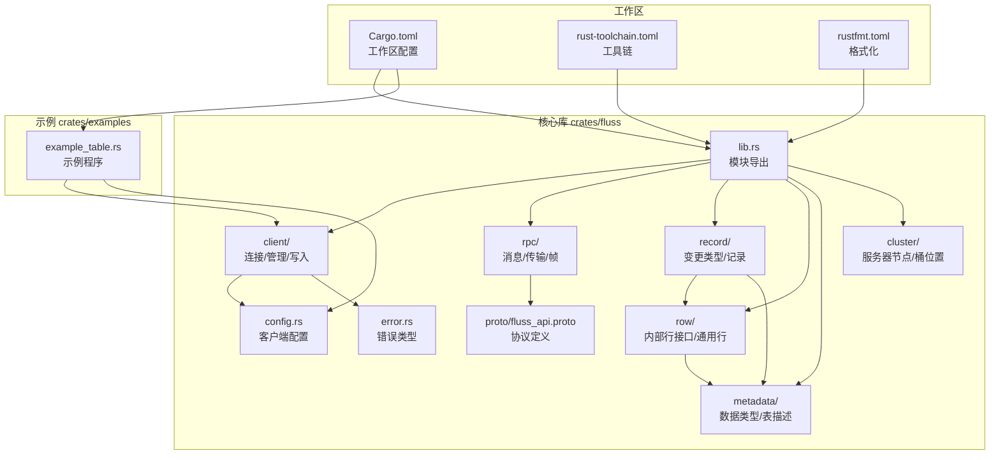
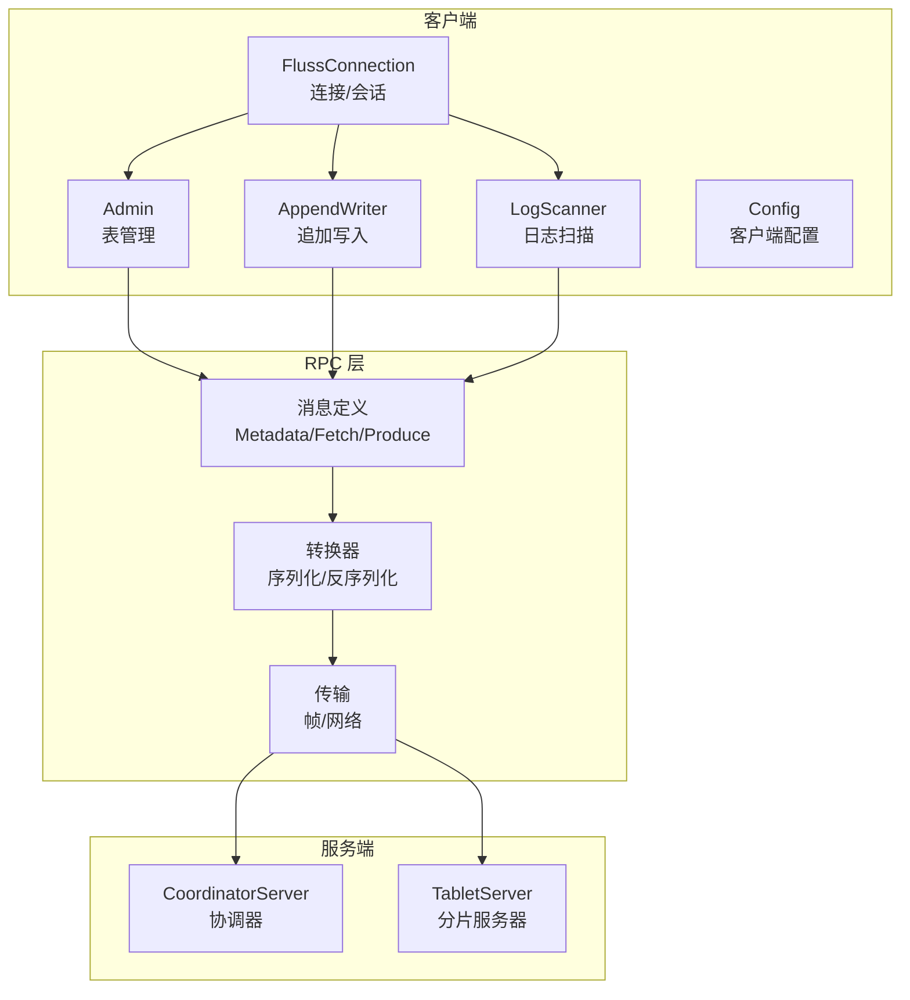
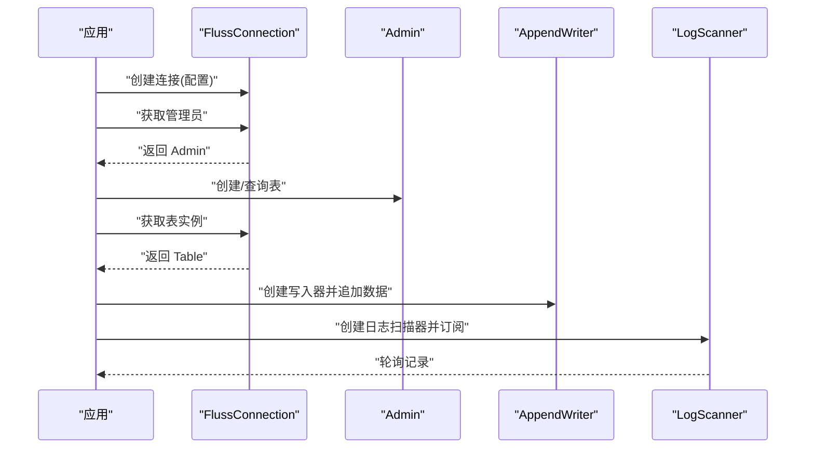
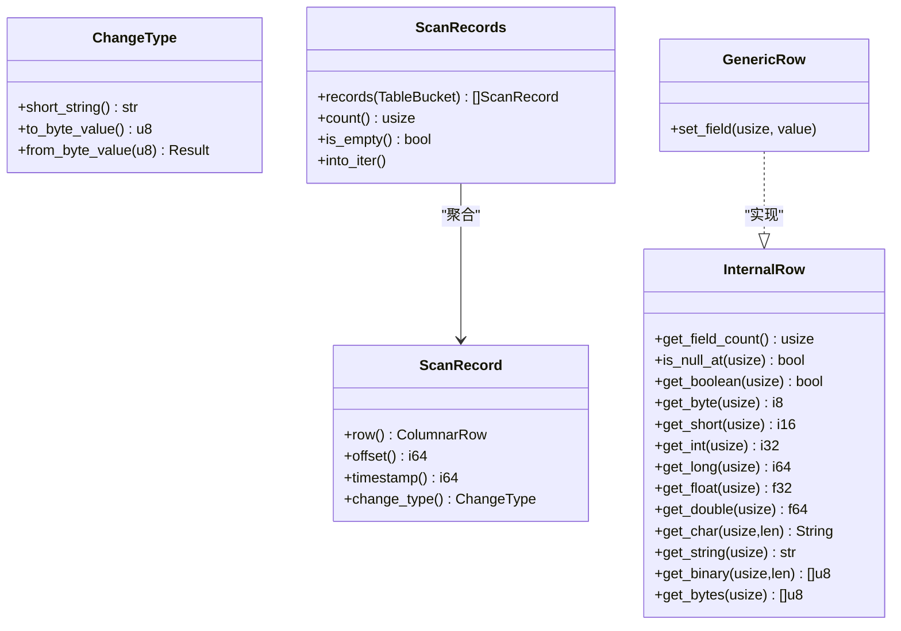
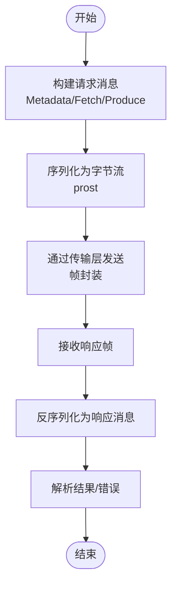
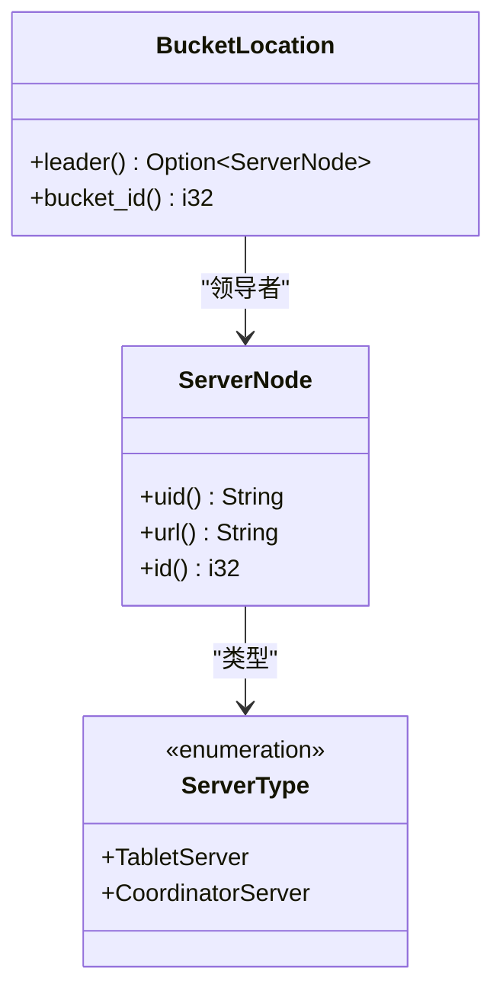
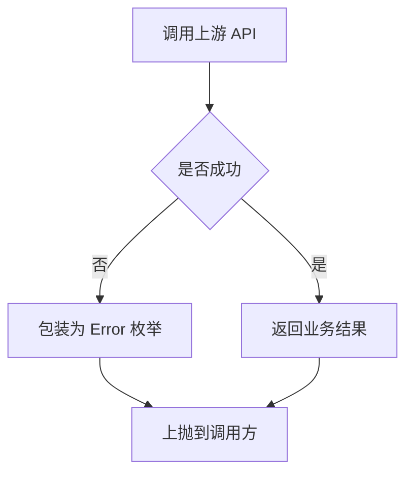
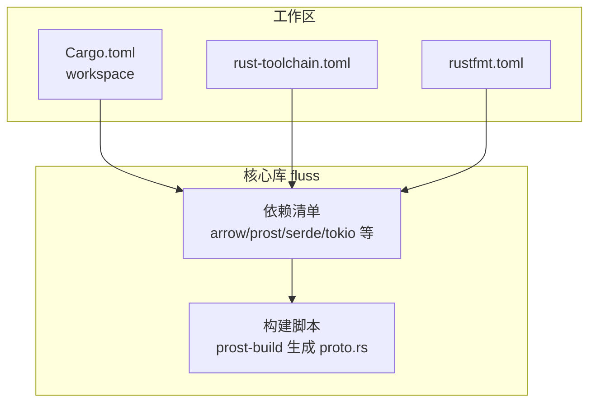

# 项目概述

<cite>
**本文引用的文件**
- [README.md](file://README.md)
- [Cargo.toml](file://Cargo.toml)
- [crates/fluss/Cargo.toml](file://crates/fluss/Cargo.toml)
- [crates/fluss/src/lib.rs](file://crates/fluss/src/lib.rs)
- [crates/fluss/src/config.rs](file://crates/fluss/src/config.rs)
- [crates/fluss/src/client/mod.rs](file://crates/fluss/src/client/mod.rs)
- [crates/fluss/src/record/mod.rs](file://crates/fluss/src/record/mod.rs)
- [crates/fluss/src/rpc/mod.rs](file://crates/fluss/src/rpc/mod.rs)
- [crates/fluss/src/proto/fluss_api.proto](file://crates/fluss/src/proto/fluss_api.proto)
- [crates/fluss/src/error.rs](file://crates/fluss/src/error.rs)
- [crates/fluss/src/cluster/mod.rs](file://crates/fluss/src/cluster/mod.rs)
- [crates/fluss/src/row/mod.rs](file://crates/fluss/src/row/mod.rs)
- [crates/examples/src/example_table.rs](file://crates/examples/src/example_table.rs)
- [DISCLAIMER](file://DISCLAIMER)
- [rust-toolchain.toml](file://rust-toolchain.toml)
- [rustfmt.toml](file://rustfmt.toml)
</cite>

## 目录
1. [引言](#引言)
2. [项目结构](#项目结构)
3. [核心组件](#核心组件)
4. [架构总览](#架构总览)
5. [详细组件分析](#详细组件分析)
6. [依赖分析](#依赖分析)
7. [性能考虑](#性能考虑)
8. [故障排查指南](#故障排查指南)
9. [结论](#结论)
10. [附录](#附录)

## 引言
本项目是 Apache Fluss™ 的非官方实验性 Rust 客户端实现，旨在为 Rust 生态系统提供与 Fluss 集群交互的能力。Fluss 是面向实时分析的流式存储，可作为湖仓架构的实时数据层，连接流式数据与数据湖仓，支持低延迟、高吞吐的数据摄取与处理，并与主流计算引擎无缝集成。

本 Rust 客户端目前处于实验阶段，提供基础的表管理与日志流读写能力，帮助开发者在 Rust 环境中探索与使用 Fluss。项目采用 Apache 许可证（Apache-2.0），并遵循 Apache 软件基金会的孵化项目规范与免责声明。

章节来源
- [README.md](file://README.md#L19-L31)
- [DISCLAIMER](file://DISCLAIMER#L1-L10)

## 项目结构
仓库采用多 crate 工作区组织，核心模块位于 crates/fluss，示例位于 crates/examples。工作区通过统一的版本、工具链与许可证配置进行管理。

- 工作区顶层
  - 工作区包元信息与成员声明
  - 统一的工具链与格式化配置
- 核心库 crates/fluss
  - 客户端入口与模块划分：client、metadata、record、row、rpc、cluster、config、error
  - 协议定义与生成：proto 目录下的 .proto 文件及构建脚本
- 示例 crates/examples
  - 提供最小可用示例，演示表创建、写入与日志扫描流程

图表来源
- [Cargo.toml](file://Cargo.toml#L29-L35)
- [crates/fluss/Cargo.toml](file://crates/fluss/Cargo.toml#L18-L47)
- [crates/fluss/src/lib.rs](file://crates/fluss/src/lib.rs#L18-L37)
- [crates/fluss/src/client/mod.rs](file://crates/fluss/src/client/mod.rs#L18-L26)
- [crates/fluss/src/rpc/mod.rs](file://crates/fluss/src/rpc/mod.rs#L18-L31)
- [crates/fluss/src/record/mod.rs](file://crates/fluss/src/record/mod.rs#L18-L26)
- [crates/fluss/src/row/mod.rs](file://crates/fluss/src/row/mod.rs#L18-L24)
- [crates/fluss/src/metadata/mod.rs](file://crates/fluss/src/metadata/mod.rs#L18-L24)
- [crates/fluss/src/cluster/mod.rs](file://crates/fluss/src/cluster/mod.rs#L18-L24)
- [crates/fluss/src/config.rs](file://crates/fluss/src/config.rs#L21-L39)
- [crates/fluss/src/error.rs](file://crates/fluss/src/error.rs#L23-L50)
- [crates/fluss/src/proto/fluss_api.proto](file://crates/fluss/src/proto/fluss_api.proto#L18-L197)
- [crates/examples/src/example_table.rs](file://crates/examples/src/example_table.rs#L18-L25)

章节来源
- [Cargo.toml](file://Cargo.toml#L29-L35)
- [crates/fluss/Cargo.toml](file://crates/fluss/Cargo.toml#L18-L47)
- [crates/fluss/src/lib.rs](file://crates/fluss/src/lib.rs#L18-L37)

## 核心组件
- 客户端与连接
  - 连接配置：支持引导服务器地址、请求最大尺寸、写入确认策略、重试次数、批大小等参数
  - 表管理：通过管理员接口创建/查询表
  - 写入：支持追加写入，批量累积与发送
  - 日志扫描：订阅并轮询日志记录
- 记录与行模型
  - 变更类型：支持追加、插入、更新前/后、删除等
  - 扫描记录：封装行、偏移、时间戳与变更类型
  - 行接口：统一的内部行访问接口，提供多种标量类型的读取
- RPC 与协议
  - 消息与版本：定义元数据、生产、拉取等请求/响应消息
  - 传输与帧：基于 prost 的序列化与网络帧封装
- 元数据与集群
  - 数据类型与表描述：Schema、列定义、表路径等
  - 集群节点与桶位置：协调器与分片服务器、桶领导者与副本信息
- 错误处理
  - 统一 Result 类型与错误枚举，覆盖 IO、JSON 序列化、RPC、行转换、Arrow、写入与非法参数等场景

章节来源
- [crates/fluss/src/config.rs](file://crates/fluss/src/config.rs#L21-L39)
- [crates/fluss/src/client/mod.rs](file://crates/fluss/src/client/mod.rs#L18-L26)
- [crates/fluss/src/record/mod.rs](file://crates/fluss/src/record/mod.rs#L28-L133)
- [crates/fluss/src/row/mod.rs](file://crates/fluss/src/row/mod.rs#L26-L148)
- [crates/fluss/src/rpc/mod.rs](file://crates/fluss/src/rpc/mod.rs#L18-L31)
- [crates/fluss/src/metadata/mod.rs](file://crates/fluss/src/metadata/mod.rs#L18-L24)
- [crates/fluss/src/cluster/mod.rs](file://crates/fluss/src/cluster/mod.rs#L26-L99)
- [crates/fluss/src/error.rs](file://crates/fluss/src/error.rs#L25-L50)

## 架构总览
下图展示了 Rust 客户端与 Fluss 集群之间的交互关系：客户端通过 RPC 层与服务端通信，使用 Protobuf 定义的消息进行元数据、生产与拉取操作；客户端负责表管理、写入与扫描逻辑，并以 Arrow 与内部行模型处理数据。

图表来源
- [crates/fluss/src/client/mod.rs](file://crates/fluss/src/client/mod.rs#L18-L26)
- [crates/fluss/src/rpc/mod.rs](file://crates/fluss/src/rpc/mod.rs#L18-L31)
- [crates/fluss/src/proto/fluss_api.proto](file://crates/fluss/src/proto/fluss_api.proto#L22-L197)
- [crates/fluss/src/cluster/mod.rs](file://crates/fluss/src/cluster/mod.rs#L26-L66)

## 详细组件分析

### 客户端与连接（FlussConnection）
- 功能职责
  - 建立与 Fluss 集群的连接，提供管理员与表实例的获取入口
  - 支持通过配置参数控制连接行为（如引导服务器、请求大小、写入确认策略等）
- 关键流程
  - 初始化连接配置
  - 获取管理员句柄以执行表管理操作
  - 获取表实例以进行写入与扫描

图表来源
- [crates/fluss/src/client/mod.rs](file://crates/fluss/src/client/mod.rs#L18-L26)
- [crates/fluss/src/config.rs](file://crates/fluss/src/config.rs#L21-L39)
- [crates/examples/src/example_table.rs](file://crates/examples/src/example_table.rs#L28-L67)

章节来源
- [crates/fluss/src/client/mod.rs](file://crates/fluss/src/client/mod.rs#L18-L26)
- [crates/fluss/src/config.rs](file://crates/fluss/src/config.rs#L21-L39)
- [crates/examples/src/example_table.rs](file://crates/examples/src/example_table.rs#L28-L67)

### 记录与行模型（Record/Row）
- 记录模型
  - 变更类型：支持多种 CDC 变更语义，便于下游处理
  - 扫描记录：封装行数据、偏移、时间戳与变更类型
  - 批量记录容器：按桶聚合记录，支持迭代与计数
- 行模型
  - 内部行接口：统一的字段访问方法族，覆盖布尔、字节、短整型、整型、长整型、浮点、双精度、字符串、二进制等
  - 通用行：动态值集合，支持设置字段与类型转换

图表来源
- [crates/fluss/src/record/mod.rs](file://crates/fluss/src/record/mod.rs#L28-L133)
- [crates/fluss/src/row/mod.rs](file://crates/fluss/src/row/mod.rs#L26-L148)

章节来源
- [crates/fluss/src/record/mod.rs](file://crates/fluss/src/record/mod.rs#L28-L133)
- [crates/fluss/src/row/mod.rs](file://crates/fluss/src/row/mod.rs#L26-L148)

### RPC 与协议（RPC/Message/Transport）
- 消息定义
  - 元数据：获取协调器、分片服务器、表与分区元数据
  - 生产：按桶发送记录，支持确认策略与超时
  - 拉取：按表/桶拉取日志，支持投影下推与最大/最小字节数
- 传输与帧
  - 基于 prost 的编码/解码
  - 帧封装与网络传输抽象

图表来源
- [crates/fluss/src/rpc/mod.rs](file://crates/fluss/src/rpc/mod.rs#L18-L31)
- [crates/fluss/src/proto/fluss_api.proto](file://crates/fluss/src/proto/fluss_api.proto#L22-L197)

章节来源
- [crates/fluss/src/rpc/mod.rs](file://crates/fluss/src/rpc/mod.rs#L18-L31)
- [crates/fluss/src/proto/fluss_api.proto](file://crates/fluss/src/proto/fluss_api.proto#L22-L197)

### 元数据与集群（Metadata/Cluster）
- 元数据
  - 数据类型与表描述：Schema、列定义、表路径
  - JSON 序列化：用于表元数据的序列化与反序列化
- 集群
  - 服务器节点：协调器与分片服务器标识与地址
  - 桶位置：表桶与其领导者节点映射

图表来源
- [crates/fluss/src/cluster/mod.rs](file://crates/fluss/src/cluster/mod.rs#L26-L99)
- [crates/fluss/src/metadata/mod.rs](file://crates/fluss/src/metadata/mod.rs#L18-L24)

章节来源
- [crates/fluss/src/cluster/mod.rs](file://crates/fluss/src/cluster/mod.rs#L26-L99)
- [crates/fluss/src/metadata/mod.rs](file://crates/fluss/src/metadata/mod.rs#L18-L24)

### 错误处理（Error）
- 错误类型
  - IO、无效表、JSON 序列化、RPC、行转换、Arrow、写入、非法参数等
- 使用方式
  - 统一 Result 类型，便于在异步调用中传播错误

图表来源
- [crates/fluss/src/error.rs](file://crates/fluss/src/error.rs#L25-L50)

章节来源
- [crates/fluss/src/error.rs](file://crates/fluss/src/error.rs#L25-L50)

## 依赖分析
- 技术栈概览
  - 运行时：Tokio（异步运行时）
  - 数据处理：Arrow 与 Arrow Schema（列式数据）
  - 序列化：Prost（Protobuf）、Serde（JSON/派生特性）
  - 网络与传输：Bytes、Futures、CRC32C、DashMap、ParkingLot
  - 工具链：Clap（命令行解析）、Chrono（日期时间）、Rand（随机数）
- 工作区与核心库
  - 工作区统一版本、工具链与成员声明
  - 核心库依赖上述技术栈，构建期生成 Protobuf 代码

图表来源
- [Cargo.toml](file://Cargo.toml#L29-L35)
- [crates/fluss/Cargo.toml](file://crates/fluss/Cargo.toml#L25-L47)
- [crates/fluss/src/lib.rs](file://crates/fluss/src/lib.rs#L35-L37)

章节来源
- [Cargo.toml](file://Cargo.toml#L29-L35)
- [crates/fluss/Cargo.toml](file://crates/fluss/Cargo.toml#L25-L47)
- [crates/fluss/src/lib.rs](file://crates/fluss/src/lib.rs#L35-L37)

## 性能考虑
- 异步与并发
  - 基于 Tokio 的异步 I/O，适合高并发场景
  - 并发数据结构（DashMap、ParkingLot）提升锁竞争下的吞吐
- 序列化与内存
  - Prost 与 Arrow 在序列化/反序列化与列式数据处理方面具备较高效率
  - 合理设置批大小与请求上限，避免过大内存占用
- 网络传输
  - 使用帧封装与 CRC 校验，确保传输可靠性
- 写入策略
  - 通过确认策略与重试次数平衡一致性与性能
  - 批量累积与发送减少网络往返

## 故障排查指南
- 常见错误类别
  - IO 错误：检查网络连通性与权限
  - RPC 错误：核对服务端状态与消息版本
  - JSON 序列化错误：检查表元数据格式
  - Arrow 错误：检查列式数据类型与长度
  - 写入错误：核对确认策略、批大小与分区/桶映射
  - 非法参数：检查输入参数合法性
- 排查步骤
  - 启用调试日志（Tracing）
  - 核对配置项（bootstrap_server、request_max_size、writer_*）
  - 验证表存在与元数据一致性
  - 检查桶领导者与副本状态

章节来源
- [crates/fluss/src/error.rs](file://crates/fluss/src/error.rs#L25-L50)
- [crates/fluss/src/config.rs](file://crates/fluss/src/config.rs#L21-L39)
- [crates/fluss/src/cluster/mod.rs](file://crates/fluss/src/cluster/mod.rs#L68-L99)

## 结论
本 Rust 客户端为 Fluss 提供了实验性的基础能力，涵盖表管理、写入与日志扫描，结合 Arrow 与 Protobuf 实现高效的数据处理与传输。尽管仍处于实验阶段，但其模块化设计与清晰的错误处理机制为后续扩展奠定了良好基础。建议在生产环境中谨慎评估，并关注上游 Fluss 的发展与官方客户端进展。

## 附录
- 快速开始
  - 启动 Fluss 本地集群
  - 安装 Rust 工具链
  - 构建并运行示例程序
- 许可证
  - 本项目采用 Apache License 2.0
- 项目定位
  - 非官方实验性客户端，目标是探索与验证在 Rust 生态中的可行性

章节来源
- [README.md](file://README.md#L33-L64)
- [crates/examples/src/example_table.rs](file://crates/examples/src/example_table.rs#L28-L86)
- [crates/fluss/Cargo.toml](file://crates/fluss/Cargo.toml#L25-L25)
- [DISCLAIMER](file://DISCLAIMER#L1-L10)