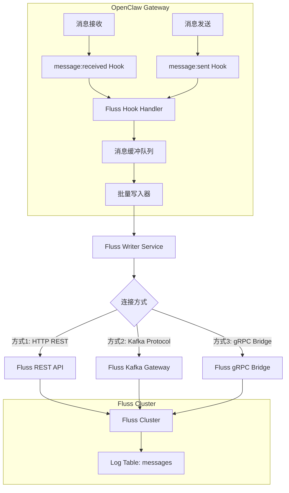

# Fluss Hook 设计方案

## 0. 约束与现状

### 0.1 当前约束

| 约束项 | 状态 | 说明 |
|--------|------|------|
| Hook 开发语言 | JS/TS | OpenClaw 技术栈要求 |
| Fluss REST API | 暂无 | Fluss 尚未提供 HTTP 接口 |
| Fluss CLI | 暂无 | 需要自行实现 |
| Kafka 协议 | 不支持 | Fluss 暂不支持 Kafka 协议兼容 |
| fluss-rust | 可用 | Rust 客户端库已可用，支持写入 |
| fluss-client (Java) | 可用 | 官方 Java 客户端 |
| 部署环境 | 用户环境 | OpenClaw 部署在用户环境，不适合 Sidecar |
| 性能要求 | 不高 | 消息量和延迟要求适中 |

### 0.2 核心挑战

- **无 REST API**: 无法直接使用 HTTP 调用
- **用户环境部署**: 不能依赖额外服务/Sidecar
- **跨平台支持**: 需要支持 macOS/Linux/Windows

---

## 1. 架构设计

### 1.1 整体架构



### 1.2 Hook 触发时机

| Hook 事件 | 触发时机 | 数据方向 | 推荐用途 |
|-----------|----------|----------|----------|
| `message:received` | 收到入站消息时 | inbound | 记录用户发送的消息 |
| `message:sent` | 发送出站消息后 | outbound | 记录 AI 回复消息 |
| `message:preprocessed` | 消息预处理完成后 | inbound | 记录包含转录内容的完整消息 |

**推荐方案**: 监听 `message:received` 和 `message:sent` 事件，覆盖完整的对话记录。

### 1.3 数据流转过程

```
+-------------------+     +-------------------+     +-------------------+
|   消息事件触发     |---->|   Hook Handler    |---->|   消息转换层      |
| (message:received |     |                   |     | (Canonical ->     |
|  message:sent)    |     |                   |     |  Fluss Row)       |
+-------------------+     +-------------------+     +-------------------+
                                                           |
                                                           v
+-------------------+     +-------------------+     +-------------------+
|   Fluss 集群      |<----|   批量写入器      |<----|   内存缓冲队列    |
| (持久化存储)       |     | (异步 + 重试)     |     | (有界队列)        |
+-------------------+     +-------------------+     +-------------------+
```

---

## 2. 技术选型

### 2.1 实现方案对比

#### 方案 A: N-API Native Addon

```
+-------------------+     直接调用      +-------------------+
|   OpenClaw Hook   |<----------------->|   fluss-node      |
|   (TypeScript)    |     N-API FFI     |   (Rust 编译)     |
+-------------------+                   +-------------------+
                                              |
                                              v
                                       +-------------------+
                                       |   Fluss Cluster   |
                                       +-------------------+
```

**实现方式**:
- 使用 `napi-rs` 将 fluss-rust 封装成 Node.js native addon
- 发布为 `@openclaw/fluss-node` npm 包
- CI 预编译多平台二进制，用户无需本地编译

**目录结构**:
```
packages/fluss-node/
├── src/
│   └── lib.rs                # napi-rs 封装 fluss-rust
├── Cargo.toml
├── package.json
├── build.rs                  # napi-rs 构建配置
└── npm/                      # 预编译产物
    ├── darwin-x64/
    ├── darwin-arm64/
    ├── linux-x64/
    └── win32-x64/
```

**Hook 调用示例**:
```typescript
import { FlussClient } from '@openclaw/fluss-node';

const client = await FlussClient.connect({
  bootstrapServers: 'localhost:9123',
  database: 'openclaw',
  table: 'messages'
});

await client.append(row);
```

| 优点 | 缺点 |
|------|------|
| 性能最优，无网络/进程开销 | 需要维护 Rust 代码 |
| 无需额外进程，用户体验好 | 需要多平台预编译 |
| 类型安全，开发体验好 | 依赖发布流程 |
| 直接调用，架构简洁 | 首次实现工作量较大 |

**推荐度**: ⭐⭐⭐⭐⭐ (长期方案)

---

#### 方案 B: Rust CLI + 子进程调用

```
+-------------------+     spawn         +-------------------+
|   OpenClaw Hook   |------------------>|   fluss-cli       |
|   (TypeScript)    |     stdin/stdout  |   (Rust 二进制)   |
+-------------------+                   +-------------------+
                                              |
                                              v
                                       +-------------------+
                                       |   Fluss Cluster   |
                                       +-------------------+
```

**实现方式**:
- 用 Rust 实现独立 CLI 工具
- 从 stdin 读取 JSON，批量写入 Fluss
- OpenClaw Hook 通过 `child_process.spawn` 调用

**目录结构**:
```
extensions/fluss-message-logger/
├── HOOK.md
├── handler.ts              # 调用 CLI
├── message-mapper.ts
└── bin/
    └── fluss-writer        # 预编译 Rust CLI
```

**CLI 实现**:
```rust
// fluss-writer/src/main.rs
use std::io::{self, BufRead};

#[tokio::main]
async fn main() -> Result<()> {
    let args: Vec<String> = std::env::args().collect();
    let bootstrap = &args[1];
    let database = &args[2];
    let table = &args[3];

    let client = FlussClient::connect(bootstrap).await?;
    let table_client = client.get_table(database, table).await?;

    // 从 stdin 读取 JSON 行
    let stdin = io::stdin();
    for line in stdin.lock().lines() {
        let row: FlussRow = serde_json::from_str(&line?)?;
        table_client.append(row).await?;
    }

    table_client.flush().await?;
    Ok(())
}
```

**Hook 调用**:
```typescript
import { spawn } from 'child_process';

async function writeToFluss(messages: FlussRow[]): Promise<void> {
  const child = spawn('fluss-writer', [
    bootstrapServers,
    database,
    table
  ]);

  for (const msg of messages) {
    child.stdin.write(JSON.stringify(msg) + '\n');
  }
  child.stdin.end();

  await new Promise((resolve, reject) => {
    child.on('close', (code) => {
      code === 0 ? resolve(undefined) : reject(new Error(`Exit ${code}`));
    });
  });
}
```

| 优点 | 缺点 |
|------|------|
| 实现简单，快速验证 | 每次调用有进程启动开销 |
| 调试方便，可独立运行 | 需要管理子进程生命周期 |
| 进程隔离，崩溃不影响主进程 | 批量写入需额外处理 |
| 预编译简单，无需 napi-rs | 错误处理较复杂 |

**推荐度**: ⭐⭐⭐⭐ (短期快速验证)

---

#### 方案 C: 混合模式 (CLI + 持久进程)

```
+-------------------+     HTTP/UDS      +-------------------+
|   OpenClaw Hook   |------------------>|   fluss-writer    |
|   (TypeScript)    |                   |   (Rust 持久进程) |
+-------------------+                   +-------------------+
        |                                      |
        |  start/stop                          v
        v                               +-------------------+
  OpenClaw 管理生命周期                  |   Fluss Cluster   |
                                        +-------------------+
```

**实现方式**:
- OpenClaw 启动时 spawn `fluss-writer` 持久进程
- 进程内部监听 HTTP 或 Unix Domain Socket
- Hook 通过本地 HTTP/UDS 发送消息
- OpenClaw 关闭时优雅停止进程

| 优点 | 缺点 |
|------|------|
| 比 Sidecar 轻量，由 OpenClaw 管理 | 需要管理子进程生命周期 |
| 批量写入效率高 | 进程崩溃需要重启机制 |
| 可复用连接，性能较好 | 比 N-API 更复杂 |
| 无需每次启动进程 | 需要实现进程间通信 |

**推荐度**: ⭐⭐⭐ (折中方案)

---

#### 方案 D: WASM Bindings (不推荐)

```
+-------------------+     WASM ABI      +-------------------+
|   OpenClaw Hook   |<----------------->|   fluss-wasm      |
|   (TypeScript)    |                   |   (Rust + wasm)   |
+-------------------+                   +-------------------+
```

**不推荐原因**:
- fluss-rust 依赖网络库和系统调用，难以编译为 WASM
- 异步模型可能不兼容
- 技术风险大，可行性未知

---

### 2.2 方案对比矩阵

| 方案 | 性能 | 实现复杂度 | 部署便利性 | 维护成本 | 推荐度 |
|------|------|-----------|-----------|----------|--------|
| A: N-API Native | ⭐⭐⭐⭐⭐ | ⭐⭐⭐ | ⭐⭐⭐⭐ | ⭐⭐⭐ | **长期首选** |
| B: CLI 子进程 | ⭐⭐⭐ | ⭐⭐ | ⭐⭐⭐⭐⭐ | ⭐⭐⭐⭐ | **短期验证** |
| C: 混合模式 | ⭐⭐⭐⭐ | ⭐⭐⭐⭐ | ⭐⭐⭐ | ⭐⭐ | 折中 |
| D: WASM | ⭐⭐⭐ | ⭐⭐⭐⭐⭐ | ⭐⭐⭐⭐ | ⭐⭐ | 不推荐 |

### 2.3 推荐实施路径

**阶段 1: 快速验证 (方案 B)**

使用 Rust CLI + 子进程方式快速实现，验证:
- 数据流是否正确
- Schema 设计是否合理
- 用户场景覆盖度

**阶段 2: 优化体验 (方案 A)**

验证后再实现 N-API Native Addon:
- 更好的性能
- 更简洁的调用方式
- 无进程管理开销

---

### 2.4 错误处理策略

消息写入失败时的处理策略:

| 策略 | 适用场景 | 实现方式 |
|------|----------|----------|
| **丢弃 + 日志** | 非关键数据 | 记录错误日志，继续处理 |
| **本地持久化重试** | 重要数据 | 写入本地队列，后台重试 |
| **回调通知** | 用户需感知 | 通过 OpenClaw 事件通知 |

**推荐**: 默认使用 **丢弃 + 日志** 策略，可选开启本地重试。

---

### 2.5 原方案对比 (历史参考)

以下为最初调研的方案，部分已因约束变化而不适用:

| 原方案 | 状态 | 原因 |
|--------|------|------|
| HTTP REST API | 不可行 | Fluss 暂无 REST API |
| Kafka Protocol | 不可行 | Fluss 暂不支持 Kafka 协议 |
| gRPC Bridge | 不推荐 | 需要额外服务，不适合用户环境 |
| Java Sidecar | 不推荐 | 需要运行 JVM，不适合用户环境 |

---

## 3. Schema 设计

### 3.1 Fluss 表结构

```java
// Log Table Schema (Append Only)
Schema schema = Schema.newBuilder()
    // 主键字段
    .column("message_id", DataTypes.STRING())
    .column("conversation_id", DataTypes.STRING())

    // 消息方向: "inbound" | "outbound"
    .column("direction", DataTypes.STRING())

    // 发送者信息
    .column("from_id", DataTypes.STRING())
    .column("from_name", DataTypes.STRING())
    .column("from_username", DataTypes.STRING())

    // 接收者信息
    .column("to_id", DataTypes.STRING())
    .column("to_name", DataTypes.STRING())

    // 消息内容
    .column("content", DataTypes.STRING())
    .column("body_raw", DataTypes.STRING())         // 原始消息体
    .column("body_for_agent", DataTypes.STRING())   // 增强消息体
    .column("transcript", DataTypes.STRING())       // 音频转录

    // 渠道信息
    .column("channel_id", DataTypes.STRING())       // telegram, whatsapp, etc.
    .column("account_id", DataTypes.STRING())
    .column("provider", DataTypes.STRING())
    .column("surface", DataTypes.STRING())

    // 时间戳
    .column("timestamp", DataTypes.BIGINT())        // Unix timestamp (ms)
    .column("created_at", DataTypes.TIMESTAMP())    // 写入时间

    // 群组信息
    .column("is_group", DataTypes.BOOLEAN())
    .column("group_id", DataTypes.STRING())
    .column("guild_id", DataTypes.STRING())         // Discord server
    .column("channel_name", DataTypes.STRING())

    // 媒体信息
    .column("media_path", DataTypes.STRING())
    .column("media_type", DataTypes.STRING())

    // 发送状态 (出站消息)
    .column("success", DataTypes.BOOLEAN())
    .column("error_message", DataTypes.STRING())

    // 扩展元数据 (JSON)
    .column("metadata", DataTypes.STRING())

    .build();

// 表配置: 按 conversation_id 分桶
TableDescriptor tableDescriptor = TableDescriptor.builder()
    .schema(schema)
    .distributedBy(4, "conversation_id")  // 4 个分桶
    .property("table.log.retention", "7d")
    .build();
```

### 3.2 字段映射表

| OpenClaw 字段 | Fluss 字段 | 类型 | 说明 |
|---------------|------------|------|------|
| `messageId` | `message_id` | STRING | 消息唯一标识 |
| `conversationId` | `conversation_id` | STRING | 会话标识 (分桶键) |
| - | `direction` | STRING | inbound/outbound |
| `from` | `from_id` | STRING | 发送者 ID |
| `senderName` | `from_name` | STRING | 发送者名称 |
| `senderUsername` | `from_username` | STRING | 发送者用户名 |
| `to` | `to_id` | STRING | 接收者 ID |
| `content` | `content` | STRING | 消息内容 |
| `body` | `body_raw` | STRING | 原始消息体 |
| `bodyForAgent` | `body_for_agent` | STRING | 增强消息体 |
| `transcript` | `transcript` | STRING | 音频转录 |
| `channelId` | `channel_id` | STRING | 渠道标识 |
| `accountId` | `account_id` | STRING | 账户 ID |
| `timestamp` | `timestamp` | BIGINT | 消息时间戳 |
| `isGroup` | `is_group` | BOOLEAN | 是否群组 |
| `groupId` | `group_id` | STRING | 群组 ID |
| `success` | `success` | BOOLEAN | 发送是否成功 (outbound) |
| `error` | `error_message` | STRING | 错误信息 |

---

## 4. Hook 结构设计

### 4.1 目录结构

**方案 B (CLI 子进程)**:
```
extensions/fluss-message-logger/
├── HOOK.md                    # Hook 元数据和文档
├── handler.ts                 # 主处理器 (调用 CLI)
├── message-mapper.ts          # 消息映射器
├── config.ts                  # 配置解析
└── bin/
    ├── fluss-writer-darwin-x64
    ├── fluss-writer-darwin-arm64
    ├── fluss-writer-linux-x64
    └── fluss-writer-win32-x64.exe
```

**方案 A (N-API Native)**:
```
packages/fluss-node/                    # 独立 npm 包
├── src/lib.rs                          # napi-rs 封装
├── Cargo.toml
├── package.json
├── index.d.ts                          # TypeScript 类型
└── npm/                                # 预编译产物
    ├── darwin-x64/
    ├── darwin-arm64/
    ├── linux-x64/
    └── win32-x64/

extensions/fluss-message-logger/
├── HOOK.md
├── handler.ts                          # 使用 @openclaw/fluss-node
├── message-mapper.ts
└── config.ts
```

### 4.2 HOOK.md 配置

```markdown
---
name: fluss-message-logger
description: "Log all message events to Apache Fluss for real-time analytics"
homepage: https://docs.openclaw.ai/automation/hooks#fluss-message-logger
metadata:
  {
    "openclaw":
      {
        "emoji": "📊",
        "events": ["message:received", "message:sent"],
        "requires":
          {
            "env": ["FLUSS_BOOTSTRAP_SERVERS"],
            "config": ["hooks.internal.entries.fluss-message-logger.enabled"]
          },
        "install": [{ "id": "bundled", "kind": "bundled", "label": "Bundled with OpenClaw" }],
      },
  }
---

# Fluss Message Logger Hook

Logs all inbound and outbound messages to Apache Fluss for real-time analytics.

## Requirements

- Apache Fluss cluster running and accessible
- Environment variable `FLUSS_BOOTSTRAP_SERVERS` set (e.g., `localhost:9123`)

## Configuration

{
  "hooks": {
    "internal": {
      "enabled": true,
      "entries": {
        "fluss-message-logger": {
          "enabled": true,
          "database": "openclaw",
          "table": "messages",
          "batchSize": 100,
          "flushIntervalMs": 5000,
          "maxRetries": 3,
          "retryDelayMs": 1000
        }
      }
    }
  }
}
```

### 4.3 核心组件设计

| 组件 | 职责 | 依赖 |
|------|------|------|
| `handler.ts` | 事件过滤、消息缓冲、触发写入 | message-mapper, fluss-client/CLI |
| `message-mapper.ts` | OpenClaw 消息 -> Fluss Row 转换 | - |
| `config.ts` | 解析配置项、环境变量 | - |
| `fluss-writer` (CLI) | Rust CLI，从 stdin 读取并写入 Fluss | fluss-rust |
| `@openclaw/fluss-node` | N-API Native Addon，直接调用 | fluss-rust, napi-rs |

### 4.4 数据流程

```
消息事件 (message:received/sent)
    |
    v
+------------------+
| handler.ts       |  1. 事件过滤
|                  |  2. 调用 message-mapper
|                  |  3. 写入内存缓冲队列
+------------------+
    |
    v (批量触发: batchSize 或 flushIntervalMs)
    |
+------------------+     方案 B: spawn CLI     +------------------+
| fluss-writer CLI |<------------------------| child_process    |
| (Rust)           |                         +------------------+
+------------------+
    |     或
    |     方案 A: 直接调用
    v
+------------------+
| @openclaw/       |  N-API FFI
| fluss-node       |
+------------------+
    |
    v
+------------------+
| Fluss Cluster    |
+------------------+
```

---

## 5. 配置和部署

### 5.1 OpenClaw 配置项

```json
{
  "hooks": {
    "internal": {
      "enabled": true,
      "entries": {
        "fluss-message-logger": {
          "enabled": true,
          "database": "openclaw",
          "table": "messages",
          "batchSize": 100,
          "flushIntervalMs": 5000,
          "maxRetries": 3,
          "retryDelayMs": 1000,
          "timeoutMs": 30000
        }
      }
    }
  }
}
```

### 5.2 环境变量

```bash
# 必需
export FLUSS_BOOTSTRAP_SERVERS="fluss-coordinator:9123"

# 可选 (认证)
export FLUSS_SECURITY_PROTOCOL="SASL"
export FLUSS_SASL_USERNAME="openclaw-user"
export FLUSS_SASL_PASSWORD="secret"
```

### 5.3 启用和管理

```bash
# 启用 hook
openclaw hooks enable fluss-message-logger

# 检查状态
openclaw hooks check

# 查看详情
openclaw hooks info fluss-message-logger

# 禁用 hook
openclaw hooks disable fluss-message-logger
```

---

## 6. 性能和可靠性

### 6.1 异步写入策略

```typescript
// 1. Fire-and-forget 模式
void flushBuffer(config);  // 不等待结果

// 2. 缓冲队列
const messageBuffer: FlussMessageRow[] = [];  // 有界队列

// 3. 批量写入
if (messageBuffer.length >= config.batchSize) {
  void flushBuffer(config);
}
```

### 6.2 错误处理

```typescript
// 1. 重试机制
for (let attempt = 0; attempt <= options.maxRetries; attempt++) {
  try {
    await write();
    return;
  } catch (err) {
    if (attempt < options.maxRetries) {
      await sleep(options.retryDelayMs);
    }
  }
}

// 2. 失败消息重新入队
messageBuffer.unshift(...failedMessages);

// 3. 不阻塞主流程
void processInBackground(event);  // Fire and forget
```

### 6.3 监控和日志

```typescript
// 使用 OpenClaw 子系统日志
const log = createSubsystemLogger("hooks/fluss-message-logger");

log.info(`Fluss client initialized`);
log.debug(`Flushed ${messages.length} messages to Fluss`);
log.warn(`Fluss write attempt ${attempt} failed`);
log.error(`Failed to flush messages: ${err.message}`);

// 通过 clawlog.sh 查看
// ./scripts/clawlog.sh | grep fluss
```

### 6.4 资源管理

```typescript
// 1. 连接池: HTTP client 天然支持连接复用

// 2. 内存管理: 有界缓冲队列
const MAX_BUFFER_SIZE = 10000;
if (messageBuffer.length >= MAX_BUFFER_SIZE) {
  // 丢弃最旧的消息或触发强制刷新
  messageBuffer.shift();
}

// 3. 优雅关闭
process.on("SIGTERM", async () => {
  clearInterval(flushTimer);
  await flushBuffer(config);
  await flussClient?.close();
});
```

---

## 7. 实现步骤

### Phase 1: CLI 快速验证 (方案 B)

**目标**: 快速实现，验证数据流和 Schema

1. **Rust CLI 实现**
   - 创建 `fluss-writer` Rust 项目
   - 实现从 stdin 读取 JSON 并写入 Fluss
   - 实现批量写入和 flush
   - 预编译多平台二进制

2. **Hook 实现**
   - 创建 `extensions/fluss-message-logger/` 目录
   - 实现 `HOOK.md` 配置
   - 实现 `handler.ts` 调用 CLI
   - 实现 `message-mapper.ts` 字段映射

3. **验证和测试**
   - 单元测试
   - 本地集成测试
   - 收集用户反馈

**预估工作量**: 2-3 天

---

### Phase 2: N-API Native Addon (方案 A)

**目标**: 优化性能和用户体验

1. **Native Addon 实现**
   - 创建 `packages/fluss-node/` 项目
   - 使用 napi-rs 封装 fluss-rust
   - 实现 TypeScript 类型定义
   - CI 多平台预编译

2. **Hook 迁移**
   - 更新 `handler.ts` 使用 Native Addon
   - 保留 CLI 作为 fallback

3. **测试和发布**
   - 单元测试和集成测试
   - npm 发布流程
   - 文档更新

**预估工作量**: 3-5 天

---

### Phase 3: 生产优化

1. **可靠性增强**
   - 实现连接池管理
   - 实现断线重连
   - 实现本地重试队列 (可选)

2. **监控和日志**
   - 添加性能指标
   - 完善错误日志
   - 添加调试模式

3. **文档和示例**
   - 用户配置文档
   - Schema 定义示例
   - 故障排查指南

---

## 8. 关键参考文件

| 文件 | 用途 |
|------|------|
| `src/hooks/internal-hooks.ts` | Hook 事件类型定义 |
| `src/hooks/bundled/command-logger/handler.ts` | 简单 hook 实现参考 |
| `src/hooks/bundled/session-memory/handler.ts` | 复杂 hook 实现参考 |
| `src/infra/net/fetch-guard.ts` | HTTP 客户端工具 |
| `src/hooks/message-hook-mappers.ts` | 消息映射工具 |

---

## 9. 待确认事项

### 技术调研

1. **fluss-rust API 风格**
   - 写入 API 是否类似 Java 客户端？
   - 是否支持异步写入和批量 flush？
   - 连接池如何管理？

2. **napi-rs 兼容性**
   - fluss-rust 的依赖是否与 napi-rs 兼容？
   - 是否有异步运行时冲突 (tokio vs napi-rs)?

3. **跨平台编译**
   - fluss-rust 是否支持交叉编译？
   - Windows 编译是否有特殊依赖？

### 功能决策

1. **打包策略**
   - A) 独立 npm 包 (`@openclaw/fluss-node`)
   - B) 内嵌在 OpenClaw 中一起发布
   - C) 作为可选依赖，按需下载

2. **错误处理级别**
   - 默认策略: 丢弃 + 日志
   - 是否提供本地重试选项？
   - 是否需要用户通知机制？

3. **Schema 灵活性**
   - 是否支持自定义字段映射？
   - 是否支持多表写入？
   - 是否支持消息过滤？